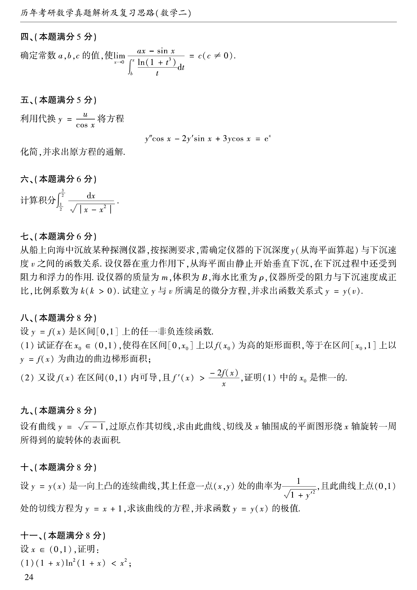
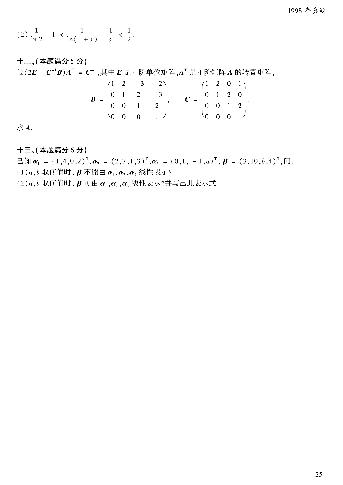

# 1998 年数学二真题

资料类型：考研数学二历年真题  
年份：1998  
科目：数学二  
范围：试卷 III  
整理状态：已按原卷页面校对并转写。

**第 1-11 题题图**

## 第 1 题
- 题型：填空题
- 分值：3
- 模块：高等数学
- 考点：极限、等价无穷小

计算
$$
\lim_{x\to 0}\frac{\sqrt{1+x}+\sqrt{1-x}-2}{x^2}=\underline{\qquad}.
$$

## 第 2 题
- 题型：填空题
- 分值：3
- 模块：高等数学
- 考点：定积分、面积

曲线
$$
y=-x^3+x^2+2x
$$
与 $x$ 轴所围成的图形的面积
$$
A=\underline{\qquad}.
$$

## 第 3 题
- 题型：填空题
- 分值：3
- 模块：高等数学
- 考点：不定积分、分部积分

计算
$$
\int \frac{\ln(\sin x)}{\sin^2 x}\,dx=\underline{\qquad}.
$$

## 第 4 题
- 题型：填空题
- 分值：3
- 模块：高等数学
- 考点：积分上限函数、求导

设 $f(x)$ 连续，则
$$
\frac{d}{dx}\int_0^x t\,f(x^2-t^2)\,dt=\underline{\qquad}.
$$

## 第 5 题
- 题型：填空题
- 分值：3
- 模块：高等数学
- 考点：渐近线

曲线
$$
y=x\ln\left(e+\frac{1}{x}\right)\qquad(x>0)
$$
的渐近线方程为 $\underline{\qquad}$。

## 第 6 题
- 题型：选择题
- 分值：3
- 模块：高等数学
- 考点：数列极限

设数列 $\{x_n\}$ 与 $\{y_n\}$ 满足
$$
\lim_{n\to\infty}x_ny_n=0,
$$
则下列断言正确的是（ ）。

(A) 若 $\{x_n\}$ 发散，则 $\{y_n\}$ 必发散  
(B) 若 $\{x_n\}$ 无界，则 $\{y_n\}$ 必有界  
(C) 若 $\{x_n\}$ 有界，则 $\{y_n\}$ 必为无穷小  
(D) 若 $\left\{\dfrac1{x_n}\right\}$ 为无穷小，则 $\{y_n\}$ 必为无穷小

## 第 7 题
- 题型：选择题
- 分值：3
- 模块：高等数学
- 考点：绝对值函数、可导性

函数
$$
f(x)=(x^2-x-2)\lvert x^3-x\rvert
$$
的不可导点的个数为（ ）。

(A) 0  
(B) 1  
(C) 2  
(D) 3

## 第 8 题
- 题型：选择题
- 分值：3
- 模块：高等数学
- 考点：微分、可微

已知函数 $y=y(x)$ 在任意点 $x$ 处的增量
$$
\Delta y=\frac{y\Delta x}{1+x^2}+\alpha,
$$
其中 $\alpha$ 是比 $\Delta x$（$\Delta x\to0$）高阶的无穷小，且 $y(0)=\pi$，则 $y(1)=（\ ）$。

(A) $\pi e^{\pi/4}$  
(B) $2\pi$  
(C) $\pi$  
(D) $e^{\pi/4}$

## 第 9 题
- 题型：选择题
- 分值：3
- 模块：高等数学
- 考点：极值、连续性

设函数 $f(x)$ 在 $x=a$ 的某个邻域内连续，且 $f(a)$ 为其极大值，则存在 $\delta>0$，当 $x\in(a-\delta,a+\delta)$ 时，必有（ ）。

(A) $(x-a)[f(x)-f(a)]\ge 0$  
(B) $(x-a)[f(x)-f(a)]\le 0$  
(C) $\lim\limits_{t\to a}\dfrac{f(t)-f(x)}{(t-x)^2}\ge 0\ (x\ne a)$  
(D) $\lim\limits_{t\to a}\dfrac{f(t)-f(x)}{(t-x)^2}\le 0\ (x\ne a)$

## 第 10 题
- 题型：选择题
- 分值：3
- 模块：线性代数
- 考点：伴随矩阵

设 $A$ 是任一 $n\ (n\ge 3)$ 阶方阵，$A^*$ 是其伴随矩阵，又 $k$ 为常数，且 $k\ne 0,\pm1$，则必有
$$
(kA)^* = (\ \ )
$$

(A) $kA^*$  
(B) $k^{n-1}A^*$  
(C) $k^nA^*$  
(D) $k^{-1}A^*$

**第 11-19 题题图**

## 第 11 题
- 题型：解答题
- 分值：5
- 模块：高等数学
- 考点：间断点、极限

求函数
$$
f(x)=(1+x)^{\frac{x}{\tan\left(x-\frac{\pi}{4}\right)}}
$$
在区间 $(0,2\pi)$ 内的间断点，并判断其类型。

## 第 12 题
- 题型：解答题
- 分值：5
- 模块：高等数学
- 考点：含参极限、洛必达法则

确定常数 $a,b,c$ 的值，使
$$
\lim_{x\to 0}\frac{ax-\sin x}{\int_b^x \frac{\ln(1+t^3)}{t}\,dt}=c\qquad(c\ne 0).
$$

## 第 13 题
- 题型：解答题
- 分值：5
- 模块：高等数学
- 考点：二阶线性微分方程

利用代换
$$
y=\frac{u}{\cos x}
$$
将方程
$$
y''\cos x-2y'\sin x+3y\cos x=e^x
$$
化简，并求出原方程的通解。

## 第 14 题
- 题型：解答题
- 分值：6
- 模块：高等数学
- 考点：广义积分、三角代换

计算积分
$$
\int_{1/2}^{3/2}\frac{dx}{\sqrt{|x-x^2|}}.
$$

## 第 15 题
- 题型：解答题
- 分值：6
- 模块：高等数学
- 考点：微分方程、应用题

从船上向海中沉放某种探测仪器，按探测要求，需确定仪器的下沉深度 $y$（从海平面算起）与下沉速度 $v$ 之间的函数关系。设仪器在重力作用下，从海平面由静止开始垂直下沉，在下沉过程中还受到阻力和浮力的作用。仪器的质量为 $m$，体积为 $B$，海水比重为 $\rho$，仪器所受的阻力与下沉速度成正比，比例系数为 $k\ (k>0)$。试建立 $y$ 与 $v$ 所满足的微分方程，并求出函数关系式 $y=y(v)$。

## 第 16 题
- 题型：证明题
- 分值：8
- 模块：高等数学
- 考点：零点定理、Rolle定理

设 $y=f(x)$ 是区间 $[0,1]$ 上的任一非负连续函数。

(1) 试证存在 $x_0\in(0,1)$，使得在区间 $[0,x_0]$ 上以 $f(x_0)$ 为高的矩形面积，等于在区间 $[x_0,1]$ 上以 $y=f(x)$ 为曲边的曲边梯形面积；

(2) 又设 $f(x)$ 在区间 $(0,1)$ 内可导，且 $f'(x)>-\dfrac{2f(x)}{x}$，证明 (1) 中的 $x_0$ 是唯一的。

## 第 17 题
- 题型：解答题
- 分值：8
- 模块：高等数学
- 考点：旋转曲面、切线

设有曲线
$$
y=\sqrt{x-1},
$$
过原点作其切线，求由此曲线、切线及 $x$ 轴围成的平面图形绕 $x$ 轴旋转一周所得到的旋转体的表面积。

## 第 18 题
- 题型：解答题
- 分值：8
- 模块：高等数学
- 考点：曲率、微分方程

设 $y=y(x)$ 是一向上凸的连续曲线，其上任意点 $(x,y)$ 处的曲率为
$$
\frac{1}{\sqrt{1+y'^2}},
$$
且此曲线上点 $(0,1)$ 处的切线方程为 $y=x+1$，求该曲线的方程，并求函数 $y=y(x)$ 的极值。

**第 19-21 题题图**

## 第 19 题
- 题型：证明题
- 分值：8
- 模块：高等数学
- 考点：不等式、单调性

设 $x\in(0,1)$，证明：

(1)
$$
(1+x)\ln^2(1+x)<x^2;
$$

(2)
$$
\frac{1}{\ln2}-1<\frac{1}{\ln(1+x)}-\frac{1}{x}<\frac12.
$$

## 第 20 题
- 题型：解答题
- 分值：5
- 模块：线性代数
- 考点：矩阵方程

设
$$
(2E-C^{-1}B)A^T=C^{-1},
$$
其中 $E$ 是 $4$ 阶单位矩阵，$A^T$ 是 $4$ 阶矩阵 $A$ 的转置矩阵，
$$
B=
\begin{pmatrix}
1&2&-3&-2\\
0&1&2&-3\\
0&0&1&2\\
0&0&0&1
\end{pmatrix},
\qquad
C=
\begin{pmatrix}
1&2&0&1\\
0&1&2&0\\
0&0&1&2\\
0&0&0&1
\end{pmatrix}.
$$
求 $A$。

## 第 21 题
- 题型：解答题
- 分值：6
- 模块：线性代数
- 考点：线性表示、非齐次线性方程组

已知
$$
\alpha_1=(1,4,0,2)^T,\quad
\alpha_2=(2,7,1,3)^T,\quad
\alpha_3=(0,1,-1,a)^T,\quad
\beta=(3,10,b,4)^T,
$$
问：

(1) $a,b$ 取何值时，$\beta$ 不能由 $\alpha_1,\alpha_2,\alpha_3$ 线性表示？

(2) $a,b$ 取何值时，$\beta$ 可由 $\alpha_1,\alpha_2,\alpha_3$ 线性表示？并写出此表示式。

