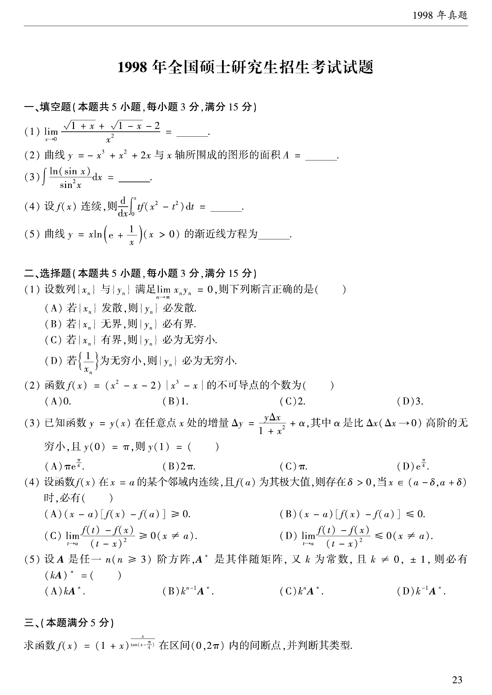

# 1998 数学二第 5 题

## 题目

曲线
$$
y=x\ln\left(e+\frac{1}{x}\right)\qquad(x>0)
$$
的渐近线方程为 $\underline{\qquad}$。

## 标准答案

$y=x+\dfrac{1}{e}$

## 解析

当 $x\to+\infty$ 时，
$$
\ln\left(e+\frac1x\right)=1+\ln\left(1+\frac{1}{ex}\right),
$$
故
$$
y-x=x\ln\left(1+\frac{1}{ex}\right)\to \frac1e.
$$
因此斜渐近线为
$$
y=x+\frac1e.
$$

## 来源

- 题目来源：`math2_1998_questions.md`
- 答案来源：`math2_1998_answers.md`
