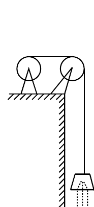

# 1999 年数学二真题

资料类型：考研数学二历年真题  
年份：1999  
科目：数学二  
整理状态：已按题页图像校对并转录。

**第 1-9 题题图**

## 第 1 题
- 题型：填空题
- 分值：3
- 模块：高等数学
- 考点：参数方程、法线方程

曲线
$$
\begin{cases}
x=e^t\sin 2t,\\
y=e^t\cos t
\end{cases}
$$
在点 $(0,1)$ 处的法线方程为 $\underline{\qquad}$。

## 第 2 题
- 题型：填空题
- 分值：3
- 模块：高等数学
- 考点：隐函数求导、链式法则

设函数 $y=y(x)$ 由方程
$$
\ln(x^2+y)=x^3y+\sin x
$$
确定，则
$$
\left.\frac{dy}{dx}\right|_{x=0}=\underline{\qquad}.
$$

## 第 3 题
- 题型：填空题
- 分值：3
- 模块：高等数学
- 考点：不定积分、配方

计算
$$
\int \frac{x+5}{x^2-6x+13}\,dx=\underline{\qquad}.
$$

## 第 4 题
- 题型：填空题
- 分值：3
- 模块：高等数学
- 考点：定积分、平均值

函数
$$
y=\frac{x^2}{\sqrt{1-x^2}}
$$
在区间 $\left[\dfrac12,\dfrac{\sqrt3}{2}\right]$ 上的平均值为 $\underline{\qquad}$。

## 第 5 题
- 题型：填空题
- 分值：3
- 模块：高等数学
- 考点：二阶常系数线性方程、特解

微分方程
$$
y''-4y=e^{2x}
$$
的通解为 $\underline{\qquad}$。

## 第 6 题
- 题型：选择题
- 分值：3
- 模块：高等数学
- 考点：连续与可导、极限

设
$$
f(x)=\begin{cases}
\dfrac{1-\cos x}{\sqrt x}, & x>0,\\
x^2g(x), & x\le 0,
\end{cases}
$$
其中 $g(x)$ 是有界函数，则 $f(x)$ 在 $x=0$ 处（ ）。

A. 极限不存在

B. 极限存在，但不连续

C. 连续，但不可导

D. 可导

## 第 7 题
- 题型：选择题
- 分值：3
- 模块：高等数学
- 考点：无穷小比较、定积分

设
$$
\alpha(x)=\int_0^{5x}\frac{\sin t}{t}\,dt,\qquad
\beta(x)=\int_0^{\sin x}(1+t)^{1/t}dt,
$$
则当 $x\to0$ 时，$\alpha(x)$ 是 $\beta(x)$ 的（ ）。

A. 高阶无穷小

B. 低阶无穷小

C. 同阶但不等价的无穷小

D. 等价无穷小

## 第 8 题
- 题型：选择题
- 分值：3
- 模块：高等数学
- 考点：原函数、奇偶性

设 $f(x)$ 是连续函数，$F(x)$ 是 $f(x)$ 的原函数，则（ ）。

A. 当 $f(x)$ 是奇函数时，$F(x)$ 必是偶函数

B. 当 $f(x)$ 是偶函数时，$F(x)$ 必是奇函数

C. 当 $f(x)$ 是周期函数时，$F(x)$ 必是周期函数

D. 当 $f(x)$ 是单调增函数时，$F(x)$ 必是单调增函数

## 第 9 题
- 题型：选择题
- 分值：3
- 模块：高等数学
- 考点：数列极限、充要条件

“对任意给定的 $\varepsilon\in(0,1)$，总存在正整数 $N$，当 $n\ge N$ 时，恒有 $|x_n-a|\le 2\varepsilon$”是数列 $\{x_n\}$ 收敛于 $a$ 的（ ）。

A. 充分条件但非必要条件

B. 必要条件但非充分条件

C. 充分必要条件

D. 既非充分条件又非必要条件

**第 10-16 题题图**

## 第 10 题
- 题型：选择题
- 分值：3
- 模块：高等数学
- 考点：行列式、方程根的个数

记行列式
$$
f(x)=\begin{vmatrix}
x-2 & x-1 & x-2 & x-3\\
2x-2 & 2x-1 & 2x-2 & 2x-3\\
3x-3 & 3x-2 & 4x-5 & 3x-5\\
4x & 4x-3 & 5x-7 & 4x-3
\end{vmatrix},
$$
则方程 $f(x)=0$ 的根的个数为（ ）。

A. 1

B. 2

C. 3

D. 4

## 第 11 题
- 题型：解答题
- 分值：5
- 模块：高等数学
- 考点：极限、等价无穷小

求极限
$$
\lim_{x\to0}\frac{\sqrt{1+\tan x}-\sqrt{1+\sin x}}{x\ln(1+x)-x^2}.
$$

## 第 12 题
- 题型：解答题
- 分值：6
- 模块：高等数学
- 考点：反常积分、分部积分

计算
$$
\int_1^{+\infty}\frac{\arctan x}{x^2}\,dx.
$$

## 第 13 题
- 题型：解答题
- 分值：7
- 模块：高等数学
- 考点：齐次微分方程、变量代换

求初值问题
$$
(y+\sqrt{x^2+y^2})\,dx-x\,dy=0\qquad (x>0),
$$
$$
y\big|_{x=1}=0
$$
的解。

## 第 14 题
- 题型：解答题
- 分值：7
- 模块：高等数学
- 考点：变力做功、定积分应用

为清除井底的污泥，用缆绳将抓斗放入井底，抓起污泥后提出井口。已知井深 $30\text{ m}$，抓斗自重 $400\text{ N}$，缆绳每米重 $50\text{ N}$，抓斗抓起的污泥重 $2000\text{ N}$，提升速度为 $3\text{ m/s}$。在提升过程中，污泥以 $20\text{ N/s}$ 的速率从抓斗缝隙中漏掉。现将抓起污泥的抓斗提升至井口，问克服重力需作多少焦耳的功？

（说明：忽略抓斗高度及位于井口上方的缆绳长度。）

## 第 15 题
- 题型：解答题
- 分值：8
- 模块：高等数学
- 考点：导数应用、渐近线

已知函数
$$
y=\frac{x^3}{(x-1)^2},
$$
求

1. 函数的增减区间及极值；
2. 函数图形的凹凸区间及拐点；
3. 函数图形的渐近线。

## 第 16 题
- 题型：证明题
- 分值：8
- 模块：高等数学
- 考点：泰勒公式、介值定理

设函数 $f(x)$ 在闭区间 $[-1,1]$ 上具有三阶连续导数，且 $f(-1)=0$，$f(1)=1$，$f'(0)=0$。证明：在开区间 $(-1,1)$ 内至少存在一点 $\xi$，使得
$$
f'''(\xi)=3.
$$

**第 17-20 题题图**

## 第 17 题
- 题型：解答题
- 分值：8
- 模块：高等数学
- 考点：微分方程、导数应用

设函数 $y=y(x)$（$x\ge0$）二阶可导，且 $y'(x)>0$，$y(0)=1$。过曲线 $y=y(x)$ 上任意一点 $P(x,y)$ 作该曲线的切线及 $x$ 轴的垂线，上述两直线与 $x$ 轴所围成的三角形的面积记为 $S_1$，区间 $[0,x]$ 上以 $y=y(x)$ 为曲边的曲边梯形面积记为 $S_2$，并设 $2S_1-S_2$ 恒为 $1$。求此曲线 $y=y(x)$ 的方程。

## 第 18 题
- 题型：证明题
- 分值：7
- 模块：高等数学
- 考点：数列极限、单调有界准则

设 $f(x)$ 是区间 $[0,+\infty)$ 上单调减少且非负的连续函数，
$$
a_n=\sum_{k=1}^n f(k)-\int_1^n f(x)\,dx\qquad (n=1,2,\dots).
$$
证明数列 $\{a_n\}$ 的极限存在。

## 第 19 题
- 题型：解答题
- 分值：6
- 模块：线性代数
- 考点：伴随矩阵、逆矩阵

设矩阵
$$
A=\begin{pmatrix}
1&1&-1\\
-1&1&1\\
1&-1&1
\end{pmatrix},
$$
矩阵 $X$ 满足
$$
A^*X=A^{-1}+2X,
$$
其中 $A^*$ 是 $A$ 的伴随矩阵，求矩阵 $X$。

## 第 20 题
- 题型：解答题
- 分值：8
- 模块：线性代数
- 考点：向量组线性相关性、秩

设向量组
$$
\alpha_1=(1,1,1,3)^T,\quad
\alpha_2=(-1,-3,5,1)^T,\quad
\alpha_3=(3,2,-1,p+2)^T,\quad
\alpha_4=(-2,-6,10,p)^T.
$$

1. $p$ 为何值时，该向量组线性无关？并在此时将向量 $\alpha=(4,1,6,10)^T$ 用 $\alpha_1,\alpha_2,\alpha_3,\alpha_4$ 线性表示；
2. $p$ 为何值时，该向量组线性相关？并在此时求出它的秩和一个极大线性无关组。
