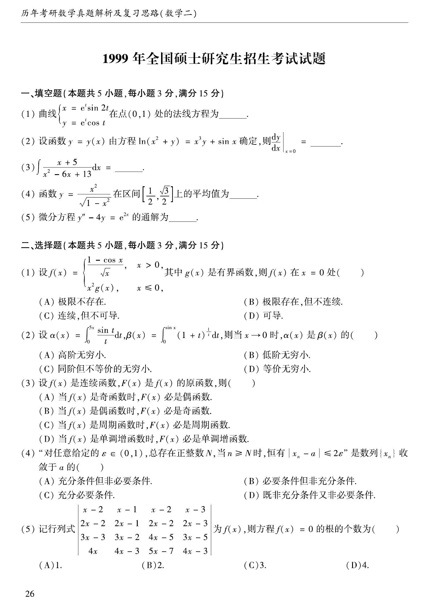

# 1999 数学二第 9 题

## 题目

“对任意给定的 $\varepsilon\in(0,1)$，总存在正整数 $N$，当 $n\ge N$ 时，恒有 $|x_n-a|\le 2\varepsilon$”是数列 $\{x_n\}$ 收敛于 $a$ 的（ ）。

A. 充分条件但非必要条件

B. 必要条件但非充分条件

C. 充分必要条件

D. 既非充分条件又非必要条件

## 标准答案

C

## 解析

若 $x_n\to a$，则对任意 $\varepsilon\in(0,1)$，当然存在 $N$ 使 $|x_n-a|<\varepsilon<2\varepsilon$，所以它是必要条件。反过来，若题设条件成立，任取任意 $\eta>0$，取
$$
\varepsilon=\min\left\{\frac{\eta}{2},\frac12\right\},
$$
则 $\varepsilon\in(0,1)$，从而当 $n\ge N$ 时有
$$
|x_n-a|\le 2\varepsilon\le \eta.
$$
这正是 $x_n\to a$ 的定义，因此它也是充分条件。

## 来源

- 题目来源：`math2_1999_questions.md`
- 答案来源：`math2_1999_answers.md`
