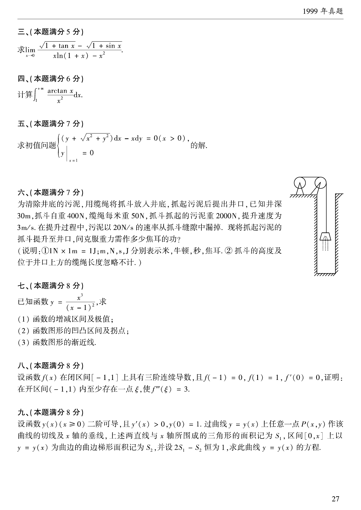

# 1999 数学二第 11 题

## 题目

求极限
$$
\lim_{x\to0}\frac{\sqrt{1+\tan x}-\sqrt{1+\sin x}}{x\ln(1+x)-x^2}.
$$

## 标准答案

$-\dfrac12$

## 解析

先化分子：
$$
\sqrt{1+\tan x}-\sqrt{1+\sin x}
=\frac{\tan x-\sin x}{\sqrt{1+\tan x}+\sqrt{1+\sin x}}.
$$
当 $x\to0$ 时，分母趋于 $2$，而
$$
\tan x=x+\frac{x^3}{3}+o(x^3),\qquad
\sin x=x-\frac{x^3}{6}+o(x^3),
$$
故
$$
\tan x-\sin x=\frac{x^3}{2}+o(x^3).
$$
于是分子为
$$
\frac{1}{2}\left(\frac{x^3}{2}+o(x^3)\right)=\frac{x^3}{4}+o(x^3).
$$
再看分母：
$$
\ln(1+x)=x-\frac{x^2}{2}+o(x^2),
$$
所以
$$
x\ln(1+x)-x^2
=x\left(x-\frac{x^2}{2}+o(x^2)\right)-x^2
=-\frac{x^3}{2}+o(x^3).
$$
因此原极限为
$$
\lim_{x\to0}\frac{x^3/4+o(x^3)}{-x^3/2+o(x^3)}=-\frac12.
$$

## 来源

- 题目来源：`math2_1999_questions.md`
- 答案来源：`math2_1999_answers.md`
