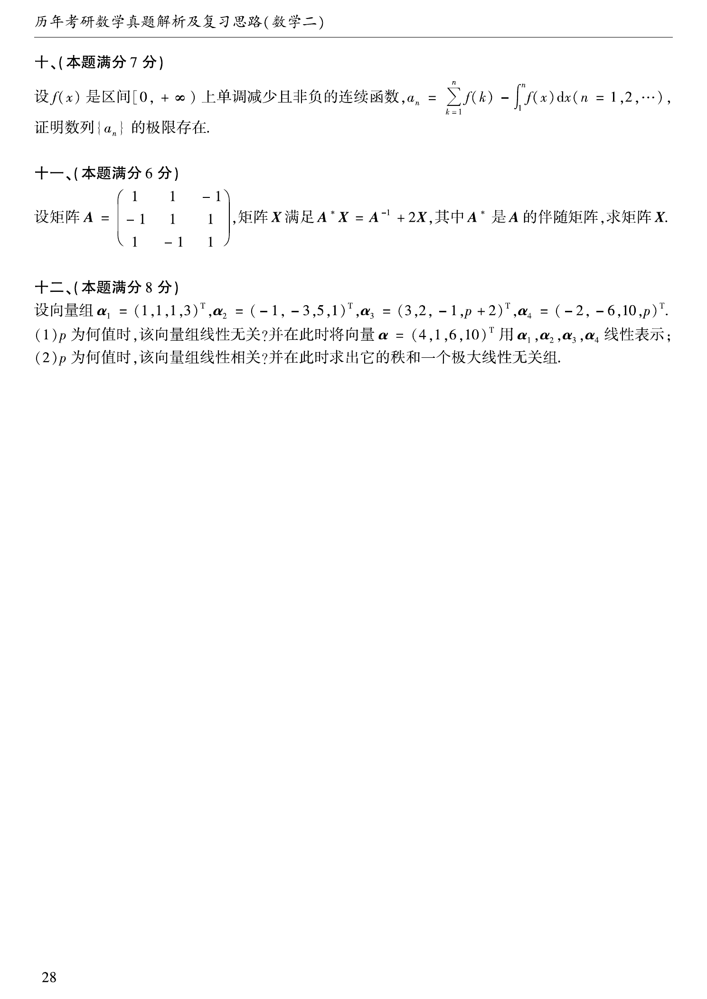

# 1999 数学二第 18 题

## 题目

设 $f(x)$ 是区间 $[0,+\infty)$ 上单调减少且非负的连续函数，
$$
a_n=\sum_{k=1}^n f(k)-\int_1^n f(x)\,dx\qquad (n=1,2,\dots).
$$
证明数列 $\{a_n\}$ 的极限存在。

## 标准答案

见解析。

## 解析

先求相邻两项之差：
$$
a_{n+1}-a_n=f(n+1)-\int_n^{n+1}f(x)\,dx.
$$
由于 $f$ 在 $[0,+\infty)$ 上单调减少，对任意 $x\in[n,n+1]$ 有
$$
f(n+1)\le f(x)\le f(n).
$$
积分得
$$
f(n+1)\le \int_n^{n+1}f(x)\,dx\le f(n).
$$
于是
$$
a_{n+1}-a_n\le0,
$$
故 $\{a_n\}$ 单调减少。另一方面，由
$$
\int_1^n f(x)\,dx\le \sum_{k=1}^{n-1}f(k)
$$
可得
$$
a_n=\sum_{k=1}^n f(k)-\int_1^n f(x)\,dx\ge f(n)\ge0.
$$
因此 $\{a_n\}$ 有下界 $0$。数列单调减少且有下界，所以极限存在。

## 来源

- 题目来源：`math2_1999_questions.md`
- 答案来源：`math2_1999_answers.md`
