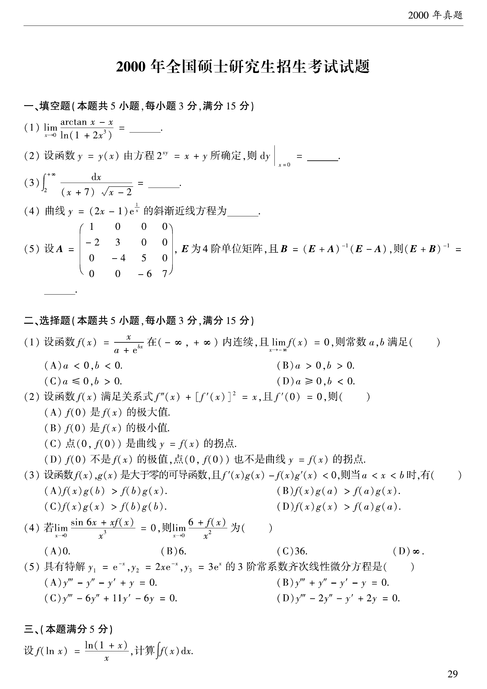

# 2000 数学二第 2 题

## 题目

设函数 $y=y(x)$ 由方程
$$
2^{xy}=x+y
$$
所确定，则
$$
dy\big|_{x=0}=\underline{\qquad}.
$$

## 标准答案

$(\ln2-1)\,dx$

## 解析

由 $x=0$ 时得 $y=1$。对方程两边微分：
$$
2^{xy}\ln2\,(x\,dy+y\,dx)=dx+dy.
$$
代入 $(x,y)=(0,1)$，得
$$
\ln2\,dx=dx+dy,
$$
故
$$
dy=(\ln2-1)\,dx.
$$

## 来源

- 题目来源：`math2_2000_questions.md`
- 答案来源：`math2_2000_answers.md`
