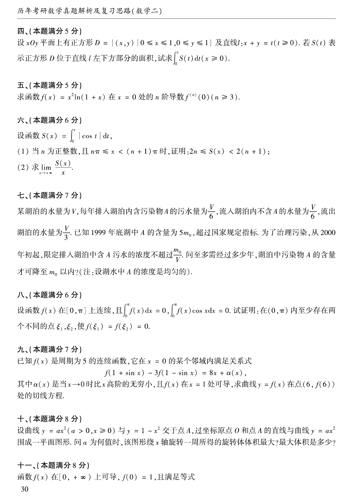

# 2000 数学二第 14 题

## 题目

设函数
$$
S(x)=\int_0^x|\cos t|\,dt,
$$

(1) 当 $n$ 为正整数，且 $n\pi\le x<(n+1)\pi$ 时，证明：$2n\le S(x)<2(n+1)$；

(2) 求
$$
\lim_{x\to+\infty}\frac{S(x)}{x}.
$$

## 标准答案

$(1)$ 见解析；$(2)\ \dfrac{2}{\pi}$。

## 解析

函数 $|\cos t|$ 以 $\pi$ 为周期，且
$$
\int_0^\pi |\cos t|\,dt=2.
$$
因此当
$$
n\pi\le x<(n+1)\pi
$$
时，
$$
S(x)=2n+\int_{n\pi}^{x}|\cos t|\,dt,
$$
故
$$
2n\le S(x)<2(n+1).
$$
再由夹逼，
$$
\frac{2n}{(n+1)\pi}\le \frac{S(x)}{x}\le \frac{2(n+1)}{n\pi},
$$
令 $x\to+\infty$ 即得
$$
\lim_{x\to+\infty}\frac{S(x)}{x}=\frac{2}{\pi}.
$$

## 来源

- 题目来源：`math2_2000_questions.md`
- 答案来源：`math2_2000_answers.md`
