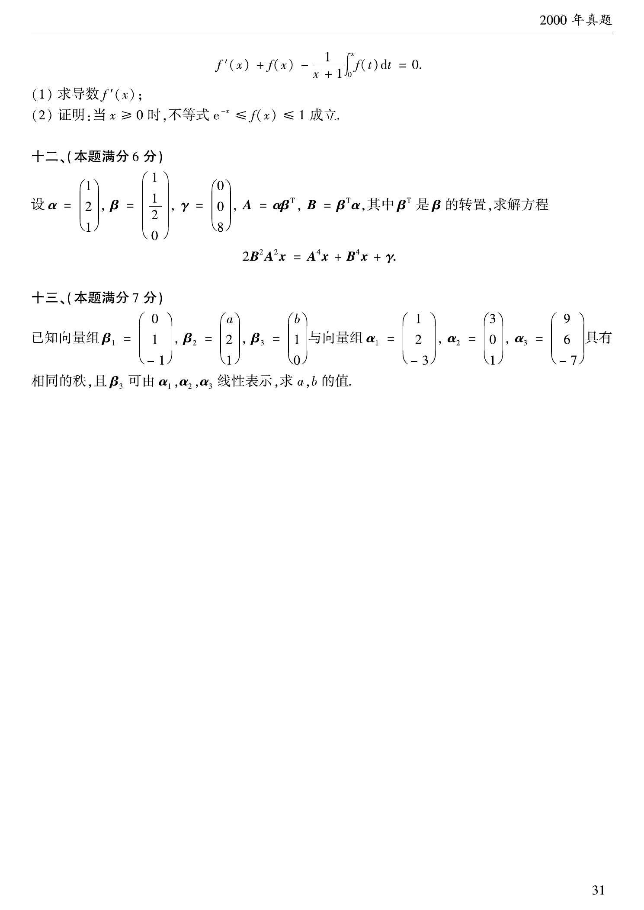

# 2000 数学二第 20 题

## 题目

设
$$
\alpha=\begin{pmatrix}1\\2\\1\end{pmatrix},\quad
\beta=\begin{pmatrix}1\\ \frac12\\ 0\end{pmatrix},\quad
\gamma=\begin{pmatrix}0\\0\\8\end{pmatrix},
$$
$$
A=\alpha\beta^T,\quad B=\beta^T\alpha,
$$
其中 $\beta^T$ 是 $\beta$ 的转置，求解方程
$$
2B^2A^2x=A^4x+B^4x+\gamma.
$$

## 标准答案

$x=\begin{pmatrix}0\\0\\8\end{pmatrix}$

## 解析

先算
$$
B=\beta^T\alpha=1\cdot1+\frac12\cdot2+0\cdot1=2.
$$
又
$$
A=\alpha\beta^T
$$
是秩为 $1$ 的矩阵，并满足
$$
A^2=(\beta^T\alpha)A=2A.
$$
进而
$$
A^4=8A,\qquad 2B^2A^2=16A,\qquad B^4=16.
$$
原方程化为
$$
16Ax=8Ax+16x+\gamma,
$$
即
$$
8Ax-16x=\gamma.
$$
解得
$$
x=\begin{pmatrix}0\\0\\8\end{pmatrix}.
$$

## 来源

- 题目来源：`math2_2000_questions.md`
- 答案来源：`math2_2000_answers.md`
