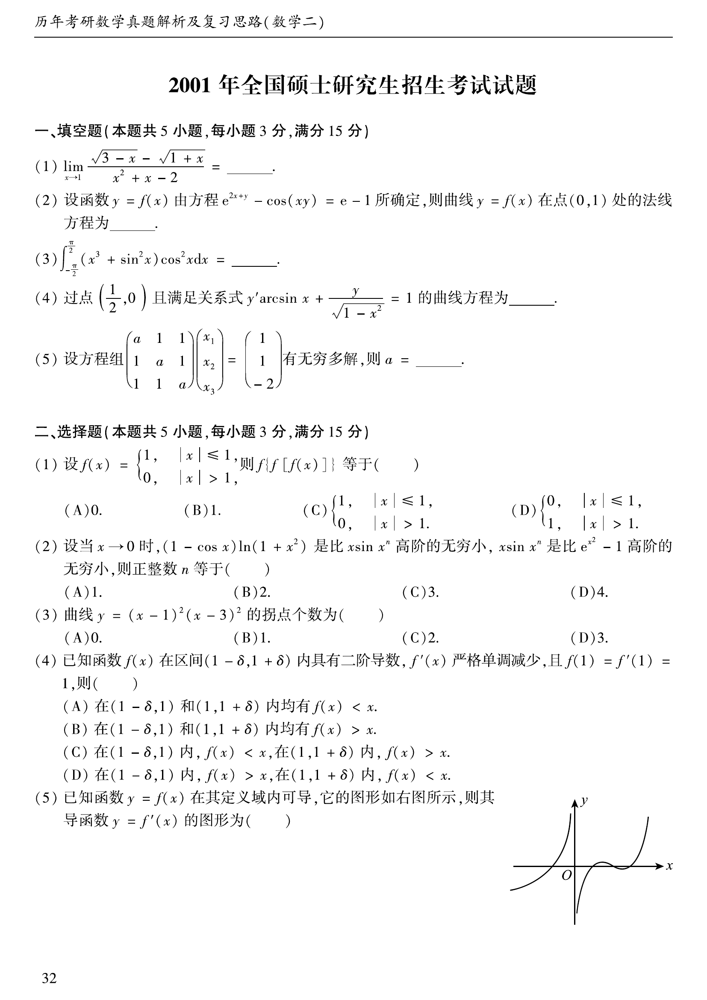
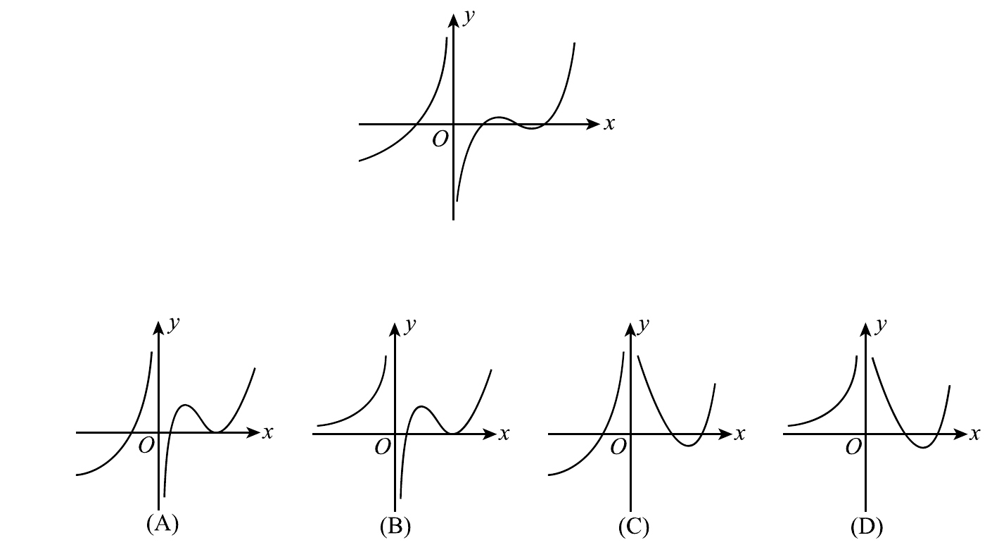
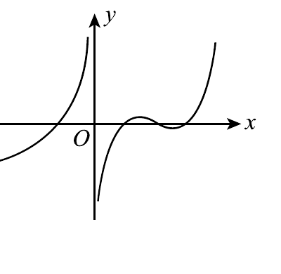
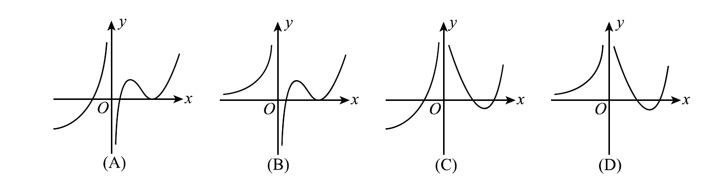
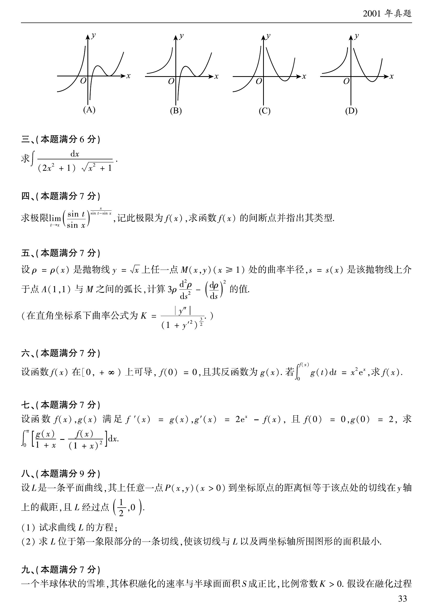
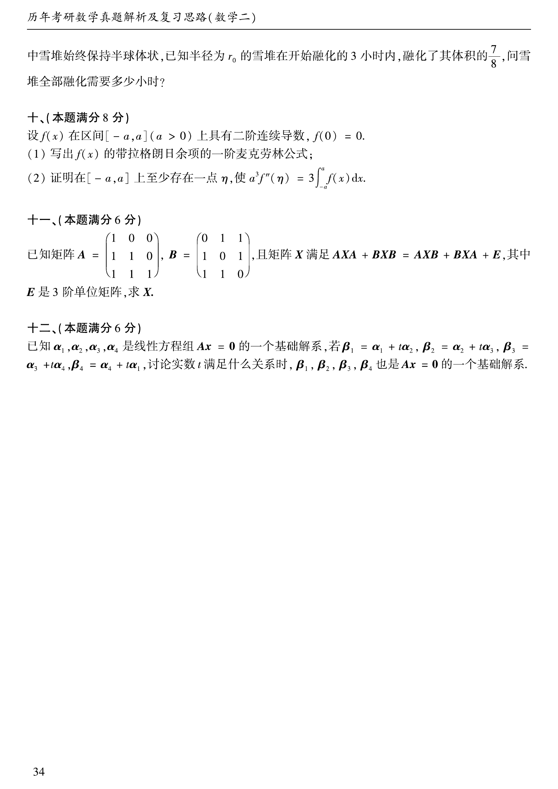

# 2001 年数学二真题

资料类型：考研数学二历年真题  
年份：2001  
科目：数学二  
范围：试卷 III  
整理状态：已按原卷页面与答案页清洗整理。

**第 1-9 题题图**

## 第 1 题
- 题型：填空题
- 分值：3
- 模块：高等数学
- 考点：极限、根式有理化

Compute

$$
\lim_{x\to 1}\frac{\sqrt{3-x}-\sqrt{1+x}}{x^2+x-2}=\underline{\qquad}.
$$

## 第 2 题
- 题型：填空题
- 分值：3
- 模块：高等数学
- 考点：隐函数求导、法线方程

Let $y=f(x)$ be defined by

$$
e^{2x+y}-\cos(xy)=e-1.
$$

Find the normal line at $(0,1)$.

## 第 3 题
- 题型：填空题
- 分值：3
- 模块：高等数学
- 考点：定积分、奇偶性

Compute

$$
\int_{-\pi/2}^{\pi/2}(x^3+\sin^2x)\cos^2x\,dx.
$$

## 第 4 题
- 题型：填空题
- 分值：3
- 模块：高等数学
- 考点：微分方程、乘积求导

Find the curve through $\left(\dfrac12,0\right)$ satisfying

$$
y'\arcsin x+\frac{y}{\sqrt{1-x^2}}=1.
$$

## 第 5 题
- 题型：填空题
- 分值：3
- 模块：线性代数
- 考点：线性方程组、秩

If the system

$$
\begin{pmatrix}a&1&1\\1&a&1\\1&1&a\end{pmatrix}
\begin{pmatrix}x_1\\x_2\\x_3\end{pmatrix}
=
\begin{pmatrix}1\\1\\-2\end{pmatrix}
$$

has infinitely many solutions, find $a$.

## 第 6 题
- 题型：选择题
- 分值：3
- 模块：高等数学
- 考点：分段函数、复合函数

Let

$$
f(x)=\begin{cases}1,&|x|\le1,\\0,&|x|>1.\end{cases}
$$

Then $f\{f[f(x)]\}$ equals:

A. $0$

B. $1$

C. $\begin{cases}1,&|x|\le1,\\0,&|x|>1\end{cases}$

D. $\begin{cases}0,&|x|\le1,\\1,&|x|>1\end{cases}$

## 第 7 题
- 题型：选择题
- 分值：3
- 模块：高等数学
- 考点：无穷小比较、等价无穷小

As $x\to0$, $(1-\cos x)\ln(1+x^2)$ is of higher order than $x\sin x^n$, and $x\sin x^n$ is of higher order than $e^{x^2}-1$. Find the positive integer $n$.

A. $1$  B. $2$  C. $3$  D. $4$

## 第 8 题
- 题型：选择题
- 分值：3
- 模块：高等数学
- 考点：拐点、导数应用

How many inflection points does the curve $y=(x-1)^2(x-3)^2$ have?

A. $0$  B. $1$  C. $2$  D. $3$

## 第 9 题
- 题型：选择题
- 分值：3
- 模块：高等数学
- 考点：极值、导数单调性

Suppose $f(x)$ has a second derivative on $(1-\delta,1+\delta)$, $f'(x)$ is strictly decreasing, and $f(1)=f'(1)=1$. Which statement is true?

A. $f(x)<x$ on both sides of $x=1$

B. $f(x)>x$ on both sides of $x=1$

C. $f(x)<x$ for $x<1$ and $f(x)>x$ for $x>1$

D. $f(x)>x$ for $x<1$ and $f(x)<x$ for $x>1$

## 第 10 题
- 题型：选择题
- 分值：3
- 模块：高等数学
- 考点：导函数图像、函数图像

For the differentiable function $y=f(x)$ shown below, choose the graph of $y=f'(x)$.

A. Graph A  B. Graph B  C. Graph C  D. Graph D

**第 11-16 题题图**

## 第 11 题
- 题型：解答题
- 分值：6
- 模块：高等数学
- 考点：积分计算、三角换元

Compute

$$
\int\frac{dx}{(2x^2+1)\sqrt{x^2+1}}.
$$

## 第 12 题
- 题型：解答题
- 分值：7
- 模块：高等数学
- 考点：极限、间断点

Let

$$
f(x)=\lim_{t\to x}\left(\frac{\sin t}{\sin x}\right)^{\frac{x}{t-\sin x}}.
$$

Find $f(x)$ and classify its discontinuities.

## 第 13 题
- 题型：解答题
- 分值：7
- 模块：高等数学
- 考点：曲率、弧长

For the parabola $y=\sqrt{x}$ with $x\ge1$, let $\rho$ be the radius of curvature at $(x,y)$ and let $s$ be the arc length from $A(1,1)$ to $(x,y)$. Compute

$$
3\rho\frac{d^2\rho}{ds^2}-\left(\frac{d\rho}{ds}\right)^2.
$$

## 第 14 题
- 题型：解答题
- 分值：7
- 模块：高等数学
- 考点：反函数、integral equation

Let $f(x)$ be differentiable on $[0,+\infty)$ with $f(0)=0$, and let $g$ be its inverse. If

$$
\int_0^{f(x)}g(t)\,dt=x^2e^x,
$$

find $f(x)$.

## 第 15 题
- 题型：解答题
- 分值：7
- 模块：高等数学
- 考点：常微分方程、积分计算

Given $f'(x)=g(x)$, $g'(x)=2e^x-f(x)$, and $f(0)=0, g(0)=2$, compute

$$
\int_0^\pi\left[\frac{g(x)}{1+x}-\frac{f(x)}{(1+x)^2}\right]dx.
$$

## 第 16 题
- 题型：解答题
- 分值：9
- 模块：高等数学
- 考点：微分方程、最值

A plane curve $L$ has the property that for every point $P(x,y)$ with $x>0$, the distance from $P$ to the origin equals the $y$-intercept of the tangent line at $P$. The curve passes through $\left(\dfrac12,0\right)$.

(1) Find the equation of $L$.

(2) Find the tangent line on the first-quadrant part of $L$ that minimizes the area enclosed by the tangent, the curve, and the coordinate axes.

**第 17-20 题题图**

## 第 17 题
- 题型：解答题
- 分值：7
- 模块：高等数学
- 考点：相关变化率、应用建模

A hemispherical snow pile melts at a rate proportional to its surface area, and it stays hemispherical during melting. A pile of initial radius $r_0$ loses $7/8$ of its volume in the first $3$ hours. How many hours does it take to melt completely?

## 第 18 题
- 题型：解答题
- 分值：8
- 模块：高等数学
- 考点：麦克劳林公式、积分中值定理

Let $f(x)$ have a continuous second derivative on $[-a,a]$ with $a>0$ and $f(0)=0$.

(1) Write the first-order Maclaurin formula with Lagrange remainder.

(2) Prove that there exists $\eta\in[-a,a]$ such that

$$
a^3f''(\eta)=3\int_{-a}^{a}f(x)\,dx.
$$

## 第 19 题
- 题型：解答题
- 分值：6
- 模块：线性代数
- 考点：矩阵方程、可逆矩阵

Let

$$
A=\begin{pmatrix}1&0&0\\1&1&0\\1&1&1\end{pmatrix},\qquad
B=\begin{pmatrix}0&1&1\\1&0&1\\1&1&0\end{pmatrix},
$$

and suppose $X$ satisfies

$$
AXA+BXB=AXB+BXA+E,
$$

where $E$ is the $3\times3$ identity matrix. Find $X$.

## 第 20 题
- 题型：解答题
- 分值：6
- 模块：线性代数
- 考点：基础解系、线性无关

Assume $\alpha_1,\alpha_2,\alpha_3,\alpha_4$ form a basis of the solution space of $Ax=0$. Define

$$
\beta_1=\alpha_1+t\alpha_2,\quad
\beta_2=\alpha_2+t\alpha_3,\quad
\beta_3=\alpha_3+t\alpha_4,\quad
\beta_4=\alpha_4+t\alpha_1.
$$

For which real $t$ do $\beta_1,\beta_2,\beta_3,\beta_4$ also form a basis of the solution space?

