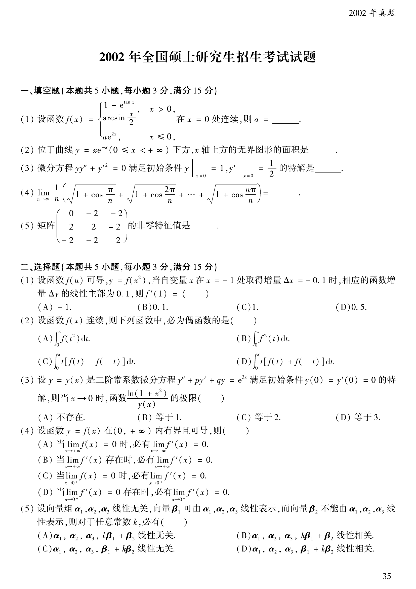
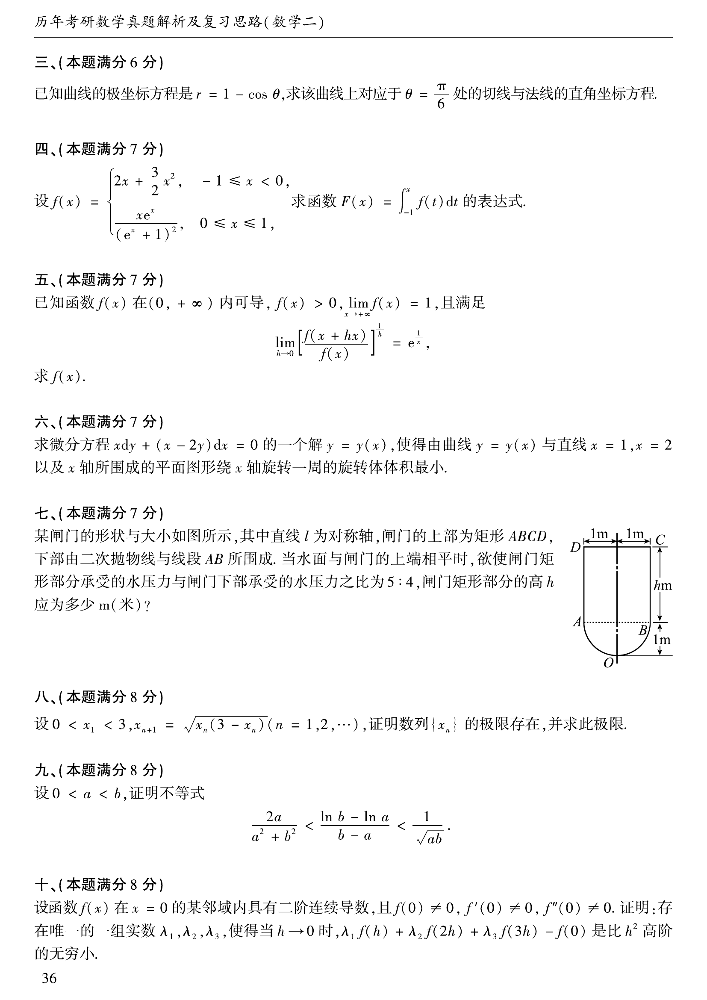
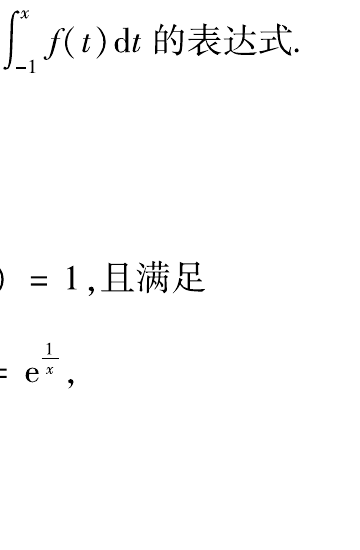
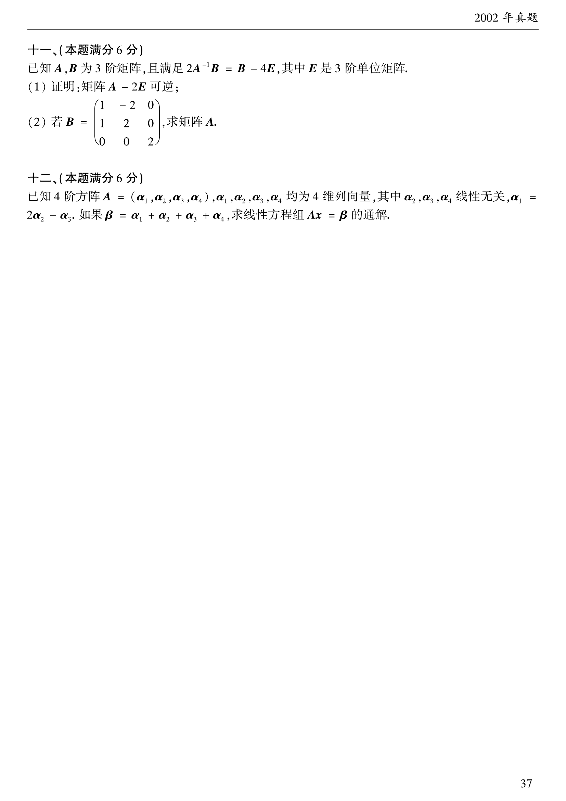

# 2002 年数学二真题

资料类型：考研数学二历年真题  
年份：2002  
科目：数学二  
范围：试卷 III  
整理状态：已按原卷页面与答案页清洗整理。

**第 1-10 题题图**

## 第 1 题
- 题型：填空题
- 分值：3
- 模块：高等数学
- 考点：极限、分段函数

设函数

$$
f(x)=\begin{cases}
\dfrac{1-e^{\tan x}}{\arcsin(x/2)},&x>0,\\
ae^{2x},&x\le 0,
\end{cases}
$$

在 $x=0$ 处连续，则 $a=\underline{\qquad}$。

## 第 2 题
- 题型：填空题
- 分值：3
- 模块：高等数学
- 考点：广义积分、面积

位于曲线 $y=xe^{-x}\ (0\le x<+\infty)$ 下方，$x$ 轴上方的无界图形的面积是 $\underline{\qquad}$。

## 第 3 题
- 题型：填空题
- 分值：3
- 模块：高等数学
- 考点：微分方程、初值问题

微分方程 $yy''+{y'}^2=0$ 满足初始条件 $y\vert_{x=0}=1,\ y'\vert_{x=0}=\dfrac12$ 的特解是 $\underline{\qquad}$。

## 第 4 题
- 题型：填空题
- 分值：3
- 模块：高等数学
- 考点：定积分、定义

求极限

$$
\lim_{n\to\infty}\frac1n\left(\sqrt{1+\cos\frac\pi n}+\sqrt{1+\cos\frac{2\pi}n}+\cdots+\sqrt{1+\cos\frac{n\pi}n}\right)=\underline{\qquad}.
$$

## 第 5 题
- 题型：填空题
- 分值：3
- 模块：线性代数
- 考点：特征值、矩阵

矩阵

$$
\begin{pmatrix}0&-2&-2\\2&2&-2\\-2&-2&2\end{pmatrix}
$$

的非零特征值是 $\underline{\qquad}$。

## 第 6 题
- 题型：选择题
- 分值：3
- 模块：高等数学
- 考点：微分、线性主部

设函数 $f(u)$ 可导，$y=f(x^2)$，当自变量 $x$ 在 $x=-1$ 处取得增量 $\Delta x=-0.1$ 时，相应的函数增量 $\Delta y$ 的线性主部为 $0.1$，则 $f'(1)$ 等于（ ）。

A. $-1$  B. $0.1$  C. $1$  D. $0.5$

## 第 7 题
- 题型：选择题
- 分值：3
- 模块：高等数学
- 考点：偶函数、积分

设函数 $f(x)$ 连续，则下列函数中，必为偶函数的是（ ）。

A. $\int_0^x f(t^2)dt$

B. $\int_0^x f^2(t)dt$

C. $\int_0^x t[f(t)-f(-t)]dt$

D. $\int_0^x t[f(t)+f(-t)]dt$

## 第 8 题
- 题型：选择题
- 分值：3
- 模块：高等数学
- 考点：常系数微分方程、极限

设 $y=y(x)$ 是二阶常系数微分方程 $y''+py'+qy=e^{3x}$ 满足初始条件 $y(0)=y'(0)=0$ 的特解，则当 $x\to0$ 时，函数 $\dfrac{\ln(1+x^2)}{y(x)}$ 的极限（ ）。

A. 不存在  B. 等于 1  C. 等于 2  D. 等于 3

## 第 9 题
- 题型：选择题
- 分值：3
- 模块：高等数学
- 考点：导数极限、反例

设函数 $y=f(x)$ 在 $(0,+\infty)$ 内有界可导，则（ ）。

A. 当 $\lim_{x\to+\infty}f(x)=0$ 时，必有 $\lim_{x\to+\infty}f'(x)=0$

B. 当 $\lim_{x\to+\infty}f'(x)$ 存在时，必有 $\lim_{x\to+\infty}f'(x)=0$

C. 当 $\lim_{x\to0^+}f(x)=0$ 时，必有 $\lim_{x\to0^+}f'(x)=0$

D. 当 $\lim_{x\to0^+}f'(x)=0$ 存在时，必有 $\lim_{x\to0^+}f'(x)=0$

## 第 10 题
- 题型：选择题
- 分值：3
- 模块：线性代数
- 考点：线性无关、向量组

设向量组 $\alpha_1,\alpha_2,\alpha_3$ 线性无关，向量 $\beta_1$ 可由 $\alpha_1,\alpha_2,\alpha_3$ 线性表示，而向量 $\beta_2$ 不能由 $\alpha_1,\alpha_2,\alpha_3$ 线性表示，则对于任意常数 $k$，必有（ ）。

A. $\alpha_1,\alpha_2,\alpha_3,k\beta_1+\beta_2$ 线性无关

B. $\alpha_1,\alpha_2,\alpha_3,k\beta_1+\beta_2$ 线性相关

C. $\alpha_1,\alpha_2,\alpha_3,\beta_1+k\beta_2$ 线性无关

D. $\alpha_1,\alpha_2,\alpha_3,\beta_1+k\beta_2$ 线性相关

**第 11-18 题题图**

## 第 11 题
- 题型：解答题
- 分值：6
- 模块：高等数学
- 考点：极坐标、切线法线

已知曲线的极坐标方程是 $r=1-\cos\theta$，求该曲线上对应于 $\theta=\dfrac\pi6$ 处的切线与法线的直角坐标方程。

## 第 12 题
- 题型：解答题
- 分值：7
- 模块：高等数学
- 考点：定积分、分段函数

设

$$
f(x)=\begin{cases}
2x+\dfrac32x^2,&-1\le x<0,\\
\dfrac{xe^x}{(e^x+1)^2},&0\le x\le1,
\end{cases}
$$

求函数 $F(x)=\int_{-1}^x f(t)dt$ 的表达式。

## 第 13 题
- 题型：解答题
- 分值：7
- 模块：高等数学
- 考点：极限、对数求导

已知函数 $f(x)$ 在 $(0,+\infty)$ 内可导，$f(x)>0$，$\lim_{x\to+\infty}f(x)=1$，且满足

$$
\lim_{h\to0}\left[\frac{f(x+h)}{f(x)}\right]^{1/h}=e^{1/x},
$$

求 $f(x)$。

## 第 14 题
- 题型：解答题
- 分值：7
- 模块：高等数学
- 考点：微分方程、最值

求微分方程 $xdy+(x-2y)dx=0$ 的一个解 $y=y(x)$，使得由曲线 $y=y(x)$ 与直线 $x=1,x=2$ 以及 $x$ 轴所围成的平面图形绕 $x$ 轴旋转一周的旋转体体积最小。

## 第 15 题
- 题型：解答题
- 分值：7
- 模块：高等数学
- 考点：压力、积分应用

某闸门的形状与大小如图所示，其中直线 $l$ 为对称轴，闸门的上部为矩形 $ABCD$，下部由二次抛物线与线段 $AB$ 围成。当水面与闸门上端相平时，欲使闸门矩形部分承受的水压力与闸门下部承受的水压力之比为 $5:4$，闸门矩形部分的高 $h$ 应为多少？

## 第 16 题
- 题型：解答题
- 分值：8
- 模块：高等数学
- 考点：数列、极限

设 $0<x_1<3,\ x_{n+1}=\sqrt{x_n(3-x_n)}\ (n=1,2,\cdots)$，证明数列 $\{x_n\}$ 的极限存在，并求此极限。

## 第 17 题
- 题型：解答题
- 分值：8
- 模块：高等数学
- 考点：不等式、中值定理

设 $0<a<b$，证明不等式

$$
\frac{2a}{a^2+b^2}<\frac{\ln b-\ln a}{b-a}<\frac1{\sqrt{ab}}.
$$

## 第 18 题
- 题型：解答题
- 分值：8
- 模块：高等数学
- 考点：待定系数、极限

设函数 $f(x)$ 在 $x=0$ 的某邻域内具有二阶连续导数，且 $f(0)\ne0,\ f'(0)\ne0,\ f''(0)\ne0$。证明：存在唯一的一组实数 $\lambda_1,\lambda_2,\lambda_3$，使得当 $h\to0$ 时，$\lambda_1f(h)+\lambda_2f(2h)+\lambda_3f(3h)-f(0)$ 是比 $h^2$ 高阶的无穷小。

**第 19-20 题题图**

## 第 19 题
- 题型：解答题
- 分值：6
- 模块：线性代数
- 考点：可逆矩阵、矩阵求解

已知 $A,B$ 为 3 阶矩阵，且满足 $2A^{-1}B=B-4E$，其中 $E$ 是 3 阶单位矩阵。

(1) 证明：矩阵 $A-2E$ 可逆；

(2) 若
$$
B=\begin{pmatrix}1&-2&0\\1&2&0\\0&0&2\end{pmatrix},
$$
求矩阵 $A$。

## 第 20 题
- 题型：解答题
- 分值：6
- 模块：线性代数
- 考点：线性方程组、通解

已知 4 阶方阵 $A=(\alpha_1,\alpha_2,\alpha_3,\alpha_4)$，$\alpha_1,\alpha_2,\alpha_3,\alpha_4$ 均为 4 维列向量，其中 $\alpha_2,\alpha_3,\alpha_4$ 线性无关，$\alpha_1=2\alpha_2-\alpha_3$。如果 $\beta=\alpha_1+\alpha_2+\alpha_3+\alpha_4$，求线性方程组 $Ax=\beta$ 的通解。

