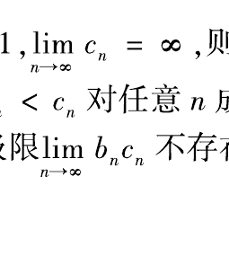
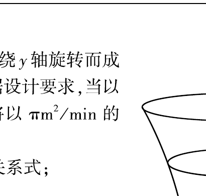

# 2003 年数学二真题

资料类型：考研数学二历年真题  
年份：2003  
科目：数学二  
整理状态：已按原卷页面图像校对并转录。

**第 1-11 题题图**

## 第 1 题
- 题型：填空题
- 分值：4
- 模块：高等数学
- 考点：等价无穷小、极限

若 $x\to 0$ 时，
$$
(1-ax^2)^{\frac14}-1
$$
与 $x\sin x$ 是等价无穷小，则 $a=\underline{\qquad}$。

## 第 2 题
- 题型：填空题
- 分值：4
- 模块：高等数学
- 考点：隐函数、切线方程

设函数 $y=f(x)$ 由方程
$$
xy+2\ln x=y^4
$$
所确定，则曲线 $y=f(x)$ 在点 $(1,1)$ 处的切线方程是 $\underline{\qquad}$。

## 第 3 题
- 题型：填空题
- 分值：4
- 模块：高等数学
- 考点：麦克劳林公式、高阶导数

$y=2^x$ 的麦克劳林公式中 $x^n$ 项的系数是 $\underline{\qquad}$。

## 第 4 题
- 题型：填空题
- 分值：4
- 模块：高等数学
- 考点：极坐标、面积

设曲线的极坐标方程为
$$
\rho=e^{a\theta}\quad (a>0),
$$
则该曲线上相应于 $\theta$ 从 $0$ 变到 $2\pi$ 的一段弧与极轴所围成的图形面积为 $\underline{\qquad}$。

## 第 5 题
- 题型：填空题
- 分值：4
- 模块：线性代数
- 考点：秩、矩阵分解

设 $\alpha$ 为 $3$ 维列向量，$\alpha^\mathrm{T}$ 是 $\alpha$ 的转置，若
$$
\alpha\alpha^\mathrm{T}=
\begin{pmatrix}
1&-1&1\\
-1&1&-1\\
1&-1&1
\end{pmatrix},
$$
则 $\alpha^\mathrm{T}\alpha=\underline{\qquad}$。

## 第 6 题
- 题型：填空题
- 分值：4
- 模块：线性代数
- 考点：行列式、矩阵方程

设 $3$ 阶方阵 $A,B$ 满足
$$
A^2B-A-B=E,
$$
其中 $E$ 为 $3$ 阶单位矩阵，若
$$
A=\begin{pmatrix}
1&0&1\\
0&2&0\\
-2&0&1
\end{pmatrix},
$$
则 $|B|=\underline{\qquad}$。

## 第 7 题
- 题型：选择题
- 分值：4
- 模块：高等数学
- 考点：数列极限、反例

设 $\{a_n\},\{b_n\},\{c_n\}$ 均为非负数列，且
$$
\lim_{n\to\infty}a_n=0,\qquad
\lim_{n\to\infty}b_n=1,\qquad
\lim_{n\to\infty}c_n=+\infty,
$$
则必有（ ）。

A. $a_n<b_n$ 对任意 $n$ 成立

B. $b_n<c_n$ 对任意 $n$ 成立

C. 极限 $\lim\limits_{n\to\infty}a_nc_n$ 不存在

D. 极限 $\lim\limits_{n\to\infty}b_nc_n$ 不存在

## 第 8 题
- 题型：选择题
- 分值：4
- 模块：高等数学
- 考点：定积分、重要极限

设
$$
a_n=\frac32\int_0^{\frac{n}{n+1}}x^{n-1}\sqrt{1+x^n}\,dx,
$$
则极限 $\lim\limits_{n\to\infty}na_n$ 等于（ ）。

A. $(1+e^{3/2})+1$

B. $(1+e^{-1})^{3/2}-1$

C. $(1+e^{-1})^{3/2}+1$

D. $(1+e^{3/2})-1$

## 第 9 题
- 题型：选择题
- 分值：4
- 模块：高等数学
- 考点：微分方程、代入法

已知
$$
y=\frac{x}{\ln x}
$$
是微分方程
$$
y'=\frac{y}{x}+\varphi\!\left(\frac{x}{y}\right)
$$
的解，则 $\varphi\!\left(\dfrac{x}{y}\right)$ 的表达式为（ ）。

A. $-\dfrac{y^2}{x^2}$

B. $\dfrac{y^2}{x^2}$

C. $-\dfrac{x^2}{y^2}$

D. $\dfrac{x^2}{y^2}$

## 第 10 题
- 题型：选择题
- 分值：4
- 模块：高等数学
- 考点：导函数图像、极值

设函数 $f(x)$ 在 $(-\infty,+\infty)$ 内连续，其导函数的图形如图所示，则 $f(x)$ 有（ ）。

A. 一个极小值点和两个极大值点

B. 两个极小值点和一个极大值点

C. 两个极小值点和两个极大值点

D. 三个极小值点和一个极大值点

## 第 11 题
- 题型：选择题
- 分值：4
- 模块：高等数学
- 考点：积分不等式、单调性

设
$$
I_1=\int_0^{\pi/4}\frac{\tan x}{x}\,dx,\qquad
I_2=\int_0^{\pi/4}\frac{x}{\tan x}\,dx,
$$
则（ ）。

A. $I_1>I_2>1$

B. $1>I_1>I_2$

C. $I_2>I_1>1$

D. $1>I_2>I_1$

**第 12-18 题题图**

## 第 12 题
- 题型：选择题
- 分值：4
- 模块：线性代数
- 考点：线性表示、线性相关

设向量组 I：$\alpha_1,\alpha_2,\ldots,\alpha_r$ 可由向量组 II：$\beta_1,\beta_2,\ldots,\beta_s$ 线性表示，则（ ）。

A. 当 $r<s$ 时，向量组 II 必线性相关

B. 当 $r>s$ 时，向量组 II 必线性相关

C. 当 $r<s$ 时，向量组 I 必线性相关

D. 当 $r>s$ 时，向量组 I 必线性相关

## 第 13 题
- 题型：解答题
- 分值：10
- 模块：高等数学
- 考点：分段函数、连续性

设函数
$$
f(x)=
\begin{cases}
\dfrac{\ln(1+ax^3)}{x-\arcsin x},&x<0,\\[2mm]
6,&x=0,\\[2mm]
\dfrac{e^{ax}+x^2-ax-1}{x\sin(x/4)},&x>0.
\end{cases}
$$
问 $a$ 为何值时，$f(x)$ 在 $x=0$ 处连续；$a$ 为何值时，$x=0$ 是 $f(x)$ 的可去间断点？

## 第 14 题
- 题型：解答题
- 分值：9
- 模块：高等数学
- 考点：参数方程、二阶导数

设函数 $y=y(x)$ 由参数方程
$$
\begin{cases}
x=1+2t^2,\\[1mm]
y=\displaystyle\int_1^{1+2\ln t}\frac{e^u}{u}\,du
\end{cases}
\qquad (t>1)
$$
所确定，求 $\left.\dfrac{d^2y}{dx^2}\right|_{x=9}$。

## 第 15 题
- 题型：解答题
- 分值：9
- 模块：高等数学
- 考点：积分换元、不定积分

计算不定积分
$$
\int \frac{x\,e^{\arctan x}}{(1+x^2)^{3/2}}\,dx.
$$

## 第 16 题
- 题型：解答题
- 分值：12
- 模块：高等数学
- 考点：反函数、微分方程

设函数 $y=y(x)$ 在 $(-\infty,+\infty)$ 内具有二阶导数，且 $y'\ne 0$，$x=x(y)$ 是 $y=y(x)$ 的反函数。

(1) 试将 $x=x(y)$ 所满足的微分方程
$$
\frac{d^2x}{dy^2}+(y+\sin x)\left(\frac{dx}{dy}\right)^3=0
$$
变换为 $y=y(x)$ 满足的微分方程；

(2) 求变换后的微分方程满足初始条件 $y(0)=0,\ y'(0)=\dfrac32$ 的解。

## 第 17 题
- 题型：解答题
- 分值：12
- 模块：高等数学
- 考点：导数应用、参数讨论

讨论曲线
$$
y=4\ln x+k
$$
与
$$
y=4x+\ln^4 x
$$
的交点个数。

## 第 18 题
- 题型：解答题
- 分值：12
- 模块：高等数学
- 考点：微分方程、弧长

设位于第一象限的曲线 $y=f(x)$ 过点 $\left(\dfrac{\sqrt2}{2},\dfrac12\right)$，其上任一点 $P(x,y)$ 处的法线与 $y$ 轴的交点为 $Q$，且线段 $PQ$ 被 $x$ 轴平分。

(1) 求曲线 $y=f(x)$ 的方程；

(2) 已知曲线 $y=\sin x$ 在 $[0,\pi]$ 上的弧长为 $l$，试用 $l$ 表示曲线 $y=f(x)$ 的弧长 $s$。

## 第 19 题
- 题型：解答题
- 分值：10
- 模块：高等数学
- 考点：应用题、微分方程

有一平底容器，其内侧壁是由曲线 $x=\varphi(y)\ (y\ge 0)$ 绕 $y$ 轴旋转而成的旋转曲面（如图），容器的底面圆的半径为 $2\text{m}$。根据设计要求，当以 $3\text{m}^3/\text{min}$ 的速率向容器内注入液体时，液面的面积将以 $\pi\text{m}^2/\text{min}$ 的速率均匀扩大（假设注入液体前，容器内无液体）。

(1) 根据 $t$ 时刻液面的面积，写出 $t$ 与 $\varphi(y)$ 之间的关系式；

(2) 求曲线 $x=\varphi(y)$ 的方程。

**第 20-22 题题图**

## 第 20 题
- 题型：证明题
- 分值：10
- 模块：高等数学
- 考点：积分中值定理、拉格朗日中值定理

设函数 $f(x)$ 在闭区间 $[a,b]$ 上连续，在开区间 $(a,b)$ 内可导，且 $f'(x)>0$。若极限
$$
\lim_{x\to a^+}\frac{f(2x-a)}{x-a}
$$
存在，证明：

(1) 在 $(a,b)$ 内 $f(x)>0$；

(2) 在 $(a,b)$ 内存在点 $\xi$，使
$$
\frac{b^2-a^2}{\int_a^b f(x)\,dx}=\frac{2\xi}{f(\xi)};
$$

(3) 在 $(a,b)$ 内存在与 (2) 中 $\xi$ 相异的点 $\eta$，使
$$
f'(\eta)(b^2-a^2)=\frac{2\xi}{\xi-a}\int_a^b f(x)\,dx.
$$

## 第 21 题
- 题型：解答题
- 分值：10
- 模块：线性代数
- 考点：特征值、相似对角化

若矩阵
$$
A=\begin{pmatrix}
2&2&0\\
8&2&a\\
0&0&6
\end{pmatrix}
$$
相似于对角矩阵 $\Lambda$，试确定常数 $a$ 的值，并求可逆矩阵 $P$ 使 $P^{-1}AP=\Lambda$。

## 第 22 题
- 题型：证明题
- 分值：8
- 模块：线性代数
- 考点：直线共点、线性方程组

已知平面上三条不同直线的方程分别为
$$
l_1:ax+2by+3c=0,\qquad
l_2:bx+2cy+3a=0,\qquad
l_3:cx+2ay+3b=0.
$$
试证：这三条直线交于一点的充要条件为 $a+b+c=0$。

