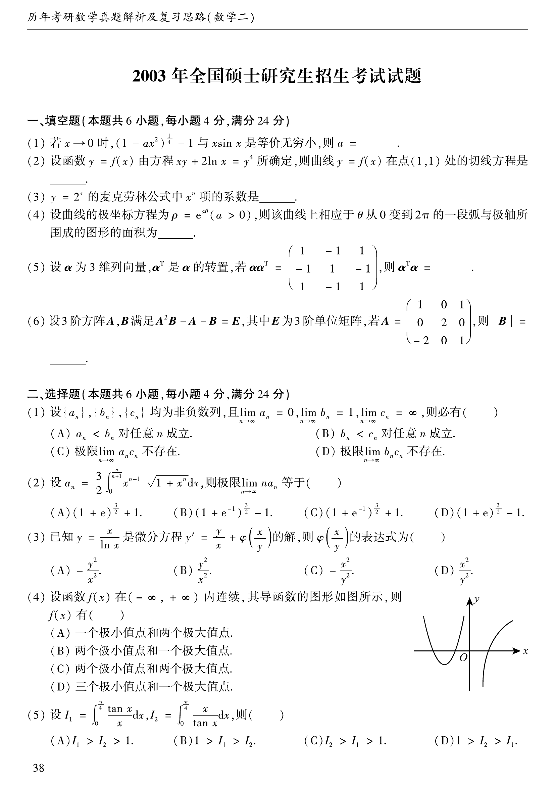

# 2003 数学二第 7 题

## 题目

设 $\{a_n\},\{b_n\},\{c_n\}$ 均为非负数列，且
$$
\lim_{n\to\infty}a_n=0,\qquad
\lim_{n\to\infty}b_n=1,\qquad
\lim_{n\to\infty}c_n=+\infty,
$$
则必有（ ）。

A. $a_n<b_n$ 对任意 $n$ 成立

B. $b_n<c_n$ 对任意 $n$ 成立

C. 极限 $\lim\limits_{n\to\infty}a_nc_n$ 不存在

D. 极限 $\lim\limits_{n\to\infty}b_nc_n$ 不存在

## 标准答案

D

## 解析

若假设 $\lim\limits_{n\to\infty}b_nc_n$ 存在且等于 $L$，则由 $b_n\to 1$ 可得
$$
c_n=\frac{b_nc_n}{b_n}\to L,
$$
这与 $c_n\to+\infty$ 矛盾。因此 $\lim\limits_{n\to\infty}b_nc_n$ 不存在，故选 D。

## 来源

- 题目来源：`math2_2003_questions.md`
- 答案来源：`math2_2003_answers.md`
