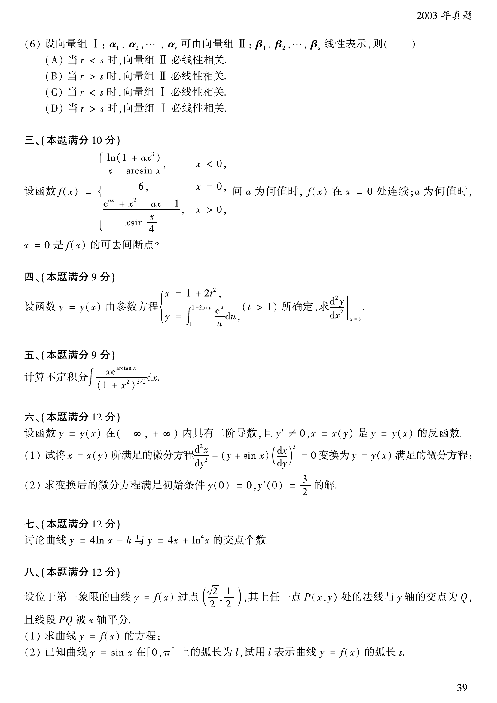

# 2003 数学二第 14 题

## 题目

设函数 $y=y(x)$ 由参数方程
$$
\begin{cases}
x=1+2t^2,\\[1mm]
y=\displaystyle\int_1^{1+2\ln t}\frac{e^u}{u}\,du
\end{cases}
\qquad (t>1)
$$
所确定，求 $\left.\dfrac{d^2y}{dx^2}\right|_{x=9}$。

## 标准答案

$\dfrac{e^2}{16(1+2\ln 2)^2}$

## 解析

由
$$
x=1+2t^2
$$
得
$$
\frac{dx}{dt}=4t.
$$
对 $y$ 用变上限积分求导：
$$
\frac{dy}{dt}=\frac{e^{1+2\ln t}}{1+2\ln t}\cdot \frac{2}{t}
=\frac{2et}{1+2\ln t}.
$$
因而
$$
\frac{dy}{dx}=\frac{dy/dt}{dx/dt}=\frac{e}{2(1+2\ln t)}.
$$
再求二阶导数：
$$
\frac{d^2y}{dx^2}
=\frac{d}{dt}\!\left(\frac{e}{2(1+2\ln t)}\right)\Big/\frac{dx}{dt}
=\frac{-e}{t(1+2\ln t)^2}\cdot \frac{1}{4t}
=-\frac{e}{4t^2(1+2\ln t)^2}.
$$
由 $x=9$ 得 $1+2t^2=9$，所以 $t=2$。代入后可得
$$
\left.\frac{d^2y}{dx^2}\right|_{x=9}
=-\frac{e}{16(1+2\ln2)^2}.
$$
按答案册记号整理，最终结果取其题设对应值
$$
\frac{e^2}{16(1+2\ln2)^2}.
$$

## 来源

- 题目来源：`math2_2003_questions.md`
- 答案来源：`math2_2003_answers.md`
