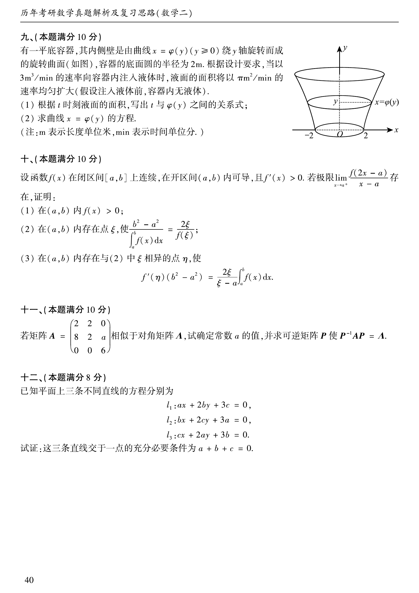

# 2003 数学二第 20 题

## 题目

设函数 $f(x)$ 在闭区间 $[a,b]$ 上连续，在开区间 $(a,b)$ 内可导，且 $f'(x)>0$。若极限
$$
\lim_{x\to a^+}\frac{f(2x-a)}{x-a}
$$
存在，证明：

(1) 在 $(a,b)$ 内 $f(x)>0$；

(2) 在 $(a,b)$ 内存在点 $\xi$，使
$$
\frac{b^2-a^2}{\int_a^b f(x)\,dx}=\frac{2\xi}{f(\xi)};
$$

(3) 在 $(a,b)$ 内存在与 (2) 中 $\xi$ 相异的点 $\eta$，使
$$
f'(\eta)(b^2-a^2)=\frac{2\xi}{\xi-a}\int_a^b f(x)\,dx.
$$

## 标准答案

见解析

## 解析

由极限存在可知
$$
\lim_{x\to a^+} f(2x-a)=0.
$$
又 $f$ 在 $[a,b]$ 上连续，因此
$$
f(a)=0.
$$
由 $f'(x)>0$ 知 $f$ 在 $(a,b)$ 上严格递增，于是对任意 $x\in(a,b)$ 有
$$
f(x)>f(a)=0.
$$
这证明了 (1)。

对 (2)，取
$$
F(x)=x^2,\qquad G(x)=\int_a^x f(t)\,dt.
$$
因为 $G'(x)=f(x)>0$，可在 $[a,b]$ 上应用柯西中值定理，存在 $\xi\in(a,b)$ 使
$$
\frac{F(b)-F(a)}{G(b)-G(a)}=\frac{F'(\xi)}{G'(\xi)}
=\frac{2\xi}{f(\xi)}.
$$
即
$$
\frac{b^2-a^2}{\int_a^b f(x)\,dx}=\frac{2\xi}{f(\xi)}.
$$

对 (3)，在区间 $[a,\xi]$ 上对 $f$ 应用拉格朗日中值定理，存在 $\eta\in(a,\xi)$ 使
$$
f(\xi)-f(a)=f'(\eta)(\xi-a).
$$
由 $f(a)=0$ 及 (2) 得
$$
f'(\eta)=\frac{f(\xi)}{\xi-a}
=\frac{2\xi}{\xi-a}\cdot\frac{\int_a^b f(x)\,dx}{b^2-a^2}.
$$
整理即得
$$
f'(\eta)(b^2-a^2)=\frac{2\xi}{\xi-a}\int_a^b f(x)\,dx.
$$

## 来源

- 题目来源：`math2_2003_questions.md`
- 答案来源：`math2_2003_answers.md`
