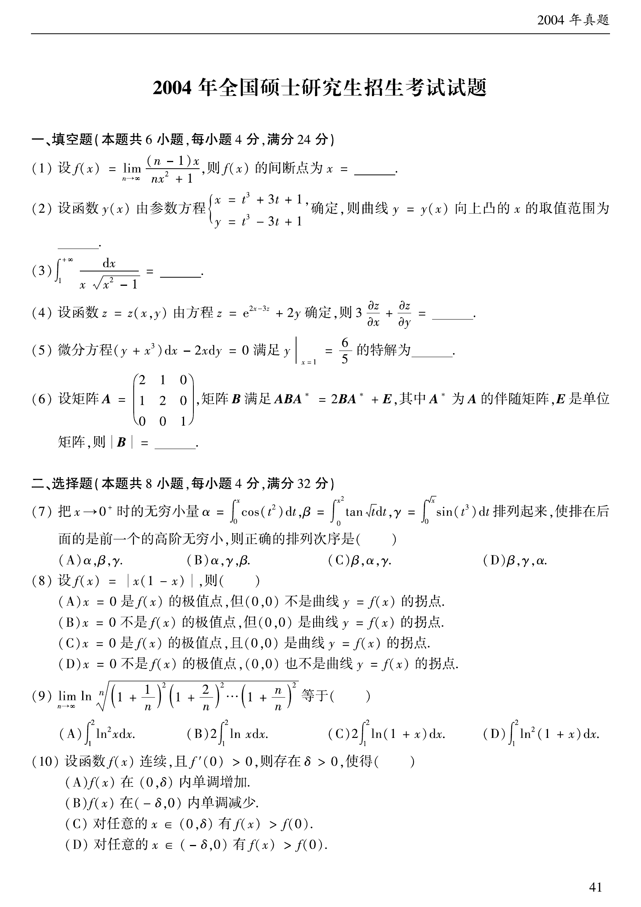

# 2004 数学二第 1 题

## 题目

设
$$
f(x)=\lim_{n\to\infty}\frac{(n-1)x}{nx^2+1},
$$
则 $f(x)$ 的间断点为 $x=\underline{\qquad}$。

## 标准答案

$0$

## 解析

当 $x=0$ 时，显然 $f(0)=0$。当 $x\neq 0$ 时，
$$
f(x)=\lim_{n\to\infty}\frac{(n-1)x}{nx^2+1}
=\lim_{n\to\infty}\frac{1-\frac1n}{x+\frac{1}{nx}}=\frac1x.
$$
因而
$$
f(x)=\begin{cases}
0,&x=0,\\[2mm]
\dfrac1x,&x\ne 0.
\end{cases}
$$
由 $\lim_{x\to 0}f(x)$ 不存在可知，$x=0$ 是间断点。

## 来源

- 题目来源：`math2_2004_questions.md`
- 答案来源：`math2_2004_answers.md`
