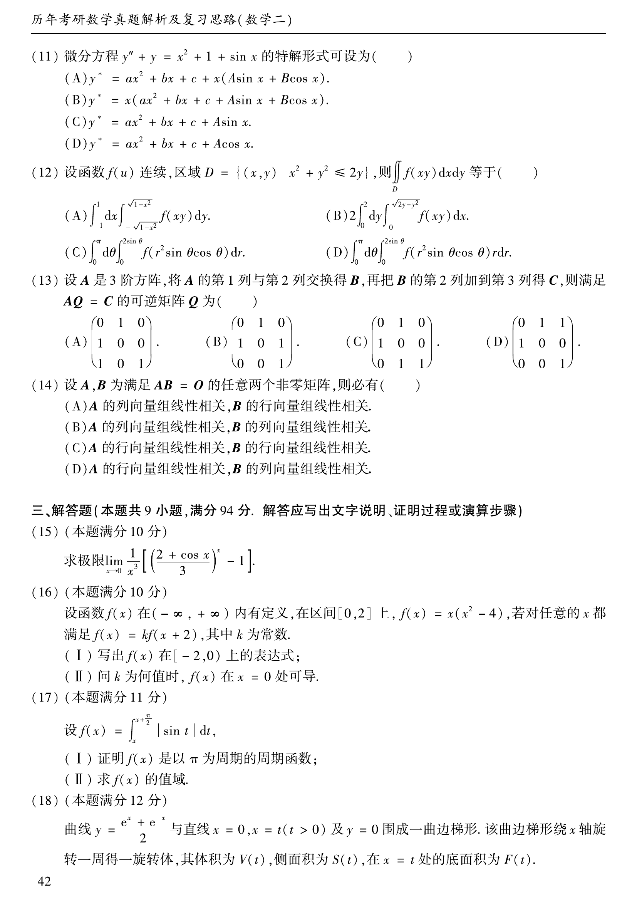

# 2004 数学二第 13 题

## 题目

设 $A$ 是 $3$ 阶方阵，将 $A$ 的第 $1$ 列与第 $2$ 列交换得 $B$，再把 $B$ 的第 $2$ 列加到第 $3$ 列得 $C$，则满足 $AQ=C$ 的可逆矩阵 $Q$ 为（ ）。

A. $\begin{pmatrix}0&1&0\\1&0&0\\1&0&1\end{pmatrix}$

B. $\begin{pmatrix}0&1&0\\1&0&1\\0&0&1\end{pmatrix}$

C. $\begin{pmatrix}0&1&0\\1&0&0\\0&1&1\end{pmatrix}$

D. $\begin{pmatrix}0&1&1\\1&0&0\\0&0&1\end{pmatrix}$

## 标准答案

D

## 解析

交换第 $1$、$2$ 列相当于右乘
$$
S=\begin{pmatrix}
0&1&0\\
1&0&0\\
0&0&1
\end{pmatrix}.
$$
再把第 $2$ 列加到第 $3$ 列，相当于右乘
$$
T=\begin{pmatrix}
1&0&0\\
0&1&1\\
0&0&1
\end{pmatrix}.
$$
所以
$$
C=AST=A(ST),
$$
从而
$$
Q=ST=\begin{pmatrix}
0&1&1\\
1&0&0\\
0&0&1
\end{pmatrix}.
$$

## 来源

- 题目来源：`math2_2004_questions.md`
- 答案来源：`math2_2004_answers.md`
