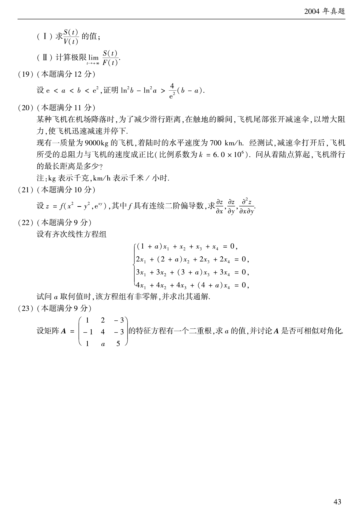

# 2004 数学二第 23 题

## 题目

设矩阵
$$
A=\begin{pmatrix}
1&2&-3\\
-1&4&-3\\
1&a&5
\end{pmatrix}
$$
的特征方程有一个二重根，求 $a$ 的值，并讨论 $A$ 是否可相似对角化。

## 标准答案

$a=-2$ 或 $a=-\dfrac23$；当 $a=-2$ 时可相似对角化，当 $a=-\dfrac23$ 时不可相似对角化。

## 解析

计算特征多项式：
$$
\det(\lambda E-A)=\lambda^3-10\lambda^2+(34+3a)\lambda-(36+6a).
$$
若其有二重根 $\lambda_0$，则 $\lambda_0$ 既满足特征方程，也满足导方程
$$
3\lambda^2-20\lambda+(34+3a)=0.
$$
消去 $a$ 后可得
$$
(\lambda_0-2)^2(\lambda_0-4)=0.
$$
因而二重根只能是 $\lambda_0=2$ 或 $\lambda_0=4$。

1. 当 $\lambda_0=2$ 时，代回得
$$
a=-2.
$$
此时
$$
\chi_A(\lambda)=(\lambda-2)^2(\lambda-6).
$$
又
$$
A-2E=\begin{pmatrix}
-1&2&-3\\
-1&2&-3\\
1&-2&3
\end{pmatrix}
$$
的秩为 $1$，故特征值 $2$ 的特征子空间维数为 $2$，等于其代数重数，所以 $A$ 可相似对角化。

2. 当 $\lambda_0=4$ 时，代回得
$$
a=-\frac23.
$$
此时
$$
\chi_A(\lambda)=(\lambda-4)^2(\lambda-2).
$$
检查 $A-4E$ 可知特征值 $4$ 只对应一个线性无关特征向量，其几何重数为 $1$，小于代数重数 $2$，因此 $A$ 不可相似对角化。

## 来源

- 题目来源：`math2_2004_questions.md`
- 答案来源：`math2_2004_answers.md`
