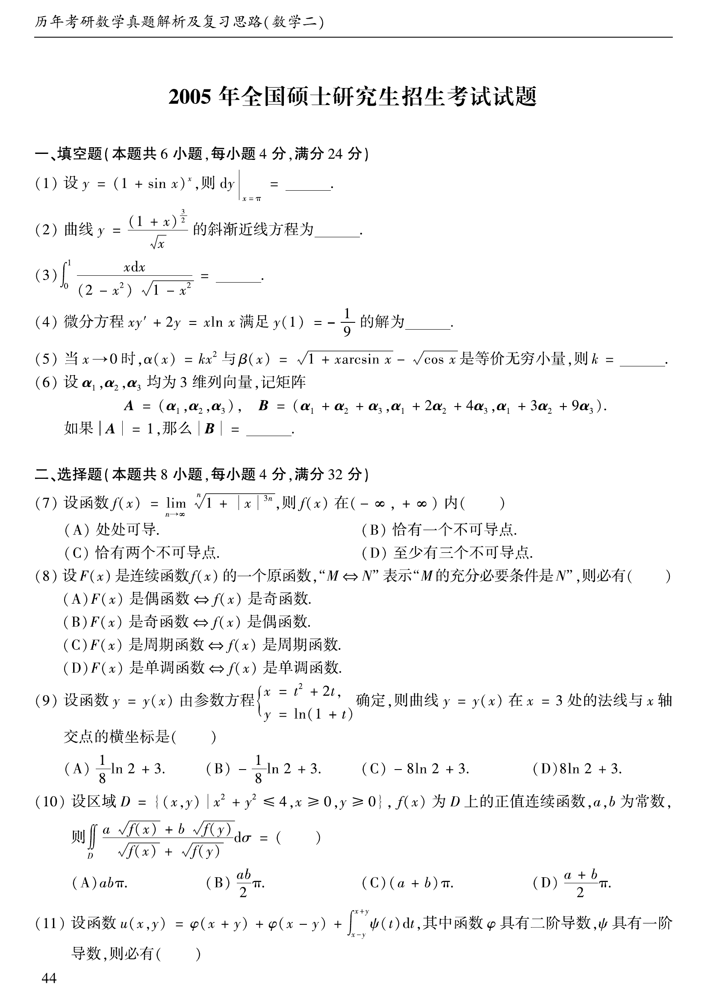
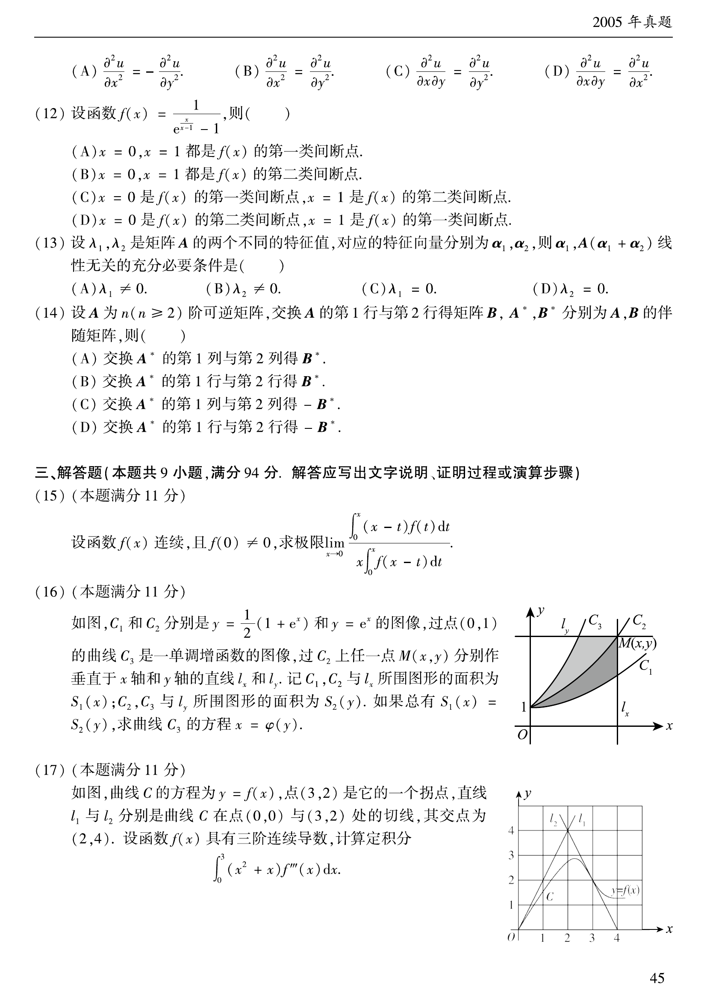
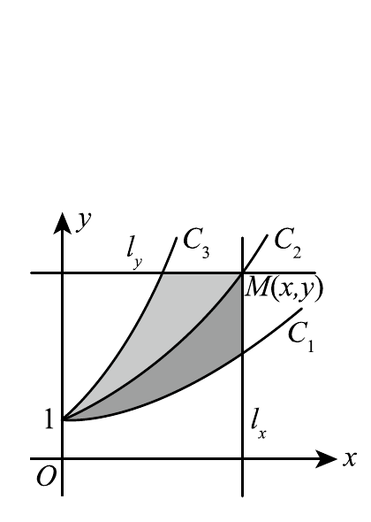
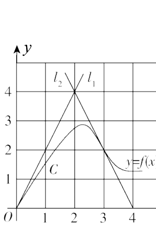

# 2005 年数学二真题

资料类型：考研数学二历年真题  
年份：2005  
科目：数学二  
范围：试卷 III  
整理状态：已按原卷页面图像校对并转录。

**第 1-11 题题图**

## 第 1 题
- 题型：填空题
- 分值：4
- 模块：高等数学
- 考点：微分、复合函数求导

设
$$
y=(1+\sin x)^x,
$$
则 $dy\vert_{x=\pi}=\underline{\qquad}$。

## 第 2 题
- 题型：填空题
- 分值：4
- 模块：高等数学
- 考点：斜渐近线、极限

曲线
$$
y=\frac{(1+x)^{3/2}}{\sqrt{x}}
$$
的斜渐近线方程为 $\underline{\qquad}$。

## 第 3 题
- 题型：填空题
- 分值：4
- 模块：高等数学
- 考点：定积分、三角换元

计算
$$
\int_0^1\frac{x\,dx}{(2-x^2)\sqrt{1-x^2}}=\underline{\qquad}。
$$

## 第 4 题
- 题型：填空题
- 分值：4
- 模块：高等数学
- 考点：一阶线性微分方程、积分因子

微分方程
$$
xy'+2y=x\ln x
$$
满足 $y(1)=-\dfrac19$ 的解为 $\underline{\qquad}$。

## 第 5 题
- 题型：填空题
- 分值：4
- 模块：高等数学
- 考点：等价无穷小、极限

当 $x\to0$ 时，$\alpha(x)=kx^2$ 与 $\beta(x)=\sqrt{1+x\arcsin x}-\sqrt{\cos x}$ 是等价无穷小量，则 $k=\underline{\qquad}$。

## 第 6 题
- 题型：填空题
- 分值：4
- 模块：线性代数
- 考点：行列式、矩阵列变换

设 $\alpha_1,\alpha_2,\alpha_3$ 均为 3 维列向量，记矩阵
$$
A=(\alpha_1,\alpha_2,\alpha_3),\quad B=(\alpha_1+\alpha_2+\alpha_3,\alpha_1+2\alpha_2+4\alpha_3,\alpha_1+3\alpha_2+9\alpha_3).
$$
如果 $|A|=1$，那么 $|B|=\underline{\qquad}$。

## 第 7 题
- 题型：选择题
- 分值：4
- 模块：高等数学
- 考点：函数极限、可导性

设函数
$$
f(x)=\lim_{n\to\infty}\sqrt[n]{1+|x|^{3n}},
$$
则 $f(x)$ 在 $(-\infty,+\infty)$ 内（  ）

A. 处处可导

B. 恰有一个不可导点

C. 恰有两个不可导点

D. 至少有三个不可导点

## 第 8 题
- 题型：选择题
- 分值：4
- 模块：高等数学
- 考点：原函数、奇偶性

设 $F(x)$ 是连续函数 $f(x)$ 的一个原函数，“$M\Leftrightarrow N$”表示“$M$ 的充分必要条件是 $N$”，则必有（  ）

A. $F(x)$ 是偶函数 $\Leftrightarrow f(x)$ 是奇函数

B. $F(x)$ 是奇函数 $\Leftrightarrow f(x)$ 是偶函数

C. $F(x)$ 是周期函数 $\Leftrightarrow f(x)$ 是周期函数

D. $F(x)$ 是单调函数 $\Leftrightarrow f(x)$ 是单调函数

## 第 9 题
- 题型：选择题
- 分值：4
- 模块：高等数学
- 考点：参数方程、法线方程

设函数 $y=y(x)$ 由参数方程
$$
\begin{cases}
x=t^2+2t,\\
y=\ln(1+t)
\end{cases}
$$
确定，则曲线 $y=y(x)$ 在 $x=3$ 处的法线与 $x$ 轴交点的横坐标是（  ）

A. $\dfrac18\ln2+3$

B. $-\dfrac18\ln2+3$

C. $-8\ln2+3$

D. $8\ln2+3$

## 第 10 题
- 题型：选择题
- 分值：4
- 模块：高等数学
- 考点：曲线积分、对称性

设区域 $D=\{(x,y)\mid x^2+y^2\le4,\ x\ge0,\ y\ge0\}$，$f(x)$ 为 $D$ 上的正值连续函数，$a,b$ 为常数，则
$$
\iint_D\frac{a\sqrt{f(x)}+b\sqrt{f(y)}}{\sqrt{f(x)}+\sqrt{f(y)}}\,d\sigma=(\ \ )
$$

A. $ab\pi$

B. $\dfrac{ab}{2}\pi$

C. $(a+b)\pi$

D. $\dfrac{a+b}{2}\pi$

**第 11-15 题题图**

## 第 11 题
- 题型：选择题
- 分值：4
- 模块：高等数学
- 考点：偏导数、二阶偏导

设函数
$$
u(x,y)=\varphi(x+y)+\varphi(x-y)+\int_{x-y}^{x+y}\psi(t)\,dt,
$$
其中函数 $\varphi$ 具有二阶导数，$\psi$ 具有一阶导数，则必有（  ）

A. $\dfrac{\partial^2u}{\partial x^2}=-\dfrac{\partial^2u}{\partial y^2}$

B. $\dfrac{\partial^2u}{\partial x^2}=\dfrac{\partial^2u}{\partial y^2}$

C. $\dfrac{\partial^2u}{\partial x\partial y}=\dfrac{\partial^2u}{\partial y^2}$

D. $\dfrac{\partial^2u}{\partial x\partial y}=\dfrac{\partial^2u}{\partial x^2}$

## 第 12 题
- 题型：选择题
- 分值：4
- 模块：高等数学
- 考点：间断点、函数极限

设函数
$$
f(x)=\frac{1}{e^{x/(x-1)}-1},
$$
则（  ）

A. $x=0,x=1$ 都是 $f(x)$ 的第一类间断点

B. $x=0,x=1$ 都是 $f(x)$ 的第二类间断点

C. $x=0$ 是 $f(x)$ 的第一类间断点，$x=1$ 是 $f(x)$ 的第二类间断点

D. $x=0$ 是 $f(x)$ 的第二类间断点，$x=1$ 是 $f(x)$ 的第一类间断点

## 第 13 题
- 题型：选择题
- 分值：4
- 模块：线性代数
- 考点：特征值、特征向量

设 $\lambda_1,\lambda_2$ 是矩阵 $A$ 的两个不同的特征值，对应的特征向量分别为 $\alpha_1,\alpha_2$，则 $\alpha_1, A(\alpha_1+\alpha_2)$ 线性无关的充要条件是（  ）

A. $\lambda_1\ne0$

B. $\lambda_2\ne0$

C. $\lambda_1=0$

D. $\lambda_2=0$

## 第 14 题
- 题型：选择题
- 分值：4
- 模块：线性代数
- 考点：伴随矩阵、初等矩阵

设 $A$ 为 $n(n\ge2)$ 阶可逆矩阵，交换 $A$ 的第 1 行与第 2 行得矩阵 $B$，$A^*,B^*$ 分别为 $A,B$ 的伴随矩阵，则（  ）

A. 交换 $A^*$ 的第 1 列与第 2 列得 $B^*$

B. 交换 $A^*$ 的第 1 行与第 2 行得 $B^*$

C. 交换 $A^*$ 的第 1 列与第 2 列得 $-B^*$

D. 交换 $A^*$ 的第 1 行与第 2 行得 $-B^*$

## 第 15 题
- 题型：解答题
- 分值：11
- 模块：高等数学
- 考点：极限、积分变量替换

设函数 $f(x)$ 连续，且 $f(0)\ne0$，求极限
$$
\lim_{x\to0}\frac{\int_0^x(x-t)f(t)\,dt}{x\int_0^xf(x-t)\,dt}。
$$

## 第 16 题
- 题型：解答题
- 分值：11
- 模块：高等数学
- 考点：定积分应用、函数方程

如图，$C_1$ 和 $C_2$ 分别是 $y=\dfrac12(1+e^x)$ 和 $y=e^x$ 的图像，过点 $(0,1)$ 的曲线 $C_3$ 是一单调增函数的图像，过 $C_2$ 上任一点 $M(x,y)$ 分别作垂直于 $x$ 轴和 $y$ 轴的直线 $l_x$ 和 $l_y$。记 $C_1,C_2$ 与 $l_x$ 所围图形的面积为 $S_1(x)$；$C_2,C_3$ 与 $l_y$ 所围图形的面积为 $S_2(y)$。如果总有 $S_1(x)=S_2(y)$，求曲线 $C_3$ 的方程 $x=\varphi(y)$。

## 第 17 题
- 题型：解答题
- 分值：11
- 模块：高等数学
- 考点：分部积分、导数几何意义

如图，曲线 $C$ 的方程为 $y=f(x)$，点 $(3,2)$ 是它的一个拐点，直线 $l_1$ 与 $l_2$ 分别是曲线 $C$ 在点 $(0,0)$ 与 $(3,2)$ 处的切线，其交点为 $(2,4)$。设函数 $f(x)$ 具有三阶连续导数，计算定积分
$$
\int_0^3(x^2+x)f'''(x)\,dx。
$$

**第 18-23 题题图**

## 第 18 题
- 题型：解答题
- 分值：12
- 模块：高等数学
- 考点：变量代换、二阶常系数微分方程

用变量代换 $x=\cos t\ (0<t<\pi)$ 化简微分方程
$$
(1-x^2)y''-xy'+y=0,
$$
并求其满足 $y\vert_{x=0}=1$，$y'\vert_{x=0}=2$ 的特解。

## 第 19 题
- 题型：证明题
- 分值：12
- 模块：高等数学
- 考点：中值定理、证明题

已知函数 $f(x)$ 在 $[0,1]$ 上连续，在 $(0,1)$ 内可导，且 $f(0)=0,\ f(1)=1$。证明：

（I）存在 $\xi\in(0,1)$，使得 $f(\xi)=1-\xi$；

（II）存在两个不同的点 $\eta,\zeta\in(0,1)$，使得 $f'(\eta)f'(\zeta)=1$。

## 第 20 题
- 题型：解答题
- 分值：10
- 模块：高等数学
- 考点：全微分、条件极值

已知函数 $z=f(x,y)$ 的全微分
$$
dz=2x\,dx-2y\,dy,
$$
并且 $f(1,1)=2$。求 $f(x,y)$ 在椭圆域
$$
D=\left\{(x,y)\mid x^2+\frac{y^2}{4}\le1\right\}
$$
上的最大值和最小值。

## 第 21 题
- 题型：解答题
- 分值：9
- 模块：高等数学
- 考点：二重积分、分区域积分

计算二重积分
$$
\iint_D|x^2+y^2-1|\,d\sigma,
$$
其中 $D=\{(x,y)\mid 0\le x\le1,\ 0\le y\le1\}$。

## 第 22 题
- 题型：解答题
- 分值：9
- 模块：线性代数
- 考点：向量组线性表示、秩

确定常数 $a$，使向量组
$$
\alpha_1=(1,1,a)^\mathrm{T},\quad \alpha_2=(1,a,1)^\mathrm{T},\quad \alpha_3=(a,1,1)^\mathrm{T}
$$
可由向量组
$$
\beta_1=(1,1,a)^\mathrm{T},\quad \beta_2=(-2,a,4)^\mathrm{T},\quad \beta_3=(-2,a,a)^\mathrm{T}
$$
线性表示，但向量组 $\beta_1,\beta_2,\beta_3$ 不能由向量组 $\alpha_1,\alpha_2,\alpha_3$ 线性表示。

## 第 23 题
- 题型：解答题
- 分值：9
- 模块：线性代数
- 考点：齐次线性方程组、秩

已知 3 阶矩阵 $A$ 的第一行是 $(a,b,c)$，$a,b,c$ 不全为零，矩阵
$$
B=\begin{pmatrix}
1&2&3\\
2&4&6\\
3&6&k
\end{pmatrix}\quad (k\text{ 为常数}),
$$
且 $AB=O$。求线性方程组 $Ax=0$ 的通解。
