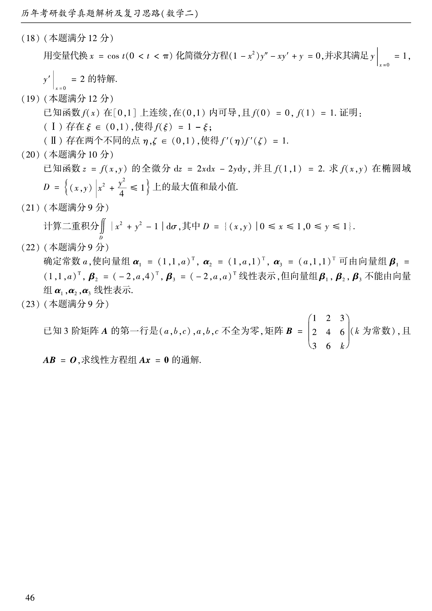

# 2005 数学二第 18 题

## 题目

用变量代换 $x=\cos t\ (0<t<\pi)$ 化简微分方程
$$
(1-x^2)y''-xy'+y=0,
$$
并求其满足 $y\vert_{x=0}=1$，$y'\vert_{x=0}=2$ 的特解。

## 标准答案

$y=2x+\sqrt{1-x^2}\quad(-1<x<1)$

## 解析

令 $x=\cos t$，则 $dx=-\sin t\,dt$。把 $y$ 看作 $t$ 的函数，利用链式法则可化原方程为
$$
\frac{d^2y}{dt^2}+y=0.
$$
其通解为
$$
y=C_1\cos t+C_2\sin t.
$$
再换回 $x$：因 $0<t<\pi$，故 $\sin t=\sqrt{1-x^2}$，从而
$$
y=C_1x+C_2\sqrt{1-x^2}.
$$
由 $y(0)=1$ 得 $C_2=1$。又
$$
y'=C_1-\frac{C_2x}{\sqrt{1-x^2}},
$$
代入 $y'(0)=2$ 得 $C_1=2$。故所求特解为
$$
y=2x+\sqrt{1-x^2},\qquad -1<x<1.
$$

## 来源

- 题目来源：`math2_2005_questions.md`
- 答案来源：`math2_2005_answers.md`
