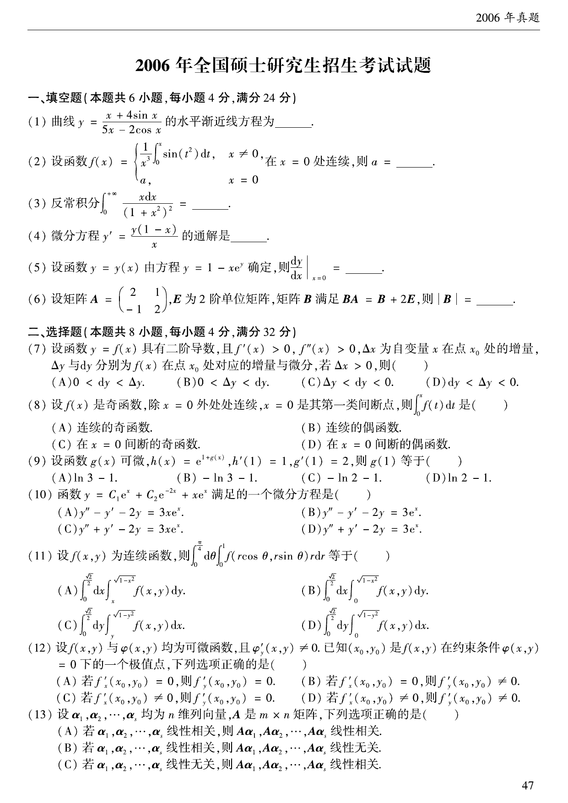

# 2006 数学二第 8 题

## 题目

设 $f(x)$ 是奇函数，除 $x=0$ 外处处连续，$x=0$ 是其第一类间断点，则
$$
\int_0^x f(t)\,dt
$$
是（  ）  
(A) 连续的奇函数  
(B) 连续的偶函数  
(C) 在 $x=0$ 间断的奇函数  
(D) 在 $x=0$ 间断的偶函数

## 标准答案

B

## 解析

设
$$
F(x)=\int_0^x f(t)\,dt.
$$
因为 $f$ 在任意有限区间上可积，所以 $F$ 处处连续。又
$$
F(-x)=\int_0^{-x}f(t)\,dt
=-\int_0^x f(-u)\,du
=\int_0^x f(u)\,du
=F(x),
$$
所以 $F$ 为连续的偶函数。

## 来源

- 题目来源：`math2_2006_questions.md`
- 答案来源：`math2_2006_answers.md`
