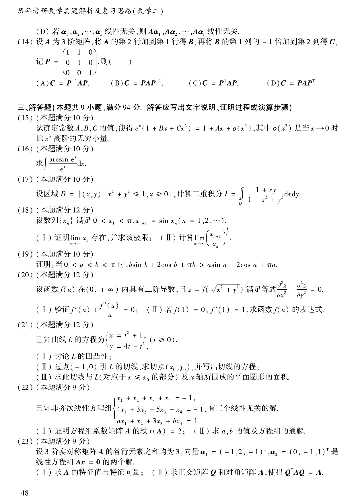

# 2006 数学二第 19 题

## 题目

证明：当 $0<a<b<\pi$ 时，
$$
b\sin b+2\cos b+\pi b>a\sin a+2\cos a+\pi a.
$$

## 标准答案

见解析

## 解析

设
$$
f(x)=x\sin x+2\cos x+\pi x.
$$
则
$$
f'(x)=x\cos x-\sin x+\pi,\qquad
f''(x)=-x\sin x<0\quad(0<x<\pi).
$$
所以 $f'(x)$ 在 $(0,\pi)$ 上严格递减。又
$$
f'(\pi)=\pi\cos\pi-\sin\pi+\pi=0,
$$
因而对任意 $0<x<\pi$，都有 $f'(x)>0$，即 $f$ 在 $(0,\pi)$ 上严格递增。由 $a<b$ 得
$$
f(b)>f(a),
$$
即原不等式成立。

## 来源

- 题目来源：`math2_2006_questions.md`
- 答案来源：`math2_2006_answers.md`
