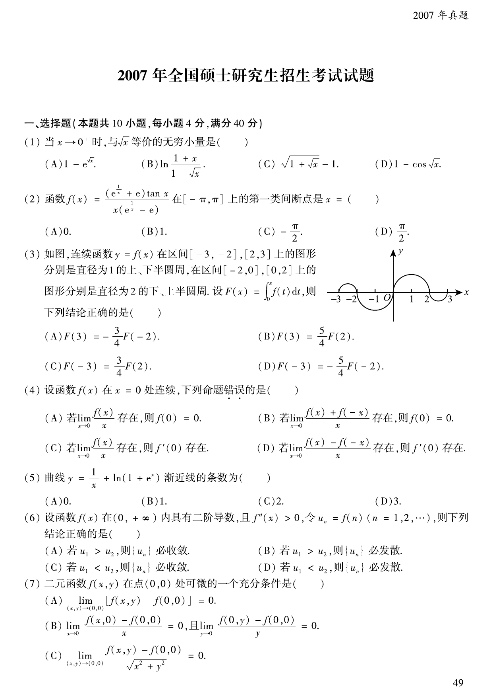

# 2007 年数学二真题

资料类型：考研数学二历年真题
年份：2007
科目：数学二
整理状态：按原卷页图转写并校对。

**第 1-7 题题图**

## 第 1 题
- 题型：选择题
- 分值：4
- 模块：高等数学
- 考点：等价无穷小、极限

当 $x\to0^+$ 时，与 $\sqrt{x}$ 等价的无穷小量是（  ）  
(A) $1-e^{\sqrt{x}}$  
(B) $\ln\dfrac{1+x}{1-\sqrt{x}}$  
(C) $\sqrt{1+\sqrt{x}}-1$  
(D) $1-\cos\sqrt{x}$

## 第 2 题
- 题型：选择题
- 分值：4
- 模块：高等数学
- 考点：间断点、极限

函数
$$
f(x)=\frac{(e^{1/x}+e)\tan x}{x(e^{1/x}-e)}
$$
在 $[-\pi,\pi]$ 上的第一类间断点是 $x=$（  ）  
(A) $0$  
(B) $1$  
(C) $-\dfrac{\pi}{2}$  
(D) $\dfrac{\pi}{2}$

## 第 3 题
- 题型：选择题
- 分值：4
- 模块：高等数学
- 考点：定积分应用、奇偶性、图像面积

如图，连续函数 $y=f(x)$ 在区间 $[-3,-2]$、$[2,3]$ 上的图形分别是直径为 $1$ 的上、下半圆弧，
在区间 $[-2,0]$、$[0,2]$ 上的图形分别是直径为 $2$ 的下、上半圆弧。设
$$
F(x)=\int_0^x f(t)\,dt,
$$
则下列结论正确的是（  ）  
(A) $F(3)=-\dfrac34F(-2)$  
(B) $F(3)=\dfrac54F(2)$  
(C) $F(-3)=\dfrac34F(2)$  
(D) $F(-3)=-\dfrac54F(-2)$

## 第 4 题
- 题型：选择题
- 分值：4
- 模块：高等数学
- 考点：连续、可导、命题判断

设函数 $f(x)$ 在 $x=0$ 处连续，下列命题错误的是（  ）  
(A) 若 $\lim\limits_{x\to0}\dfrac{f(x)}{x}$ 存在，则 $f(0)=0$  
(B) 若 $\lim\limits_{x\to0}\dfrac{f(x)+f(-x)}{x}$ 存在，则 $f(0)=0$  
(C) 若 $\lim\limits_{x\to0}\dfrac{f(x)}{x}$ 存在，则 $f'(0)$ 存在  
(D) 若 $\lim\limits_{x\to0}\dfrac{f(x)-f(-x)}{x}$ 存在，则 $f'(0)$ 存在

## 第 5 题
- 题型：选择题
- 分值：4
- 模块：高等数学
- 考点：渐近线

曲线
$$
y=\frac1x+\ln(1+e^x)
$$
渐近线的条数为（  ）  
(A) $0$  
(B) $1$  
(C) $2$  
(D) $3$

## 第 6 题
- 题型：选择题
- 分值：4
- 模块：高等数学
- 考点：数列、拉格朗日中值定理

设函数 $f(x)$ 在 $(0,+\infty)$ 内具有二阶导数，且 $f''(x)>0$，令 $u_n=f(n)\ (n=1,2,\cdots)$，
则下列结论正确的是（  ）  
(A) 若 $u_1>u_2$，则 $\{u_n\}$ 必收敛  
(B) 若 $u_1>u_2$，则 $\{u_n\}$ 必发散  
(C) 若 $u_1<u_2$，则 $\{u_n\}$ 必收敛  
(D) 若 $u_1<u_2$，则 $\{u_n\}$ 必发散

## 第 7 题
- 题型：选择题
- 分值：4
- 模块：高等数学
- 考点：可微、充分条件

二元函数 $f(x,y)$ 在点 $(0,0)$ 处可微的一个充分条件是（  ）  
(A) $\lim\limits_{(x,y)\to(0,0)}[f(x,y)-f(0,0)]=0$  
(B) $\lim\limits_{x\to0}\dfrac{f(x,0)-f(0,0)}{x}=0$，且 $\lim\limits_{y\to0}\dfrac{f(0,y)-f(0,0)}{y}=0$  
(C) $\lim\limits_{(x,y)\to(0,0)}\dfrac{f(x,y)-f(0,0)}{\sqrt{x^2+y^2}}=0$  
(D) $\lim\limits_{x\to0}[f_x'(x,0)-f_x'(0,0)]=0$，且 $\lim\limits_{y\to0}[f_y'(0,y)-f_y'(0,0)]=0$

**第 8-18 题题图**

## 第 8 题
- 题型：选择题
- 分值：4
- 模块：高等数学
- 考点：二重积分、积分次序交换

设函数 $f(x,y)$ 连续，则二次积分
$$
\int_{\pi/2}^{\pi}dx\int_{\sin x}^{1}f(x,y)\,dy
$$
等于（  ）  
(A) $\displaystyle\int_0^1dy\int_{\pi+\arcsin y}^{\pi}f(x,y)\,dx$  
(B) $\displaystyle\int_0^1dy\int_{\pi-\arcsin y}^{\pi}f(x,y)\,dx$  
(C) $\displaystyle\int_0^1dy\int_{\pi/2}^{\pi+\arcsin y}f(x,y)\,dx$  
(D) $\displaystyle\int_0^1dy\int_{\pi/2}^{\pi-\arcsin y}f(x,y)\,dx$

## 第 9 题
- 题型：选择题
- 分值：4
- 模块：线性代数
- 考点：线性相关

设向量组 $\alpha_1,\alpha_2,\alpha_3$ 线性无关，则下列向量组线性相关的是（  ）  
(A) $\alpha_1-\alpha_2,\ \alpha_2-\alpha_3,\ \alpha_3-\alpha_1$  
(B) $\alpha_1+\alpha_2,\ \alpha_2+\alpha_3,\ \alpha_3+\alpha_1$  
(C) $\alpha_1-2\alpha_2,\ \alpha_2-2\alpha_3,\ \alpha_3-2\alpha_1$  
(D) $\alpha_1+2\alpha_2,\ \alpha_2+2\alpha_3,\ \alpha_3+2\alpha_1$

## 第 10 题
- 题型：选择题
- 分值：4
- 模块：线性代数
- 考点：合同、相似、特征值

设矩阵
$$
A=\begin{pmatrix}
2&-1&-1\\
-1&2&-1\\
-1&-1&2
\end{pmatrix},\qquad
B=\begin{pmatrix}
1&0&0\\
0&1&0\\
0&0&0
\end{pmatrix},
$$
则 $A$ 与 $B$（  ）  
(A) 合同且相似  
(B) 合同，但不相似  
(C) 不合同，但相似  
(D) 既不合同，也不相似

## 第 11 题
- 题型：填空题
- 分值：4
- 模块：高等数学
- 考点：洛必达法则、等价无穷小

$$
\lim_{x\to0}\frac{\arctan x-\sin x}{x^3}=\underline{\qquad}.
$$

## 第 12 题
- 题型：填空题
- 分值：4
- 模块：高等数学
- 考点：参数方程、法线

曲线
$$
\begin{cases}
x=\cos t+\cos^2 t,\\
y=1+\sin t
\end{cases}
$$
上对应于 $t=\dfrac{\pi}{4}$ 的点处的法线斜率为 $\underline{\qquad}$。

## 第 13 题
- 题型：填空题
- 分值：4
- 模块：高等数学
- 考点：高阶导数、求导公式

设函数
$$
y=\frac{1}{2x+3},
$$
则 $y^{(n)}(0)=\underline{\qquad}$。

## 第 14 题
- 题型：填空题
- 分值：4
- 模块：高等数学
- 考点：常系数微分方程

二阶常系数非齐次线性微分方程
$$
y''-4y'+3y=2e^{2x}
$$
的通解为 $\underline{\qquad}$。

## 第 15 题
- 题型：填空题
- 分值：4
- 模块：高等数学
- 考点：多元复合函数求导

设 $f(u,v)$ 是二元可微函数，$z=f\!\left(\dfrac{y}{x},\dfrac{x}{y}\right)$，则
$$
x\frac{\partial z}{\partial x}-y\frac{\partial z}{\partial y}=\underline{\qquad}.
$$

## 第 16 题
- 题型：填空题
- 分值：4
- 模块：线性代数
- 考点：矩阵的秩、幂矩阵

设矩阵
$$
A=\begin{pmatrix}
0&1&0&0\\
0&0&1&0\\
0&0&0&1\\
0&0&0&0
\end{pmatrix},
$$
则 $A^3$ 的秩为 $\underline{\qquad}$。

## 第 17 题
- 题型：解答题
- 分值：10
- 模块：高等数学
- 考点：反函数、积分方程、微分方程

设 $f(x)$ 是区间 $\left[0,\dfrac{\pi}{4}\right]$ 上的单调、可导函数，且满足
$$
\int_0^{f(x)}f^{-1}(t)\,dt=\int_0^x \frac{\cos t-\sin t}{\sin t+\cos t}\,dt,
$$
其中 $f^{-1}$ 是 $f$ 的反函数，求 $f(x)$。

## 第 18 题
- 题型：解答题
- 分值：11
- 模块：高等数学
- 考点：旋转体体积、参数最值

设 $D$ 是位于曲线
$$
y=\sqrt{x}\,a^{-x/(2a)}\qquad(a>1,\ 0\le x<+\infty)
$$
下方、$x$ 轴上方的无界区域。  
（I）求区域 $D$ 绕 $x$ 轴旋转一周所成旋转体的体积 $V(a)$；  
（II）当 $a$ 为何值时，$V(a)$ 最小？并求此最小值。

**第 19-24 题题图**

## 第 19 题
- 题型：解答题
- 分值：10
- 模块：高等数学
- 考点：微分方程、降阶

求微分方程
$$
y''(x+y'^2)=y'
$$
满足初始条件 $y(1)=y'(1)=1$ 的特解。

## 第 20 题
- 题型：解答题
- 分值：11
- 模块：高等数学
- 考点：隐函数、复合函数求导

已知函数 $f(u)$ 具有二阶导数，且 $f'(0)=1$，函数 $y=y(x)$ 由方程
$$
y-xe^{y-1}=1
$$
所确定。设
$$
z=f(\ln y-\sin x),
$$
求
$$
\left.\frac{dz}{dx}\right|_{x=0},\qquad
\left.\frac{d^2z}{dx^2}\right|_{x=0}.
$$

## 第 21 题
- 题型：证明题
- 分值：11
- 模块：高等数学
- 考点：罗尔定理、存在性证明

设函数 $f(x),g(x)$ 在 $[a,b]$ 上连续，在 $(a,b)$ 内具有二阶导数且存在相等的最大值，
$f(a)=g(a),\ f(b)=g(b)$，证明：存在 $\xi\in(a,b)$，使得
$$
f''(\xi)=g''(\xi).
$$

## 第 22 题
- 题型：解答题
- 分值：11
- 模块：高等数学
- 考点：二重积分、分区域积分、极坐标

设二元函数
$$
f(x,y)=
\begin{cases}
x^2, & |x|+|y|\le1,\\[2mm]
\dfrac{1}{\sqrt{x^2+y^2}}, & 1<|x|+|y|\le2,
\end{cases}
$$
计算二重积分
$$
\iint_D f(x,y)\,d\sigma,
$$
其中
$$
D=\{(x,y)\mid |x|+|y|\le2\}.
$$

## 第 23 题
- 题型：解答题
- 分值：11
- 模块：线性代数
- 考点：线性方程组、参数讨论

设线性方程组
$$
\begin{cases}
x_1+x_2+x_3=0,\\
x_1+2x_2+ax_3=0,\\
x_1+4x_2+a^2x_3=0,
\end{cases}
$$
与方程
$$
x_1+2x_2+x_3=a-1
$$
有公共解，求 $a$ 的值及所有公共解。

## 第 24 题
- 题型：解答题
- 分值：11
- 模块：线性代数
- 考点：特征值、特征向量、矩阵多项式

设 $3$ 阶实对称矩阵 $A$ 的特征值为 $\lambda_1=1,\lambda_2=2,\lambda_3=-2$，
$\alpha_1=(1,-1,1)^T$ 是 $A$ 的属于 $\lambda_1$ 的一个特征向量。记
$$
B=A^5-4A^3+E,
$$
其中 $E$ 为 $3$ 阶单位矩阵。  
（I）验证 $\alpha_1$ 是矩阵 $B$ 的特征向量，并求 $B$ 的全部特征值与特征向量；  
（II）求矩阵 $B$。
