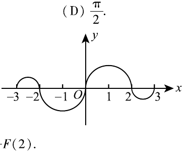

# 2007 数学二第 3 题

## 题目

如图，连续函数 $y=f(x)$ 在区间 $[-3,-2]$、$[2,3]$ 上的图形分别是直径为 $1$ 的上、下半圆弧，
在区间 $[-2,0]$、$[0,2]$ 上的图形分别是直径为 $2$ 的下、上半圆弧。设
$$
F(x)=\int_0^x f(t)\,dt,
$$
则下列结论正确的是（  ）  
(A) $F(3)=-\dfrac34F(-2)$  
(B) $F(3)=\dfrac54F(2)$  
(C) $F(-3)=\dfrac34F(2)$  
(D) $F(-3)=-\dfrac54F(-2)$

## 标准答案

C

## 解析

由图形知 $f$ 为奇函数，因此
$$
F(-x)=\int_0^{-x}f(t)\,dt=\int_0^x f(t)\,dt=F(x),
$$
所以 $F$ 为偶函数。
又
$$
F(2)=\frac{\pi}{2},
$$
因为 $[0,2]$ 上是半径 $1$ 的上半圆面积。
而 $[2,3]$ 上是半径 $\dfrac12$ 的下半圆，故
$$
\int_2^3 f(t)\,dt=-\frac{\pi}{8}.
$$
从而
$$
F(3)=F(2)-\frac{\pi}{8}=\frac{3\pi}{8}=\frac34F(2).
$$
再由偶性得
$$
F(-3)=F(3)=\frac34F(2).
$$
所以选 C。

## 来源

- 题目来源：`math2_2007_questions.md`
- 答案来源：`math2_2007_answers.md`
