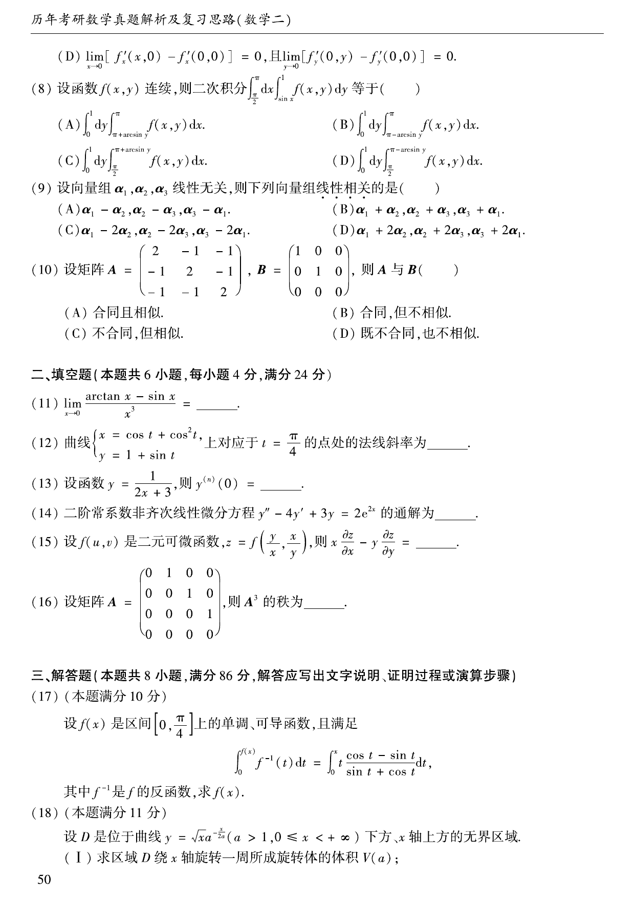

# 2007 数学二第 14 题

## 题目

二阶常系数非齐次线性微分方程
$$
y''-4y'+3y=2e^{2x}
$$
的通解为 $\underline{\qquad}$。

## 标准答案

$y=C_1e^x+C_2e^{3x}-2e^{2x}$

## 解析

先解齐次方程
$$
r^2-4r+3=0,
$$
得特征根 $r=1,3$，所以齐次解为
$$
y_h=C_1e^x+C_2e^{3x}.
$$
对非齐次项设特解 $y^*=Ae^{2x}$，代入得
$$
(4A-8A+3A)e^{2x}=2e^{2x},
$$
故 $A=-2$。所以通解为
$$
y=C_1e^x+C_2e^{3x}-2e^{2x}.
$$

## 来源

- 题目来源：`math2_2007_questions.md`
- 答案来源：`math2_2007_answers.md`
