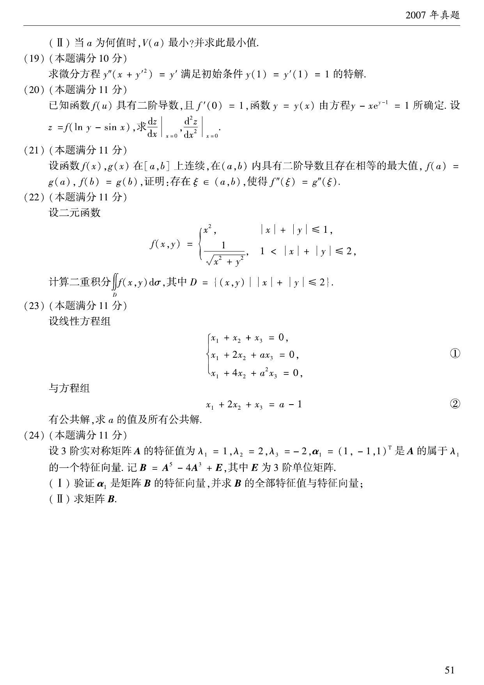

# 2007 数学二第 23 题

## 题目

设线性方程组
$$
\begin{cases}
x_1+x_2+x_3=0,\\
x_1+2x_2+ax_3=0,\\
x_1+4x_2+a^2x_3=0,
\end{cases}
$$
与方程
$$
x_1+2x_2+x_3=a-1
$$
有公共解，求 $a$ 的值及所有公共解。

## 标准答案

$a=1$ 或 $a=2$；当 $a=1$ 时公共解为 $k(1,0,-1)^T$，当 $a=2$ 时公共解为 $(0,1,-1)^T$

## 解析

把附加方程并入原线性方程组，组成增广矩阵并作消元，可得可解条件
$$
(a-1)(a-2)=0.
$$
因而
$$
a=1\quad\text{或}\quad a=2.
$$
当 $a=1$ 时，方程组化为
$$
\begin{cases}
x_1+x_2+x_3=0,\\
x_2=0,
\end{cases}
$$
所有公共解为
$$
k(1,0,-1)^T.
$$
当 $a=2$ 时，联立后解得
$$
x_2=1,\qquad x_3=-1,\qquad x_1=0,
$$
因而公共解为
$$
(0,1,-1)^T.
$$

## 来源

- 题目来源：`math2_2007_questions.md`
- 答案来源：`math2_2007_answers.md`
