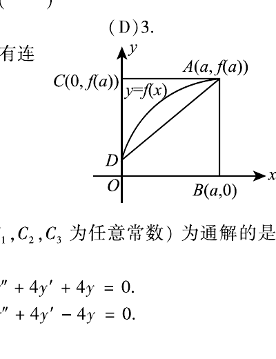

# 2008 年考研数学二真题

资料类型：考研数学二历年真题
年份：2008
科目：数学二
整理状态：按合集卷页图校对并统一转写。

**第 1-8 题题图**

## 第 1 题
- 题型：选择题
- 分值：4
- 模块：高等数学
- 考点：罗尔定理、导数零点

设函数
$$
f(x)=x^2(x-1)(x-2),
$$
则 $f'(x)$ 的零点个数为（ ）

A. $0$  B. $1$  C. $2$  D. $3$

## 第 2 题
- 题型：选择题
- 分值：4
- 模块：高等数学
- 考点：定积分几何意义、分部积分

如图，曲线段的方程为 $y=f(x)$，函数 $f(x)$ 在区间 $[0,a]$ 上有连续的导数，则
$$
\int_0^a xf'(x)\,dx
$$
等于（ ）

A. 曲边梯形 $ABOD$ 的面积
B. 梯形 $ABOD$ 的面积
C. 曲边三角形 $ACD$ 的面积
D. 三角形 $ACD$ 的面积

## 第 3 题
- 题型：选择题
- 分值：4
- 模块：高等数学
- 考点：常系数线性微分方程、特征方程

在下列微分方程中，以
$$
y=C_1e^x+C_2\cos2x+C_3\sin2x
$$
为通解的是（ ）

A. $y'''+y''-4y'-4y=0$
B. $y'''+y''+4y'+4y=0$
C. $y'''-y''-4y'+4y=0$
D. $y'''-y''+4y'-4y=0$

## 第 4 题
- 题型：选择题
- 分值：4
- 模块：高等数学
- 考点：间断点、极限

设函数
$$
f(x)=\frac{\ln|x|}{|x-1|}\sin x,
$$
则 $f(x)$ 有（ ）

A. $1$ 个可去间断点，$1$ 个跳跃间断点
B. $1$ 个可去间断点，$1$ 个无穷间断点
C. $2$ 个跳跃间断点
D. $2$ 个无穷间断点

## 第 5 题
- 题型：选择题
- 分值：4
- 模块：高等数学
- 考点：单调有界函数、数列极限

设函数 $f(x)$ 在 $(-\infty,+\infty)$ 内单调有界，$\{x_n\}$ 为数列，下列命题正确的是（ ）

A. 若 $\{x_n\}$ 收敛，则 $\{f(x_n)\}$ 收敛
B. 若 $\{x_n\}$ 单调，则 $\{f(x_n)\}$ 收敛
C. 若 $\{f(x_n)\}$ 收敛，则 $\{x_n\}$ 收敛
D. 若 $\{f(x_n)\}$ 单调，则 $\{x_n\}$ 收敛

## 第 6 题
- 题型：选择题
- 分值：4
- 模块：高等数学
- 考点：二重积分、变上限积分

设函数 $f$ 连续。若
$$
F(u,v)=\iint_{D_{uv}}\frac{f(x^2+y^2)}{\sqrt{x^2+y^2}}\,dx\,dy,
$$
其中区域 $D_{uv}$ 为图中阴影部分，则
$$
\frac{\partial F}{\partial u}=(\ \ )
$$

A. $vf(u^2)$
B. $\dfrac{v}{u}f(u^2)$
C. $v f(u)$
D. $\dfrac{v}{u}f(u)$

## 第 7 题
- 题型：选择题
- 分值：4
- 模块：线性代数
- 考点：矩阵可逆、幂零矩阵

设 $A$ 为 $n$ 阶非零矩阵，$E$ 为 $n$ 阶单位阵。若 $A^3=O$，则（ ）

A. $E-A$ 不可逆，$E+A$ 不可逆
B. $E-A$ 不可逆，$E+A$ 可逆
C. $E-A$ 可逆，$E+A$ 可逆
D. $E-A$ 可逆，$E+A$ 不可逆

## 第 8 题
- 题型：选择题
- 分值：4
- 模块：线性代数
- 考点：矩阵合同、实对称矩阵

设
$$
A=\begin{pmatrix}1&2\\2&1\end{pmatrix},
$$
则在实数域上与 $A$ 合同的矩阵为（ ）

A. $\begin{pmatrix}-2&1\\1&-2\end{pmatrix}$
B. $\begin{pmatrix}2&-1\\-1&2\end{pmatrix}$
C. $\begin{pmatrix}2&1\\1&2\end{pmatrix}$
D. $\begin{pmatrix}1&-2\\-2&1\end{pmatrix}$

**第 9-21 题题图**

## 第 9 题
- 题型：填空题
- 分值：4
- 模块：高等数学
- 考点：极限、连续性

已知函数 $f(x)$ 连续，且
$$
\lim_{x\to0}\frac{1-\cos[xf(x)]}{(e^{x^2}-1)f(x)}=1,
$$
则 $f(0)=$ ________。

## 第 10 题
- 题型：填空题
- 分值：4
- 模块：高等数学
- 考点：一阶微分方程、线性方程

微分方程
$$
(y+x^2e^{-x})\,dx-x\,dy=0
$$
的通解是 $y=$ ________。

## 第 11 题
- 题型：填空题
- 分值：4
- 模块：高等数学
- 考点：隐函数、切线方程

曲线
$$
\sin(xy)+\ln(y-x)=x
$$
在点 $(0,1)$ 处的切线方程是 ________。

## 第 12 题
- 题型：填空题
- 分值：4
- 模块：高等数学
- 考点：拐点、导数

曲线
$$
y=(x-5)x^{2/3}
$$
的拐点坐标为 ________。

## 第 13 题
- 题型：填空题
- 分值：4
- 模块：高等数学
- 考点：多元复合函数、偏导数

设
$$
z=\left(\frac yx\right)^{x/y},
$$
则
$$
\left.\frac{\partial z}{\partial x}\right|_{(1,2)}
=\underline{\qquad}.
$$

## 第 14 题
- 题型：填空题
- 分值：4
- 模块：线性代数
- 考点：特征值、行列式

设 $3$ 阶矩阵 $A$ 的特征值为 $2,3,\lambda$。若行列式 $|2A|=-48$，则 $\lambda=$ ________。

## 第 15 题
- 题型：解答题
- 分值：9
- 模块：高等数学
- 考点：极限、Taylor 展开

求极限
$$
\lim_{x\to0}\frac{[\sin x-\sin(\sin x)]\sin x}{x^4}.
$$

## 第 16 题
- 题型：解答题
- 分值：10
- 模块：高等数学
- 考点：参数方程、二阶导数

设函数 $y=y(x)$ 由参数方程
$$
\begin{cases}
x=x(t),\\
y=\int_0^{t^2}\ln(1+u)\,du
\end{cases}
$$
确定，其中 $x(t)$ 是初值问题
$$
\begin{cases}
\dfrac{dx}{dt}-2te^{-x}=0,\\
x|_{t=0}=0
\end{cases}
$$
的解，求 $\dfrac{d^2y}{dx^2}$。

## 第 17 题
- 题型：解答题
- 分值：9
- 模块：高等数学
- 考点：反常积分、换元积分

计算
$$
\int_0^1\frac{x^2\arcsin x}{\sqrt{1-x^2}}\,dx.
$$

## 第 18 题
- 题型：解答题
- 分值：11
- 模块：高等数学
- 考点：二重积分、分区域积分

计算
$$
\iint_D \max\{xy,1\}\,dx\,dy,
$$
其中
$$
D=\{(x,y)\mid 0\le x\le2,\ 0\le y\le2\}.
$$

## 第 19 题
- 题型：解答题
- 分值：11
- 模块：高等数学
- 考点：微分方程、旋转体侧面积

设 $f(x)$ 是区间 $[0,+\infty)$ 上具有连续导数的单调增加函数，且 $f(0)=1$。
对任意 $t\in[0,+\infty)$，直线 $x=0,\ x=t$，曲线 $y=f(x)$ 以及 $x$ 轴所围成的曲边梯形绕 $x$ 轴旋转一周生成一旋转体。
若该旋转体的侧面积在数值上等于其体积的 $2$ 倍，求函数 $f(x)$ 的表达式。

## 第 20 题
- 题型：证明题
- 分值：11
- 模块：高等数学
- 考点：积分中值定理、拉格朗日中值定理

（Ⅰ）证明积分中值定理：若函数 $f(x)$ 在闭区间 $[a,b]$ 上连续，则至少存在一点 $\eta\in[a,b]$，使
$$
\int_a^b f(x)\,dx=f(\eta)(b-a).
$$

（Ⅱ）若函数 $\varphi(x)$ 具有二阶导数，且满足 $\varphi(2)>\varphi(1),\ \varphi(2)>\int_2^3\varphi(x)\,dx$，
则至少存在一点 $\xi\in(1,3)$，使得 $\varphi''(\xi)<0$。

## 第 21 题
- 题型：解答题
- 分值：11
- 模块：高等数学
- 考点：条件极值、拉格朗日乘数法

求函数
$$
u=x^2+y^2+z^2
$$
在约束条件
$$
z=x^2+y^2,\qquad x+y+z=4
$$
下的最大值与最小值。

**第 22-23 题题图**

## 第 22 题
- 题型：解答题
- 分值：12
- 模块：线性代数
- 考点：行列式、线性方程组

设 $n$ 元线性方程组 $Ax=b$，其中
$$
A=
\begin{pmatrix}
2a&1\\
a^2&2a&1\\
&a^2&2a&1\\
&&\ddots&\ddots&\ddots\\
&&&a^2&2a&1\\
&&&&a^2&2a
\end{pmatrix},
\qquad
b=
\begin{pmatrix}
1\\0\\ \vdots\\0
\end{pmatrix}.
$$

（Ⅰ）证明行列式 $|A|=(n+1)a^n$；

（Ⅱ）当 $a$ 为何值时，该方程组有唯一解，并求 $x_1$；

（Ⅲ）当 $a$ 为何值时，该方程组有无穷多解，并求通解。

## 第 23 题
- 题型：解答题
- 分值：10
- 模块：线性代数
- 考点：特征向量、Jordan 标准形

设 $A$ 为 $3$ 阶矩阵，$\alpha_1,\alpha_2$ 为 $A$ 的分别属于特征值 $-1,1$ 的特征向量，向量 $\alpha_3$ 满足
$$
A\alpha_3=\alpha_2+\alpha_3.
$$

（Ⅰ）证明 $\alpha_1,\alpha_2,\alpha_3$ 线性无关；

（Ⅱ）令 $P=(\alpha_1,\alpha_2,\alpha_3)$，求 $P^{-1}AP$。
