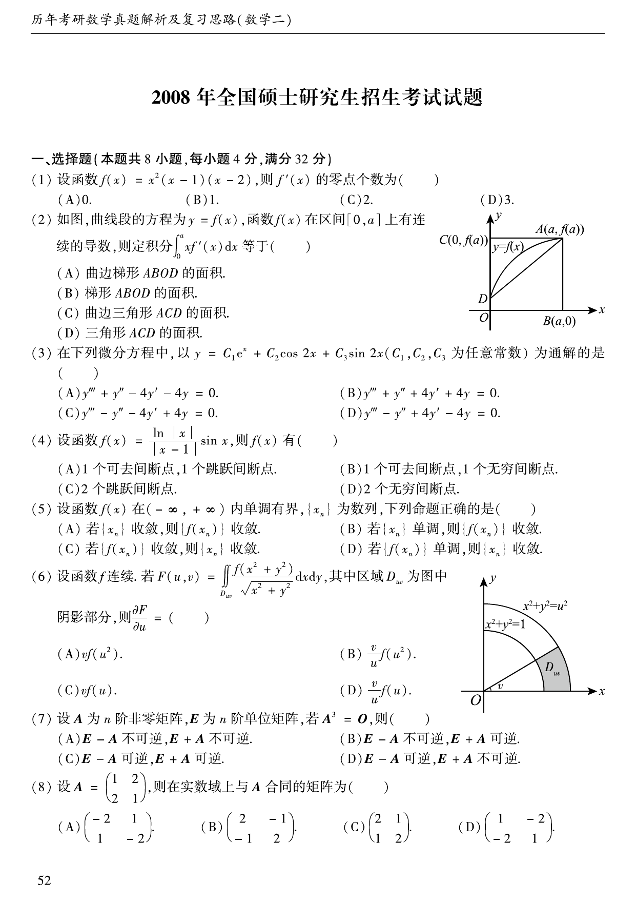

# 2008 数学二第 4 题

## 题目

设函数
$$
f(x)=\frac{\ln|x|}{|x-1|}\sin x,
$$
则 $f(x)$ 有（ ）

A. $1$ 个可去间断点，$1$ 个跳跃间断点
B. $1$ 个可去间断点，$1$ 个无穷间断点
C. $2$ 个跳跃间断点
D. $2$ 个无穷间断点

## 标准答案

A

## 解析

在 $x=0,1$ 处函数无定义。由
$$
\lim_{x\to0}\ln|x|\sin x=0
$$
可知 $x=0$ 是可去间断点；而 $x\to1^\pm$ 时左右极限存在但不相等，所以 $x=1$ 是跳跃间断点，选 A。

## 来源

- 题目来源：`math2_2008_questions.md`
- 答案来源：`math2_2008_answers.md`
