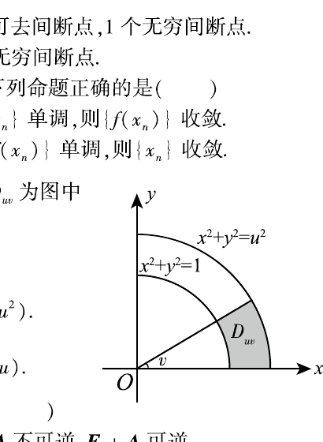

# 2008 数学二第 6 题

## 题目

设函数 $f$ 连续。若
$$
F(u,v)=\iint_{D_{uv}}\frac{f(x^2+y^2)}{\sqrt{x^2+y^2}}\,dx\,dy,
$$
其中区域 $D_{uv}$ 为图中阴影部分，则
$$
\frac{\partial F}{\partial u}=(\ \ )
$$

A. $vf(u^2)$
B. $\dfrac{v}{u}f(u^2)$
C. $v f(u)$
D. $\dfrac{v}{u}f(u)$

## 标准答案

A

## 解析

改用极坐标，区域为 $1\le r\le u,\ 0\le\theta\le v$，故
$$
F(u,v)=\int_0^v\int_1^u f(r^2)\,dr\,d\theta
=v\int_1^u f(r^2)\,dr.
$$
对 $u$ 求导即得
$$
\frac{\partial F}{\partial u}=vf(u^2).
$$

## 来源

- 题目来源：`math2_2008_questions.md`
- 答案来源：`math2_2008_answers.md`
