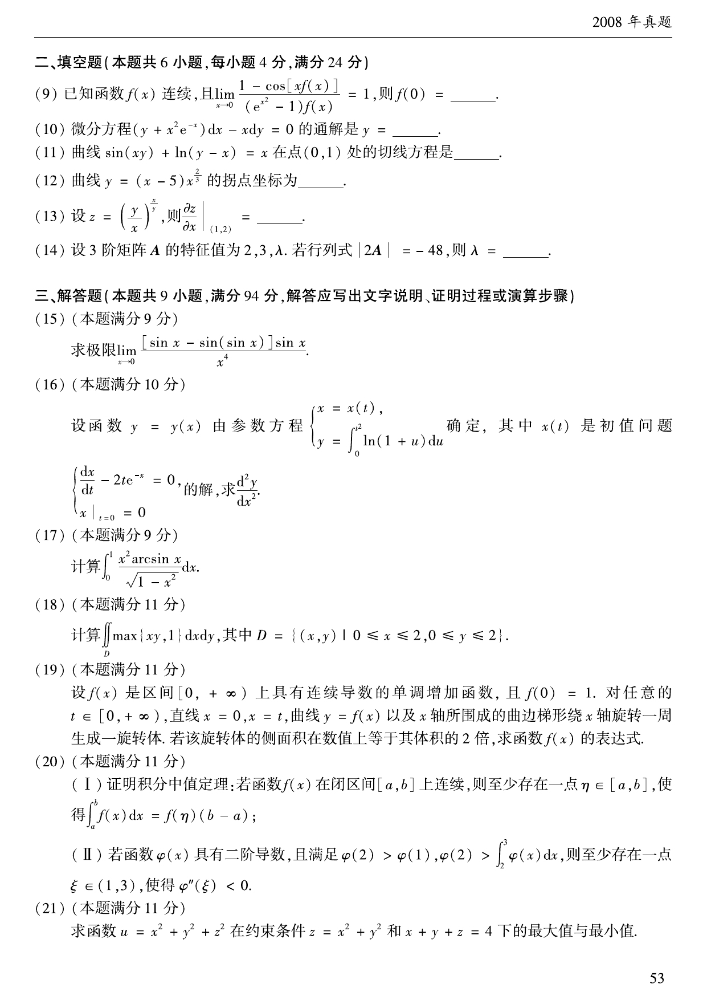

# 2008 数学二第 15 题

## 题目

求极限
$$
\lim_{x\to0}\frac{[\sin x-\sin(\sin x)]\sin x}{x^4}.
$$

## 标准答案

$\dfrac16$

## 解析

由
$$
\sin x=x-\frac{x^3}{6}+o(x^3),\qquad
\sin(\sin x)=\sin x-\frac{\sin^3x}{6}+o(x^3),
$$
得
$$
\sin x-\sin(\sin x)=\frac{x^3}{6}+o(x^3).
$$
再乘以 $\sin x\sim x$，所以原式极限为 $\dfrac16$。

## 来源

- 题目来源：`math2_2008_questions.md`
- 答案来源：`math2_2008_answers.md`
