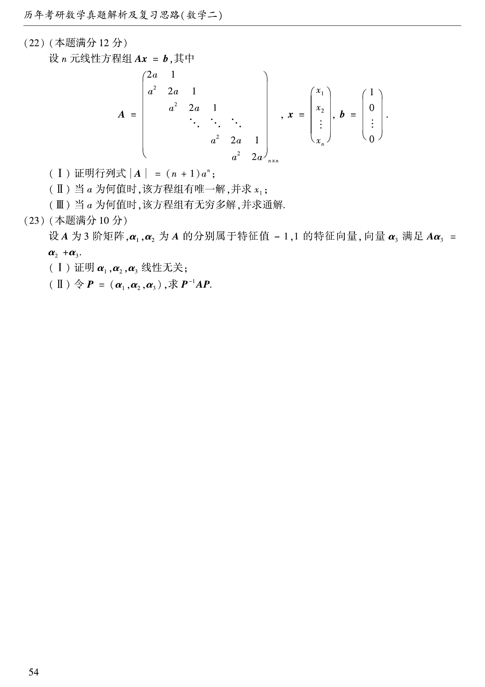

# 2008 数学二第 22 题

## 题目

设 $n$ 元线性方程组 $Ax=b$，其中
$$
A=
\begin{pmatrix}
2a&1\\
a^2&2a&1\\
&a^2&2a&1\\
&&\ddots&\ddots&\ddots\\
&&&a^2&2a&1\\
&&&&a^2&2a
\end{pmatrix},
\qquad
b=
\begin{pmatrix}
1\\0\\ \vdots\\0
\end{pmatrix}.
$$

（Ⅰ）证明行列式 $|A|=(n+1)a^n$；

（Ⅱ）当 $a$ 为何值时，该方程组有唯一解，并求 $x_1$；

（Ⅲ）当 $a$ 为何值时，该方程组有无穷多解，并求通解。

## 标准答案

见解析

## 解析

记 $D_n=|A|$，按第一列或用递推可证
$$
D_n=(n+1)a^n.
$$
因而当且仅当 $a\ne0$ 时，$D_n\ne0$，方程组有唯一解。由克拉默法则可得
$$
x_1=\frac{n}{(n+1)a}.
$$
当 $a=0$ 时，系数矩阵与增广矩阵秩同为 $n-1$，故有无穷多解；通解可写成
$$
x_1=1,\ x_2=t,\ x_3=-t,\ \ldots
$$
的等价参数形式，其中保留一个自由参数。

## 来源

- 题目来源：`math2_2008_questions.md`
- 答案来源：`math2_2008_answers.md`
