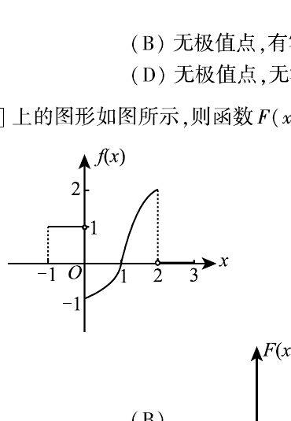

# 2009 年考研数学二真题

资料类型：考研数学二历年真题
年份：2009
科目：数学二
整理状态：按试卷页图校对并统一转写。

**第 1-6 题题图**

## 第 1 题
- 题型：选择题
- 分值：4
- 模块：高等数学
- 考点：可去间断点、极限

函数
$$
f(x)=\frac{x-x^3}{\sin \pi x}
$$
的可去间断点的个数为（ ）

A. $1$
B. $2$
C. $3$
D. 无穷多个

## 第 2 题
- 题型：选择题
- 分值：4
- 模块：高等数学
- 考点：等价无穷小、Taylor 展开

当 $x\to 0$ 时，
$$
f(x)=x-\sin ax,\qquad g(x)=x^2\ln(1-bx)
$$
是等价无穷小量，则（ ）

A. $a=1,\ b=-\dfrac16$
B. $a=1,\ b=\dfrac16$
C. $a=-1,\ b=-\dfrac16$
D. $a=-1,\ b=\dfrac16$

## 第 3 题
- 题型：选择题
- 分值：4
- 模块：高等数学
- 考点：全微分、多元函数极值

设函数 $z=f(x,y)$ 的全微分为
$$
dz=x\,dx+y\,dy,
$$
则点 $(0,0)$（ ）

A. 不是 $f(x,y)$ 的连续点
B. 不是 $f(x,y)$ 的极值点
C. 是 $f(x,y)$ 的极大值点
D. 是 $f(x,y)$ 的极小值点

## 第 4 题
- 题型：选择题
- 分值：4
- 模块：高等数学
- 考点：二重积分、积分区域化简

设函数 $f(x,y)$ 连续，则
$$
\int_1^2 dx\int_x^2 f(x,y)\,dy+\int_1^2 dy\int_y^{4-y} f(x,y)\,dx
=(\ \ )
$$

A. $\int_1^2 dx\int_1^{4-x} f(x,y)\,dy$

B. $\int_1^2 dx\int_x^{4-x} f(x,y)\,dy$

C. $\int_1^2 dy\int_1^{4-y} f(x,y)\,dx$

D. $\int_1^2 dy\int_y^2 f(x,y)\,dx$

## 第 5 题
- 题型：选择题
- 分值：4
- 模块：高等数学
- 考点：曲率、单调性与零点

若 $f''(x)$ 不变号，且曲线 $y=f(x)$ 在点 $(1,1)$ 处的曲率圆为
$$
x^2+y^2=2,
$$
则函数 $f(x)$ 在区间 $(1,2)$ 内（ ）

A. 有极值点，无零点
B. 无极值点，有零点
C. 有极值点，有零点
D. 无极值点，无零点

**第 6-16 题题图**

## 第 6 题
- 题型：选择题
- 分值：4
- 模块：高等数学
- 考点：积分上限函数、函数图像

设函数 $y=f(x)$ 在区间 $[-1,3]$ 上的图形如图所示，则函数
$$
F(x)=\int_0^x f(t)\,dt
$$
的图形为（ ）

题图见下方裁图；四个选项图见原始试卷页图。

## 第 7 题
- 题型：选择题
- 分值：4
- 模块：线性代数
- 考点：伴随矩阵、分块矩阵

设 $A,B$ 均为 $2$ 阶方阵，$A^*,B^*$ 分别为 $A,B$ 的伴随矩阵。若 $|A|=2,\ |B|=3$，
则分块矩阵
$$
\begin{pmatrix}
O & A\\
B & O
\end{pmatrix}
$$
的伴随矩阵为（ ）

A. $\begin{pmatrix}O & 3B^*\\ 2A^* & O\end{pmatrix}$

B. $\begin{pmatrix}O & 2B^*\\ 3A^* & O\end{pmatrix}$

C. $\begin{pmatrix}O & 3A^*\\ 2B^* & O\end{pmatrix}$

D. $\begin{pmatrix}O & 2A^*\\ 3B^* & O\end{pmatrix}$

## 第 8 题
- 题型：选择题
- 分值：4
- 模块：线性代数
- 考点：二次型、合同变换

设 $A,P$ 均为 $3$ 阶矩阵，$P^T$ 为 $P$ 的转置矩阵，且
$$
P^TAP=
\begin{pmatrix}
1&0&0\\
0&1&0\\
0&0&2
\end{pmatrix}.
$$
若 $P=(\alpha_1,\alpha_2,\alpha_3)$，
$$
Q=(\alpha_1+\alpha_2,\alpha_2,\alpha_3),
$$
则 $Q^TAQ$ 为（ ）

A. $\begin{pmatrix}2&1&0\\1&1&0\\0&0&2\end{pmatrix}$

B. $\begin{pmatrix}1&1&0\\1&2&0\\0&0&2\end{pmatrix}$

C. $\begin{pmatrix}2&0&0\\0&1&0\\0&0&2\end{pmatrix}$

D. $\begin{pmatrix}1&0&0\\0&2&0\\0&0&2\end{pmatrix}$

## 第 9 题
- 题型：填空题
- 分值：4
- 模块：高等数学
- 考点：参数方程、切线方程

曲线
$$
\begin{cases}
x=\int_0^{1-t} e^{-u^2}\,du,\\
y=t^2\ln(2-t^2)
\end{cases}
$$
在点 $(0,0)$ 处的切线方程为 ________。

## 第 10 题
- 题型：填空题
- 分值：4
- 模块：高等数学
- 考点：反常积分、偶函数

已知
$$
\int_{-\infty}^{+\infty} e^{k|x|}\,dx=1,
$$
则 $k=$ ________。

## 第 11 题
- 题型：填空题
- 分值：4
- 模块：高等数学
- 考点：定积分极限、分部积分

$$
\lim_{n\to\infty}\int_0^1 e^{-x}\sin(nx)\,dx
=\underline{\qquad}.
$$

## 第 12 题
- 题型：填空题
- 分值：4
- 模块：高等数学
- 考点：隐函数求导、二阶导数

设 $y=y(x)$ 是由方程
$$
xy+e^y=x+1
$$
确定的隐函数，则
$$
\left.\frac{d^2y}{dx^2}\right|_{x=0}
=\underline{\qquad}.
$$

## 第 13 题
- 题型：填空题
- 分值：4
- 模块：高等数学
- 考点：最值、对数求导

函数
$$
y=x^{2x}
$$
在区间 $(0,1]$ 上的最小值为 ________。

## 第 14 题
- 题型：填空题
- 分值：4
- 模块：线性代数
- 考点：矩阵相似、迹

设 $\alpha,\beta$ 为 $3$ 维列向量，$\beta^T$ 为 $\beta$ 的转置。若矩阵 $\alpha\beta^T$
相似于
$$
\begin{pmatrix}
2&0&0\\
0&0&0\\
0&0&0
\end{pmatrix},
$$
则 $\beta^T\alpha=$ ________。

## 第 15 题
- 题型：解答题
- 分值：9
- 模块：高等数学
- 考点：极限、无穷小展开

求极限
$$
\lim_{x\to 0}\frac{(1-\cos x)\,[x-\ln(1+\tan x)]}{\sin^4 x}.
$$

## 第 16 题
- 题型：解答题
- 分值：10
- 模块：高等数学
- 考点：不定积分、换元积分

计算不定积分
$$
\int \ln\!\left(1+\sqrt{\frac{1+x}{x}}\right)\,dx\qquad (x>0).
$$

**第 17-23 题题图**

## 第 17 题
- 题型：解答题
- 分值：10
- 模块：高等数学
- 考点：多元复合函数、链式法则

设
$$
z=f(x+y,\ x-y,\ xy),
$$
其中 $f$ 具有二阶连续偏导数，求 $dz$ 与
$$
\frac{\partial^2 z}{\partial x\,\partial y}.
$$

## 第 18 题
- 题型：解答题
- 分值：10
- 模块：高等数学
- 考点：微分方程、旋转体体积

设非负函数 $y=y(x)\ (x\ge 0)$ 满足微分方程
$$
xy''-y'+2=0.
$$
当曲线 $y=y(x)$ 过原点时，其与直线 $x=1$ 及 $y=0$ 围成平面区域 $D$ 的面积为 $2$，
求 $D$ 绕 $y$ 轴旋转所得旋转体体积。

## 第 19 题
- 题型：解答题
- 分值：10
- 模块：高等数学
- 考点：二重积分、极坐标

计算二重积分
$$
\iint_D (x-y)\,dx\,dy,
$$
其中
$$
D=\{(x,y)\mid (x-1)^2+(y-1)^2\le 2,\ y\ge x\}.
$$

## 第 20 题
- 题型：解答题
- 分值：12
- 模块：高等数学
- 考点：微分方程、分段函数

设 $y=y(x)$ 是区间 $(-\pi,\pi)$ 内过点
$$
\left(-\frac{\pi}{\sqrt2},\ \frac{\pi}{\sqrt2}\right)
$$
的光滑曲线。当 $-\pi<x<0$ 时，曲线上任一点处的法线都过原点；
当 $0\le x<\pi$ 时，函数 $y(x)$ 满足
$$
y''+y+x=0.
$$
求 $y(x)$ 的表达式。

## 第 21 题
- 题型：证明题
- 分值：11
- 模块：高等数学
- 考点：拉格朗日中值定理、导数定义

（Ⅰ）证明拉格朗日中值定理：若函数 $f(x)$ 在 $[a,b]$ 上连续，在 $(a,b)$ 内可导，
则存在点 $\xi\in(a,b)$，使得
$$
f(b)-f(a)=f'(\xi)(b-a).
$$

（Ⅱ）证明：若函数 $f(x)$ 在 $x=0$ 处连续，在 $(0,\delta)\ (\delta>0)$ 内可导，
且
$$
\lim_{x\to0^+}f'(x)=A,
$$
则 $f_+'(0)$ 存在，且 $f_+'(0)=A$。

## 第 22 题
- 题型：解答题
- 分值：11
- 模块：线性代数
- 考点：线性方程组、线性无关

设
$$
A=
\begin{pmatrix}
1&-1&-1\\
-1&1&1\\
0&-4&-2
\end{pmatrix},
\qquad
\xi_1=
\begin{pmatrix}
-1\\
1\\
-2
\end{pmatrix}.
$$

（Ⅰ）求满足
$$
A\xi_2=\xi_1,\qquad A^2\xi_3=\xi_1
$$
的所有向量 $\xi_2,\xi_3$；

（Ⅱ）对（Ⅰ）中的任意向量 $\xi_2,\xi_3$，证明 $\xi_1,\xi_2,\xi_3$ 线性无关。

## 第 23 题
- 题型：解答题
- 分值：11
- 模块：线性代数
- 考点：二次型、特征值

设二次型
$$
f(x_1,x_2,x_3)=ax_1^2+ax_2^2+(a-1)x_3^2+2x_1x_3-2x_2x_3.
$$

（Ⅰ）求二次型 $f$ 的矩阵的所有特征值；

（Ⅱ）若二次型 $f$ 的规范形为
$$
y_1^2+y_2^2,
$$
求 $a$ 的值。
