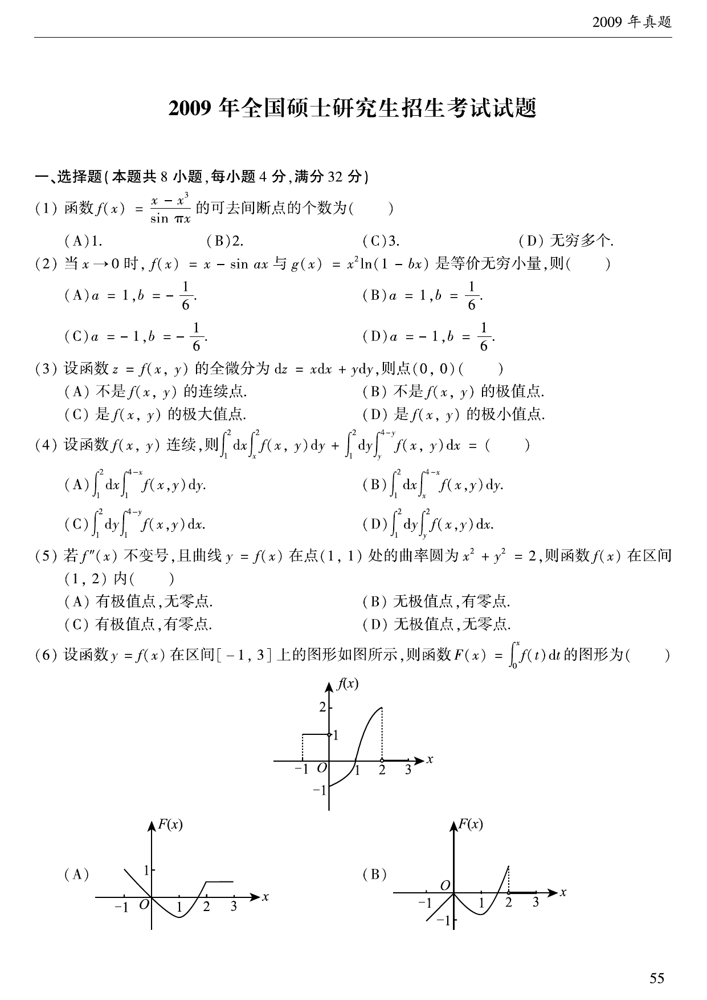

# 2009 数学二第 5 题

## 题目

若 $f''(x)$ 不变号，且曲线 $y=f(x)$ 在点 $(1,1)$ 处的曲率圆为
$$
x^2+y^2=2,
$$
则函数 $f(x)$ 在区间 $(1,2)$ 内（ ）

A. 有极值点，无零点
B. 无极值点，有零点
C. 有极值点，有零点
D. 无极值点，无零点

## 标准答案

B

## 解析

曲率圆圆心在原点，且过点 $(1,1)$，可得该点切线斜率为 $-1$，并由曲率公式求得
$$
f'(1)=-1,\qquad f''(1)<0.
$$
又 $f''(x)$ 不变号，因此在 $[1,2]$ 上始终有 $f'(x)<0$，函数单调递减，
不会出现极值点。由于 $f(1)=1>0$，而由单调性与曲率信息可知 $f(2)<0$，
由零点定理知在 $(1,2)$ 内有零点。

## 来源

- 题目来源：`math2_2009_questions.md`
- 答案来源：`math2_2009_answers.md`
