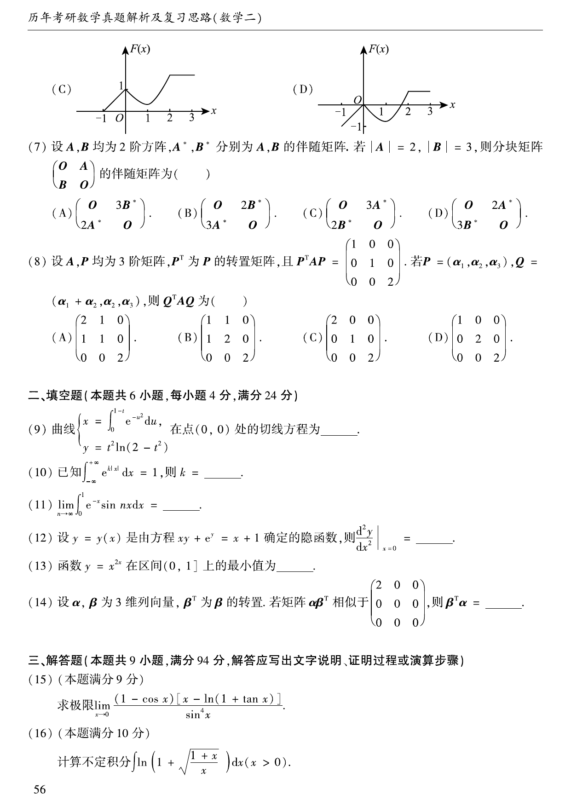

# 2009 数学二第 14 题

## 题目

设 $\alpha,\beta$ 为 $3$ 维列向量，$\beta^T$ 为 $\beta$ 的转置。若矩阵 $\alpha\beta^T$
相似于
$$
\begin{pmatrix}
2&0&0\\
0&0&0\\
0&0&0
\end{pmatrix},
$$
则 $\beta^T\alpha=$ \underline{\qquad}。

## 标准答案

$2$

## 解析

相似矩阵有相同的迹，而
$$
\operatorname{tr}(\alpha\beta^T)=\beta^T\alpha.
$$
已知相似矩阵的迹为 $2$，故
$$
\beta^T\alpha=2.
$$

## 来源

- 题目来源：`math2_2009_questions.md`
- 答案来源：`math2_2009_answers.md`
