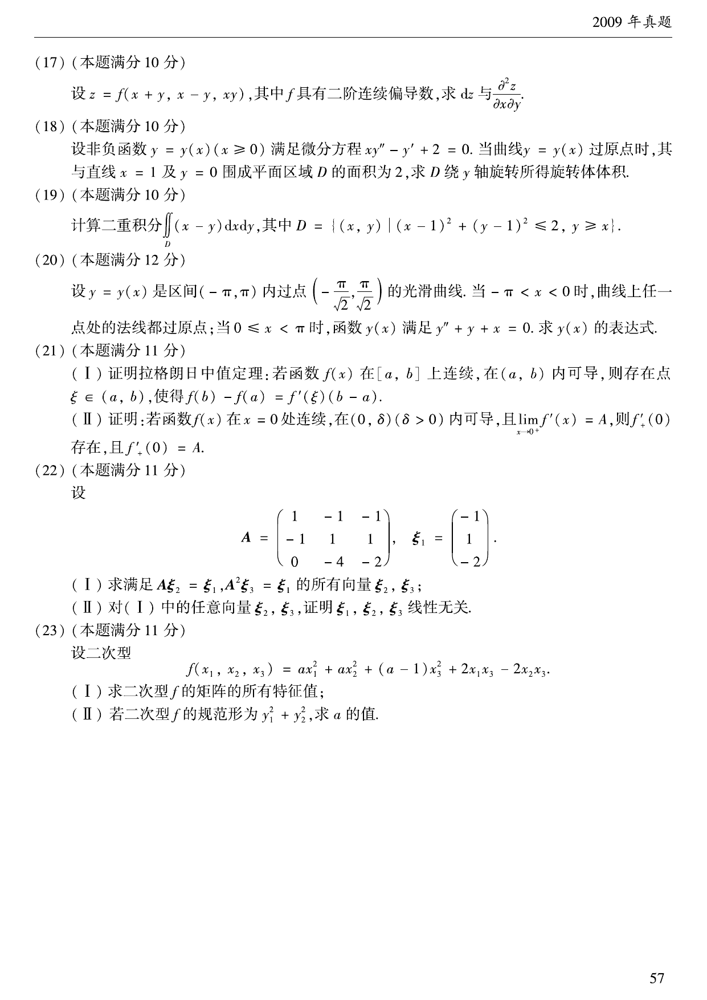

# 2009 数学二第 22 题

## 题目

设
$$
A=
\begin{pmatrix}
1&-1&-1\\
-1&1&1\\
0&-4&-2
\end{pmatrix},
\qquad
\xi_1=
\begin{pmatrix}
-1\\
1\\
-2
\end{pmatrix}.
$$

（Ⅰ）求满足
$$
A\xi_2=\xi_1,\qquad A^2\xi_3=\xi_1
$$
的所有向量 $\xi_2,\xi_3$；

（Ⅱ）对（Ⅰ）中的任意向量 $\xi_2,\xi_3$，证明 $\xi_1,\xi_2,\xi_3$ 线性无关。

## 标准答案

$$
\xi_2=
\begin{pmatrix}
1\\-1\\0
\end{pmatrix}
+k_1
\begin{pmatrix}
1\\1\\0
\end{pmatrix},
\qquad
\xi_3=
\begin{pmatrix}
0\\0\\2
\end{pmatrix}
+k_2
\begin{pmatrix}
1\\1\\0
\end{pmatrix},
\quad k_1,k_2\in\mathbb R.
$$
且任意此类 $\xi_2,\xi_3$ 与 $\xi_1$ 线性无关。

## 解析

解线性方程组 $A\xi_2=\xi_1$，可得其通解为
$$
\xi_2=
\begin{pmatrix}
1\\-1\\0
\end{pmatrix}
+k_1
\begin{pmatrix}
1\\1\\0
\end{pmatrix}.
$$
再解 $A^2\xi_3=\xi_1$，可先写成 $A(A\xi_3)=\xi_1$，得到
$$
\xi_3=
\begin{pmatrix}
0\\0\\2
\end{pmatrix}
+k_2
\begin{pmatrix}
1\\1\\0
\end{pmatrix}.
$$
对任意 $k_1,k_2$，计算三向量构成的行列式可得
$$
\det(\xi_1,\xi_2,\xi_3)=2\ne0,
$$
因而 $\xi_1,\xi_2,\xi_3$ 线性无关。

## 来源

- 题目来源：`math2_2009_questions.md`
- 答案来源：`math2_2009_answers.md`
