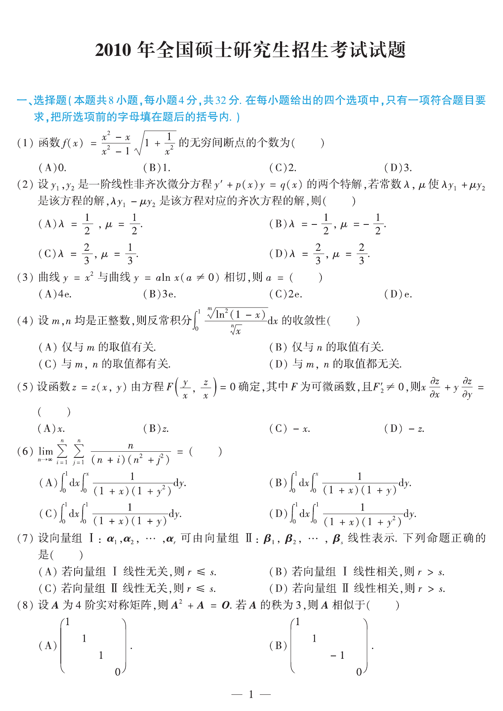
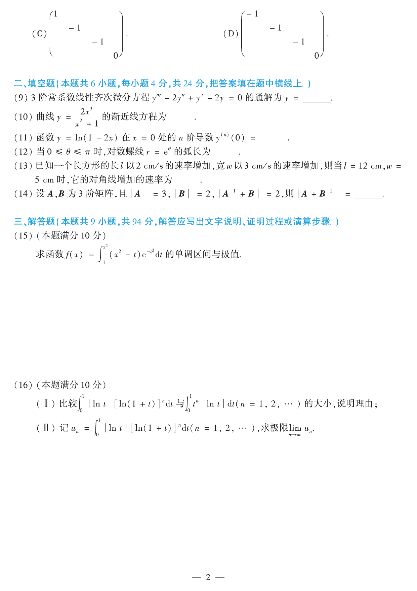
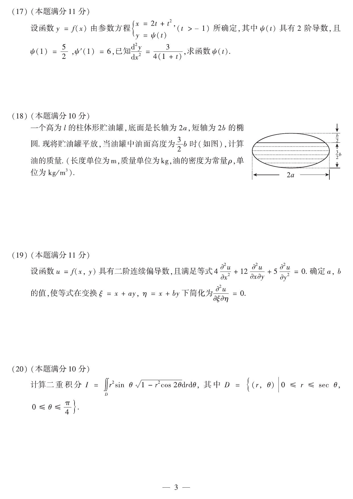
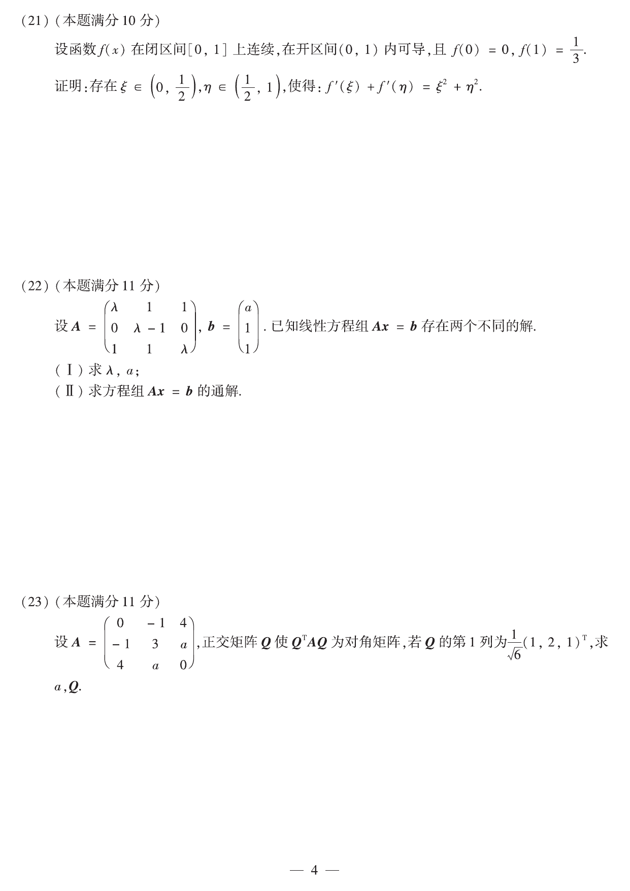

# 2010 年数学二真题

资料类型：考研数学二历年真题
年份：2010
科目：数学二
整理状态：按正式题卡整理并校对。

**第 1-8 题题图**

## 第 1 题
- 题型：choice
- 分值：4
- 模块：高等数学
- 考点：间断点、极限

函数
$$
f(x)=\frac{x^2-x}{x^2-1}\sqrt{1+\frac{1}{x^2}}
$$
的无穷间断点的个数为（  ）  
A. $0$  
B. $1$  
C. $2$  
D. $3$

## 第 2 题
- 题型：choice
- 分值：4
- 模块：高等数学
- 考点：一阶线性微分方程、非齐次方程

设 $y_1,y_2$ 是一阶线性非齐次微分方程
$$
y'+p(x)y=q(x)
$$
的两个特解，若常数 $\lambda,\mu$ 使 $\lambda y_1+\mu y_2$ 是该方程的解，$\lambda y_1-\mu y_2$ 是该方程对应齐次方程的解，则（  ）  
A. $\lambda=\dfrac12,\ \mu=\dfrac12$  
B. $\lambda=-\dfrac12,\ \mu=-\dfrac12$  
C. $\lambda=\dfrac23,\ \mu=\dfrac13$  
D. $\lambda=\dfrac23,\ \mu=\dfrac23$

## 第 3 题
- 题型：choice
- 分值：4
- 模块：高等数学
- 考点：曲线相切、导数

曲线 $y=x^2$ 与曲线 $y=a\ln x\ (a\ne0)$ 相切，则
$$
a=（\ \ ）
$$
A. $4e$  
B. $3e$  
C. $2e$  
D. $e$

## 第 4 题
- 题型：choice
- 分值：4
- 模块：高等数学
- 考点：反常积分、比较判别法

设 $m,n$ 均是正整数，则反常积分
$$
\int_0^1 \frac{\sqrt[m]{\ln^2(1-x)}}{\sqrt[n]{x}}\,dx
$$
的收敛性（  ）  
A. 仅与 $m$ 的取值有关  
B. 仅与 $n$ 的取值有关  
C. 与 $m,n$ 的取值都有关  
D. 与 $m,n$ 的取值都无关

## 第 5 题
- 题型：choice
- 分值：4
- 模块：高等数学
- 考点：隐函数、齐次函数

设函数 $z=z(x,y)$ 由方程
$$
F\!\left(\frac{y}{x},\frac{z}{x}\right)=0
$$
确定，其中 $F$ 为可微函数，且 $F_2'\ne0$，则
$$
x\frac{\partial z}{\partial x}+y\frac{\partial z}{\partial y}=（\ \ ）
$$
A. $x$  
B. $z$  
C. $-x$  
D. $-z$

## 第 6 题
- 题型：choice
- 分值：4
- 模块：高等数学
- 考点：二重积分、Riemann 和

求极限
$$
\lim_{n\to\infty}\sum_{i=1}^n\sum_{j=1}^i\frac{n}{(n+i)(n^2+j^2)}=（\ \ ）
$$
A. $\displaystyle \int_0^1 dx\int_0^x \frac{1}{(1+x)(1+y^2)}\,dy$  
B. $\displaystyle \int_0^1 dx\int_0^x \frac{1}{(1+x)(1+y)}\,dy$  
C. $\displaystyle \int_0^1 dx\int_0^1 \frac{1}{(1+x)(1+y)}\,dy$  
D. $\displaystyle \int_0^1 dx\int_0^1 \frac{1}{(1+x)(1+y^2)}\,dy$

## 第 7 题
- 题型：choice
- 分值：4
- 模块：线性代数
- 考点：向量组、秩

设向量组 I：$\alpha_1,\alpha_2,\ldots,\alpha_r$ 可由向量组 II：$\beta_1,\beta_2,\ldots,\beta_s$ 线性表示。下列命题正确的是（  ）  
A. 若向量组 I 线性无关，则 $r\le s$  
B. 若向量组 I 线性相关，则 $r>s$  
C. 若向量组 II 线性无关，则 $r\le s$  
D. 若向量组 II 线性相关，则 $r>s$

## 第 8 题
- 题型：choice
- 分值：4
- 模块：线性代数
- 考点：特征值、实对称矩阵

设 $A$ 为 $4$ 阶实对称矩阵，且
$$
A^2+A=O.
$$
若 $A$ 的秩为 $3$，则 $A$ 相似于（  ）  
A. $\operatorname{diag}(1,1,1,0)$  
B. $\operatorname{diag}(1,1,-1,0)$  
C. $\operatorname{diag}(1,-1,-1,0)$  
D. $\operatorname{diag}(-1,-1,-1,0)$

**第 9-16 题题图**

## 第 9 题
- 题型：fill_blank
- 分值：4
- 模块：高等数学
- 考点：常系数线性微分方程

$3$ 阶常系数线性齐次微分方程
$$
y'''-2y''+y'-2y=0
$$
的通解为 $y=\underline{\qquad}$。

## 第 10 题
- 题型：fill_blank
- 分值：4
- 模块：高等数学
- 考点：渐近线

曲线
$$
y=\frac{2x^3}{x^2+1}
$$
的渐近线方程为 $\underline{\qquad}$。

## 第 11 题
- 题型：fill_blank
- 分值：4
- 模块：高等数学
- 考点：高阶导数、幂级数

函数
$$
y=\ln(1-2x)
$$
在 $x=0$ 处的 $n$ 阶导数 $y^{(n)}(0)=\underline{\qquad}$。

## 第 12 题
- 题型：fill_blank
- 分值：4
- 模块：高等数学
- 考点：极坐标曲线、弧长

当 $0\le\theta\le\pi$ 时，对数螺线
$$
r=e^{\theta}
$$
的弧长为 $\underline{\qquad}$。

## 第 13 题
- 题型：fill_blank
- 分值：4
- 模块：高等数学
- 考点：相关变化率

已知一个长方形的长 $l$ 以 $2\text{ cm/s}$ 的速率增加，宽 $w$ 以 $3\text{ cm/s}$ 的速率增加，则当 $l=12\text{ cm},\ w=5\text{ cm}$ 时，它的对角线增加的速率为 $\underline{\qquad}$。

## 第 14 题
- 题型：fill_blank
- 分值：4
- 模块：线性代数
- 考点：行列式、矩阵运算

设 $A,B$ 为 $3$ 阶矩阵，且 $|A|=3,\ |B|=2,\ |A^{-1}+B|=2$，则
$$
|A+B^{-1}|=\underline{\qquad}.
$$

## 第 15 题
- 题型：solution
- 分值：10
- 模块：高等数学
- 考点：定积分函数、单调性、极值

求函数
$$
f(x)=\int_1^{x^2}(x^2-t)e^{-t^2}\,dt
$$
的单调区间与极值。

## 第 16 题
- 题型：solution
- 分值：10
- 模块：高等数学
- 考点：定积分估计、极限

(I) 比较
$$
\int_0^1 |\ln t|\,[\ln(1+t)]^n\,dt
$$
与
$$
\int_0^1 t^n|\ln t|\,dt\qquad(n=1,2,\ldots)
$$
的大小，并说明理由；  
(II) 记
$$
u_n=\int_0^1 |\ln t|\,[\ln(1+t)]^n\,dt\qquad(n=1,2,\ldots),
$$
求极限 $\displaystyle \lim_{n\to\infty}nu_n$。

**第 17-20 题题图**

## 第 17 题
- 题型：solution
- 分值：10
- 模块：高等数学
- 考点：参数方程、二阶导数

设函数 $y=f(x)$ 由参数方程
$$
\begin{cases}
x=2t+t^2,\quad t>-1,\\
y=\psi(t)
\end{cases}
$$
所确定，其中 $\psi(t)$ 具有 $2$ 阶导数，且 $\psi(1)=\dfrac52,\ \psi'(1)=6$。已知
$$
\frac{d^2y}{dx^2}=\frac{3}{4(1+t)},
$$
求函数 $\psi(t)$。

## 第 18 题
- 题型：solution
- 分值：10
- 模块：高等数学
- 考点：定积分应用、平面图形面积

一个高为 $l$ 的柱体形贮油罐，底面是长轴为 $2a$、短轴为 $2b$ 的椭圆。现将贮油罐平放，当油罐中油面高度为 $\dfrac{3b}{2}$ 时（如图），计算油的质量。（长度单位为 m，质量单位为 kg，油的密度为常量 $\rho\,\mathrm{kg/m^3}$。）

## 第 19 题
- 题型：solution
- 分值：11
- 模块：高等数学
- 考点：偏微分方程、变量代换

设函数 $u=f(x,y)$ 具有二阶连续偏导数，且满足等式
$$
4u_{xx}+12u_{xy}+5u_{yy}=0,
$$
确定 $a,b$ 的值，使等式在变换
$$
\xi=x+ay,\qquad \eta=x+by
$$
下化简为
$$
u_{\xi\eta}=0.
$$

## 第 20 题
- 题型：solution
- 分值：10
- 模块：高等数学
- 考点：二重积分、极坐标变换

计算二重积分
$$
I=\iint_D r^2\sin\theta\sqrt{1-r^2\cos2\theta}\,drd\theta,
$$
其中
$$
D=\{(r,\theta)\mid 0\le r\le\sec\theta,\ 0\le\theta\le\tfrac\pi4\}.
$$

**第 21-23 题题图**

## 第 21 题
- 题型：solution
- 分值：10
- 模块：高等数学
- 考点：微分中值定理、构造函数

设函数 $f(x)$ 在闭区间 $[0,1]$ 上连续，在开区间 $(0,1)$ 内可导，且 $f(0)=0,\ f(1)=\dfrac13$。证明：存在 $\xi\in\left(0,\dfrac12\right),\ \eta\in\left(\dfrac12,1\right)$，使得
$$
f'(\xi)+f'(\eta)=\xi^2+\eta^2.
$$

## 第 22 题
- 题型：solution
- 分值：11
- 模块：线性代数
- 考点：线性方程组、秩

设
$$
A=\begin{pmatrix}
\lambda & 1 & 1\\
0 & \lambda-1 & 0\\
1 & 1 & \lambda
\end{pmatrix},
\qquad
b=\begin{pmatrix}
a\\
1\\
1
\end{pmatrix},
$$
已知线性方程组 $Ax=b$ 存在两个不同的解。  
(I) 求 $\lambda,a$；  
(II) 求方程组 $Ax=b$ 的通解。

## 第 23 题
- 题型：solution
- 分值：11
- 模块：线性代数
- 考点：实对称矩阵、正交对角化

设
$$
A=\begin{pmatrix}
0 & -1 & 4\\
-1 & 3 & a\\
4 & a & 0
\end{pmatrix},
$$
正交矩阵 $Q$ 使 $Q^TAQ$ 为对角矩阵，若 $Q$ 的第 $1$ 列为
$$
\frac{1}{\sqrt6}(1,2,1)^T,
$$
求 $a,Q$。
