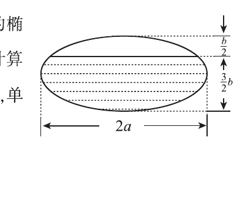

# 2010 数学二第 18 题

## 题目

一个高为 $l$ 的柱体形贮油罐，底面是长轴为 $2a$、短轴为 $2b$ 的椭圆。现将贮油罐平放，当油罐中油面高度为 $\dfrac{3b}{2}$ 时（如图），计算油的质量。（长度单位为 m，质量单位为 kg，油的密度为常量 $\rho\,\mathrm{kg/m^3}$。）

## 标准答案

$M=\rho abl\left(\dfrac{2\pi}{3}+\dfrac{\sqrt3}{4}\right)$

## 解析

椭圆截面方程可写为
$$
\frac{x^2}{a^2}+\frac{y^2}{b^2}=1.
$$
油面高度为 $\dfrac{3b}{2}$，说明顶部尚有一段高度为 $\dfrac{b}{2}$ 的空缺弓形。  
整个椭圆面积为 $\pi ab$。顶部弓形面积为
$$
S_0=2\int_{b/2}^{b} a\sqrt{1-\frac{y^2}{b^2}}\,dy
=2ab\int_{1/2}^{1}\sqrt{1-u^2}\,du
=ab\left(\frac{\pi}{3}-\frac{\sqrt3}{4}\right).
$$
因此油的截面积
$$
S=\pi ab-S_0
=ab\left(\frac{2\pi}{3}+\frac{\sqrt3}{4}\right).
$$
体积 $V=Sl$，故油的质量为
$$
M=\rho V=\rho abl\left(\frac{2\pi}{3}+\frac{\sqrt3}{4}\right).
$$

## 来源

- 题目来源：`math2_2010_questions.md`
- 答案来源：`math2_2010_answers.md`
