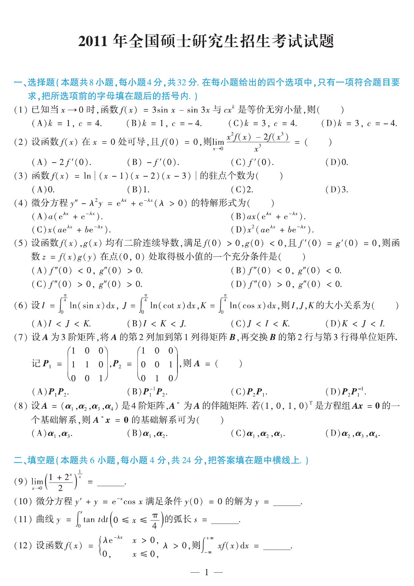
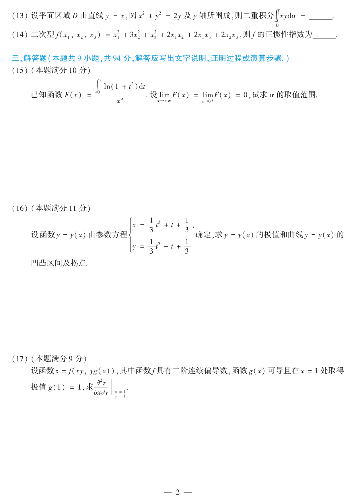
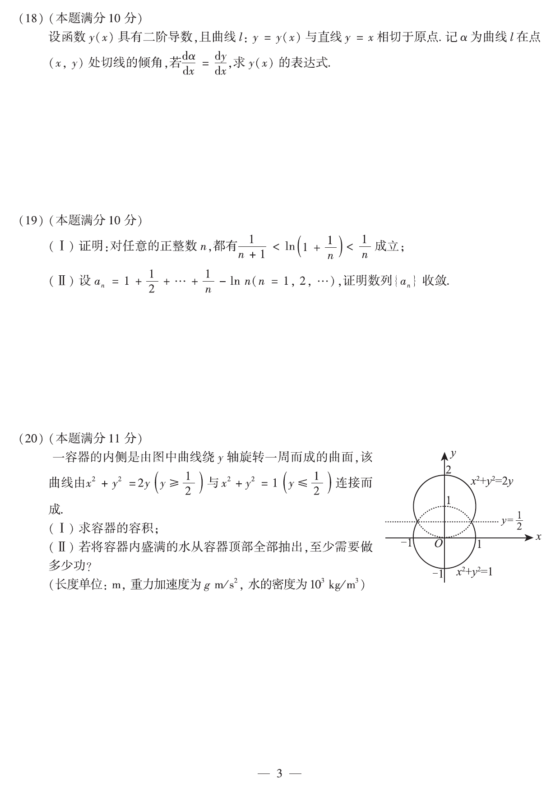
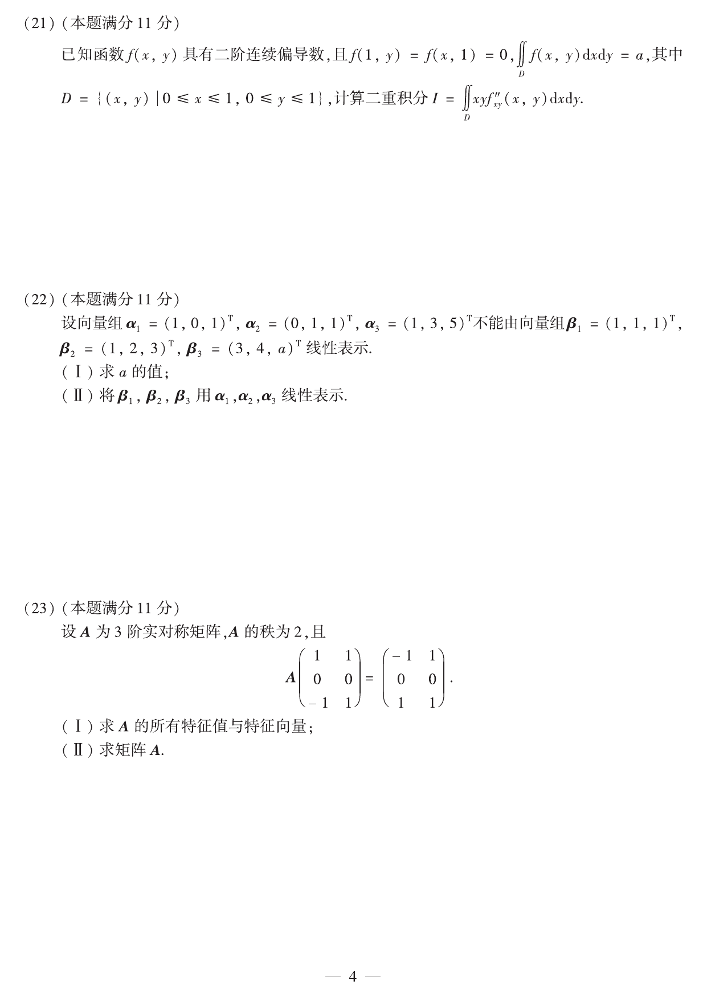

# 2011 年数学二真题

资料类型：考研数学二历年真题
年份：2011
科目：数学二
整理状态：按正式题卡整理并校对。

**第 1-12 题题图**

## 第 1 题
- 题型：choice
- 分值：4
- 模块：高等数学
- 考点：等价无穷小、Taylor 展开

已知当 $x\to0$ 时，函数
$$
f(x)=3\sin x-\sin 3x
$$
与 $cx^k$ 是等价无穷小，则（  ）  
A. $k=1,\ c=4$  
B. $k=1,\ c=-4$  
C. $k=3,\ c=4$  
D. $k=3,\ c=-4$

## 第 2 题
- 题型：choice
- 分值：4
- 模块：高等数学
- 考点：导数定义、极限

设函数 $f(x)$ 在 $x=0$ 处可导，且 $f(0)=0$，则
$$
\lim_{x\to0}\frac{x^2f(x)-2f(x^3)}{x^3}=（\ \ ）
$$
A. $-2f'(0)$  
B. $-f'(0)$  
C. $f'(0)$  
D. $0$

## 第 3 题
- 题型：choice
- 分值：4
- 模块：高等数学
- 考点：驻点、导数

函数
$$
f(x)=\ln\left|(x-1)(x-2)(x-3)\right|
$$
的驻点个数为（  ）  
A. $0$  
B. $1$  
C. $2$  
D. $3$

## 第 4 题
- 题型：choice
- 分值：4
- 模块：高等数学
- 考点：常系数线性微分方程、特解形式

微分方程
$$
y''-\lambda^2y=e^{\lambda x}+e^{-\lambda x}\qquad(\lambda>0)
$$
的特解形式为（  ）  
A. $a(e^{\lambda x}+e^{-\lambda x})$  
B. $ax(e^{\lambda x}+e^{-\lambda x})$  
C. $x(ae^{\lambda x}+be^{-\lambda x})$  
D. $x^2(ae^{\lambda x}+be^{-\lambda x})$

## 第 5 题
- 题型：choice
- 分值：4
- 模块：高等数学
- 考点：二元函数极值、充分条件

设函数 $f(x),g(x)$ 均有二阶连续导数，满足 $f(0)>0,g(0)<0$，且 $f'(0)=g'(0)=0$，则函数
$$
z=f(x)g(y)
$$
在点 $(0,0)$ 处取得极小值的一个充分条件是（  ）  
A. $f''(0)<0,\ g''(0)>0$  
B. $f''(0)<0,\ g''(0)<0$  
C. $f''(0)>0,\ g''(0)>0$  
D. $f''(0)>0,\ g''(0)<0$

## 第 6 题
- 题型：choice
- 分值：4
- 模块：高等数学
- 考点：定积分比较、对数函数

设
$$
I=\int_0^{\pi/4}\ln(\sin x)\,dx,\qquad
J=\int_0^{\pi/4}\ln(\cot x)\,dx,\qquad
K=\int_0^{\pi/4}\ln(\cos x)\,dx,
$$
则 $I,J,K$ 的大小规律为（  ）  
A. $I<J<K$  
B. $I<K<J$  
C. $J<I<K$  
D. $K<J<I$

## 第 7 题
- 题型：choice
- 分值：4
- 模块：线性代数
- 考点：初等变换、矩阵乘法

设 $A$ 为 $3$ 阶矩阵，将 $A$ 的第 $2$ 列加到第 $1$ 列得矩阵 $B$，再交换 $B$ 的第 $2$ 行与第 $3$ 行得单位矩阵。记
$$
P_1=\begin{pmatrix}
1&0&0\\
1&1&0\\
0&0&1
\end{pmatrix},
\qquad
P_2=\begin{pmatrix}
1&0&0\\
0&0&1\\
0&1&0
\end{pmatrix},
$$
则
$$
A=（\ \ ）
$$
A. $P_1P_2$  
B. $P_1^{-1}P_2$  
C. $P_2P_1$  
D. $P_2P_1^{-1}$

## 第 8 题
- 题型：choice
- 分值：4
- 模块：线性代数
- 考点：伴随矩阵、零空间

设 $A=(\alpha_1,\alpha_2,\alpha_3,\alpha_4)$ 是 $4$ 阶矩阵，$A^*$ 为 $A$ 的伴随矩阵。若 $(1,0,1,0)^T$ 是方程组 $Ax=0$ 的一个基础解系，则 $A^*x=0$ 的基础解系可为（  ）  
A. $\alpha_1,\alpha_3$  
B. $\alpha_1,\alpha_2$  
C. $\alpha_1,\alpha_2,\alpha_3$  
D. $\alpha_2,\alpha_3,\alpha_4$

## 第 9 题
- 题型：fill_blank
- 分值：4
- 模块：高等数学
- 考点：极限、指数极限

求极限
$$
\lim_{x\to0}\left(\frac{1+2^x}{2}\right)^{1/x}=\underline{\qquad}.
$$

## 第 10 题
- 题型：fill_blank
- 分值：4
- 模块：高等数学
- 考点：一阶线性微分方程

微分方程
$$
y'+y=e^{-x}\cos x
$$
满足条件 $y(0)=0$ 的解为 $y=\underline{\qquad}$。

## 第 11 题
- 题型：fill_blank
- 分值：4
- 模块：高等数学
- 考点：弧长、积分

曲线
$$
y=\int_0^x\tan t\,dt\qquad\left(0\le x\le\frac\pi4\right)
$$
的弧长 $s=\underline{\qquad}$。

## 第 12 题
- 题型：fill_blank
- 分值：4
- 模块：高等数学
- 考点：广义积分、概率密度

设函数
$$
f(x)=
\begin{cases}
\lambda e^{-\lambda x},&x>0,\ \lambda>0,\\
0,&x\le0,
\end{cases}
$$
则
$$
\int_{-\infty}^{+\infty}xf(x)\,dx=\underline{\qquad}.
$$

**第 13-17 题题图**

## 第 13 题
- 题型：fill_blank
- 分值：4
- 模块：高等数学
- 考点：二重积分、平面区域

设平面区域 $D$ 由直线 $y=x$、圆 $x^2+y^2=2y$ 及 $y$ 轴所围成，则二重积分
$$
\iint_D xy\,d\sigma=\underline{\qquad}.
$$

## 第 14 题
- 题型：fill_blank
- 分值：4
- 模块：线性代数
- 考点：二次型、惯性指数

二次型
$$
f(x_1,x_2,x_3)=x_1^2+3x_2^2+x_3^2+2x_1x_2+2x_1x_3+2x_2x_3
$$
的正惯性指数为 $\underline{\qquad}$。

## 第 15 题
- 题型：solution
- 分值：10
- 模块：高等数学
- 考点：极限、定积分函数

已知函数
$$
F(x)=\frac{\int_0^x\ln(1+t^2)\,dt}{x^{\alpha}}.
$$
设
$$
\lim_{x\to+\infty}F(x)=\lim_{x\to0^+}F(x)=0,
$$
试求 $\alpha$ 的取值范围。

## 第 16 题
- 题型：solution
- 分值：11
- 模块：高等数学
- 考点：参数方程、极值、凹凸性

设函数 $y=y(x)$ 由参数方程
$$
\begin{cases}
x=\dfrac13t^3+t+\dfrac13,\\
y=\dfrac13t^3-t+\dfrac13
\end{cases}
$$
确定，求 $y=y(x)$ 的极值和曲线 $y=y(x)$ 的凹凸区间及拐点。

## 第 17 题
- 题型：solution
- 分值：9
- 模块：高等数学
- 考点：复合函数、二阶偏导数

设函数
$$
z=f(xy,yg(x)),
$$
其中函数 $f$ 具有二阶连续偏导数，函数 $g(x)$ 可导且在 $x=1$ 处取得极值 $g(1)=1$，求
$$
\left.\frac{\partial^2 z}{\partial x\partial y}\right|_{x=1,y=1}.
$$

**第 18-20 题题图**

## 第 18 题
- 题型：solution
- 分值：10
- 模块：高等数学
- 考点：微分方程、切线倾角

设函数 $y(x)$ 具有二阶导数，且曲线 $l:y=y(x)$ 与直线 $y=x$ 相切于原点。记 $\alpha$ 为曲线 $l$ 在点 $(x,y)$ 处切线的倾角，若
$$
\frac{d\alpha}{dx}=\frac{dy}{dx},
$$
求 $y(x)$ 的表达式。

## 第 19 题
- 题型：solution
- 分值：10
- 模块：高等数学
- 考点：不等式证明、数列收敛

(I) 证明：对任意的正整数 $n$，都有
$$
\frac{1}{n+1}<\ln\left(1+\frac1n\right)<\frac1n
$$
成立；  
(II) 设
$$
a_n=1+\frac12+\cdots+\frac1n-\ln n\qquad(n=1,2,\ldots),
$$
证明数列 $\{a_n\}$ 收敛。

## 第 20 题
- 题型：solution
- 分值：11
- 模块：高等数学
- 考点：旋转体、定积分应用、做功

一容器的内侧是由图中曲线绕 $y$ 轴旋转一周而成的曲面，该曲线由
$$
x^2+y^2=2y\quad\left(y\ge\frac12\right)
$$
与
$$
x^2+y^2=1\quad\left(y\le\frac12\right)
$$
连接而成。  
(I) 求容器的容积；  
(II) 若将容器内盛满的水从容器顶部全部抽出，至少需要做多少功？（长度单位：m，重力加速度为 $g\,\mathrm{m/s^2}$，水的密度为 $10^3\,\mathrm{kg/m^3}$。）

**第 21-23 题题图**

## 第 21 题
- 题型：solution
- 分值：11
- 模块：高等数学
- 考点：二重积分、分部积分

已知函数 $f(x,y)$ 具有二阶连续偏导数，且 $f(1,y)=f(x,1)=0$，
$$
\iint_D f(x,y)\,dxdy=a,
$$
其中
$$
D=\{(x,y)\mid0\le x\le1,\ 0\le y\le1\},
$$
计算二重积分
$$
I=\iint_D xyf''_{xy}(x,y)\,dxdy.
$$

## 第 22 题
- 题型：solution
- 分值：11
- 模块：线性代数
- 考点：向量组、线性表示

设向量组
$$
\alpha_1=(1,0,1)^T,\quad \alpha_2=(0,1,1)^T,\quad \alpha_3=(1,3,5)^T
$$
不能由向量组
$$
\beta_1=(1,1,1)^T,\quad \beta_2=(1,2,3)^T,\quad \beta_3=(3,4,a)^T
$$
线性表示。  
(I) 求 $a$ 的值；  
(II) 将 $\beta_1,\beta_2,\beta_3$ 用 $\alpha_1,\alpha_2,\alpha_3$ 线性表示。

## 第 23 题
- 题型：solution
- 分值：11
- 模块：线性代数
- 考点：实对称矩阵、特征值、矩阵求解

设 $A$ 为 $3$ 阶实对称矩阵，$A$ 的秩为 $2$，且
$$
A
\begin{pmatrix}
1&1\\
0&0\\
-1&1
\end{pmatrix}
=
\begin{pmatrix}
-1&1\\
0&0\\
1&1
\end{pmatrix}.
$$
(I) 求 $A$ 的所有特征值与特征向量；  
(II) 求矩阵 $A$。
