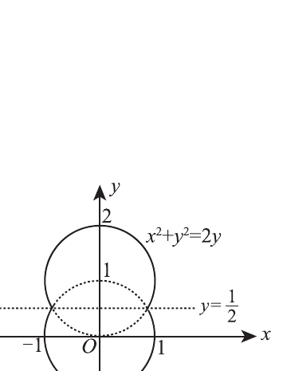

# 2011 数学二第 20 题

## 题目

一容器的内侧是由图中曲线绕 $y$ 轴旋转一周而成的曲面，该曲线由
$$
x^2+y^2=2y\quad\left(y\ge\frac12\right)
$$
与
$$
x^2+y^2=1\quad\left(y\le\frac12\right)
$$
连接而成。  
(I) 求容器的容积；  
(II) 若将容器内盛满的水从容器顶部全部抽出，至少需要做多少功？（长度单位：m，重力加速度为 $g\,\mathrm{m/s^2}$，水的密度为 $10^3\,\mathrm{kg/m^3}$。）

## 标准答案

(I) $V=\dfrac{9\pi}{4}$；  
(II) $W=3375\pi g$。

## 解析

旋转半径满足
$$
r^2=
\begin{cases}
1-y^2,&-1\le y\le \dfrac12,\\
2y-y^2,&\dfrac12\le y\le2.
\end{cases}
$$
(I) 容积
$$
V=\pi\int_{-1}^{1/2}(1-y^2)dy+\pi\int_{1/2}^{2}(2y-y^2)dy
=\frac{9\pi}{4}.
$$
(II) 把高度为 $y$ 处的薄层水抽到顶部 $y=2$，需提升距离 $2-y$。故做功
$$
W=10^3 g\pi\int_{-1}^{1/2}(2-y)(1-y^2)dy
+10^3 g\pi\int_{1/2}^{2}(2-y)(2y-y^2)dy.
$$
计算得
$$
\int_{-1}^{1/2}(2-y)(1-y^2)dy+\int_{1/2}^{2}(2-y)(2y-y^2)dy=\frac{27}{8},
$$
所以
$$
W=10^3g\pi\cdot\frac{27}{8}=3375\pi g.
$$

## 来源

- 题目来源：`math2_2011_questions.md`
- 答案来源：`math2_2011_answers.md`
