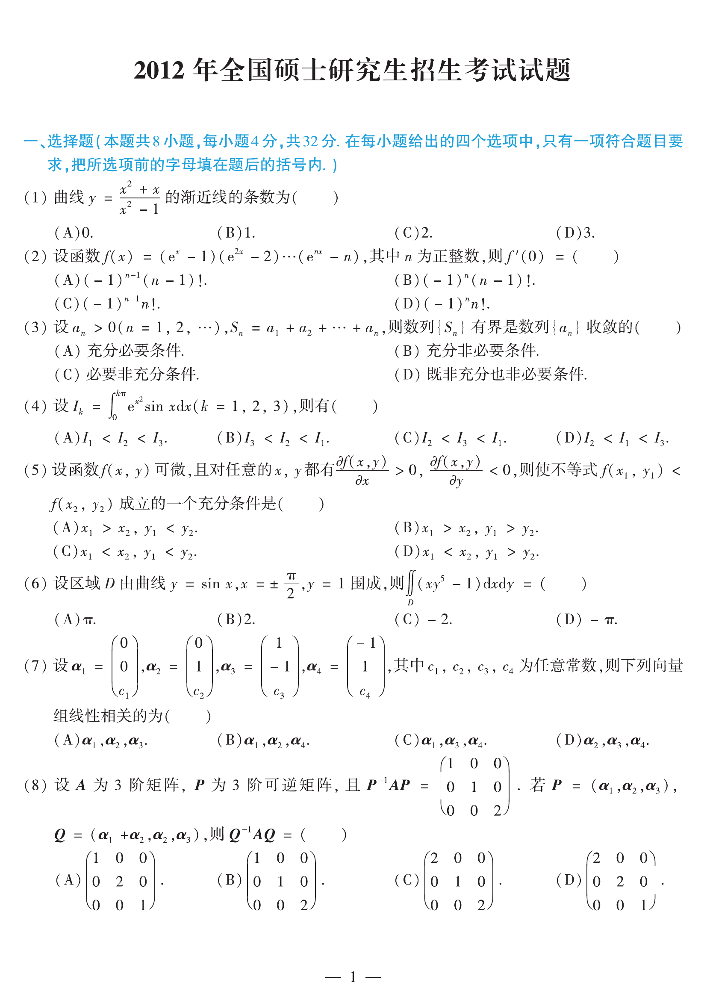

# 2012 数学二第 3 题

## 题目

设 $a_n>0\ (n=1,2,\cdots)$，$S_n=a_1+a_2+\cdots+a_n$，则数列 $\{S_n\}$ 有界是数列 $\{a_n\}$ 收敛的（ ）

A. 充分必要条件  
B. 充分非必要条件  
C. 必要非充分条件  
D. 既非充分也非必要条件

## 标准答案

B

## 解析

由 $a_n>0$ 可知 $\{S_n\}$ 单调递增。若 $\{S_n\}$ 有界，则级数 $\sum a_n$ 收敛，从而必有 $a_n\to 0$，所以它是充分条件。
但反过来 $a_n\to 0$ 不保证 $\sum a_n$ 收敛，例如 $a_n=\frac1n$，故不是必要条件。

## 来源

- 题目来源：`math2_2012_questions.md`
- 答案来源：`math2_2012_answers.md`
