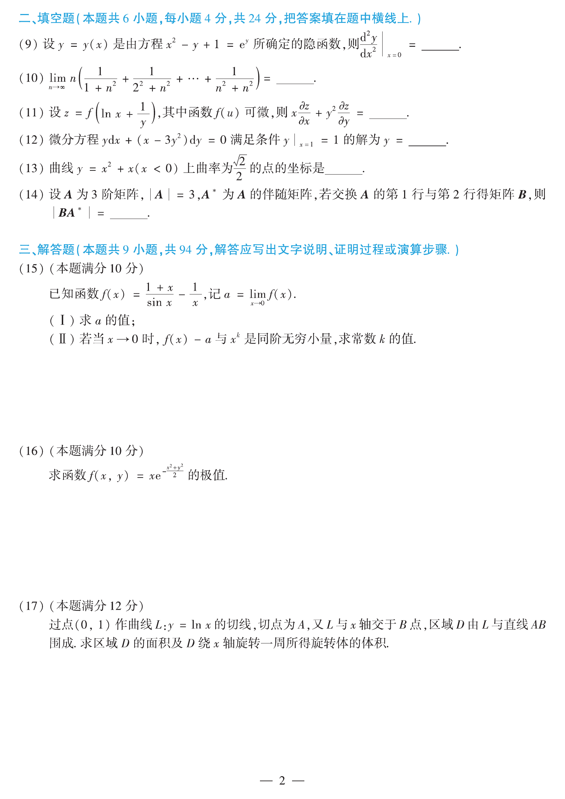

# 2012 数学二第 16 题

## 题目

求函数
$$
f(x,y)=xe^{-\frac{x^2+y^2}{2}}
$$
的极值。

## 标准答案

极大值为 $\dfrac1{\sqrt e}$（在 $(1,0)$ 处），极小值为 $-\dfrac1{\sqrt e}$（在 $(-1,0)$ 处）

## 解析

有
$$
f_x=e^{-\frac{x^2+y^2}{2}}(1-x^2),\qquad
f_y=-xye^{-\frac{x^2+y^2}{2}}.
$$
令偏导同时为零，得驻点为 $(1,0)$ 与 $(-1,0)$。

固定 $x$ 时，$e^{-(x^2+y^2)/2}$ 在 $y=0$ 处最大，因此极值只能落在 $y=0$ 上。于是问题化为研究
$$
g(x)=xe^{-x^2/2}.
$$
有
$$
g'(x)=e^{-x^2/2}(1-x^2),
$$
故在 $x=1$ 取极大值，在 $x=-1$ 取极小值。相应函数值为
$$
g(1)=e^{-1/2}=\frac1{\sqrt e},\qquad g(-1)=-e^{-1/2}=-\frac1{\sqrt e}.
$$

## 来源

- 题目来源：`math2_2012_questions.md`
- 答案来源：`math2_2012_answers.md`
