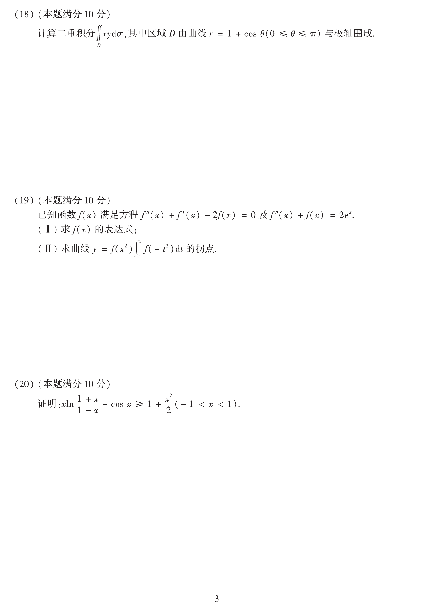

# 2012 数学二第 20 题

## 题目

证明：
$$
x\ln\frac{1+x}{1-x}+\cos x\ge 1+\frac{x^2}{2}\qquad (-1<x<1).
$$

## 标准答案

见解析

## 解析

令
$$
F(x)=x\ln\frac{1+x}{1-x}+\cos x-1-\frac{x^2}{2}.
$$
有 $F(0)=0$。计算导数：
$$
F'(x)=\ln\frac{1+x}{1-x}-\sin x+\frac{2x}{1-x^2}-x.
$$
在 $(-1,1)$ 上可利用
$$
\ln\frac{1+x}{1-x}\ge 2x,\qquad \sin x\le x
$$
以及 $\frac{2x}{1-x^2}-x\ge 0$（按 $x>0$、$x<0$ 分别讨论）推出 $F'(x)\ge 0$。因此 $F$ 在 $(-1,1)$ 上以 $0$ 为最小值点，从而
$$
F(x)\ge F(0)=0,
$$
即
$$
x\ln\frac{1+x}{1-x}+\cos x\ge 1+\frac{x^2}{2}.
$$

## 来源

- 题目来源：`math2_2012_questions.md`
- 答案来源：`math2_2012_answers.md`
