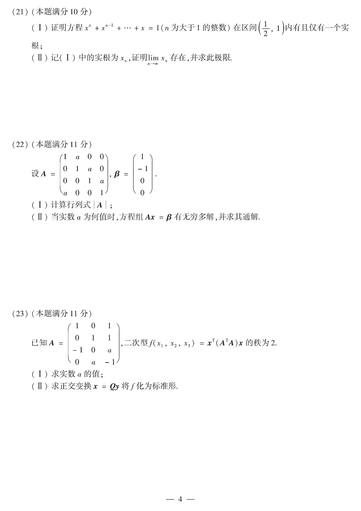

# 2012 数学二第 21 题

## 题目

（I）证明方程
$$
x^n+x^{n-1}+\cdots+x=1\qquad (n\text{ 为大于 }1\text{ 的整数})
$$
在区间 $\left(\dfrac12,1\right)$ 内有且仅有一个实根；

（II）记（I）中的实根为 $x_n$，证明 $\lim_{n\to\infty}x_n$ 存在，并求此极限。

## 标准答案

在 $\left(\dfrac12,1\right)$ 内有唯一实根；且 $\displaystyle\lim_{n\to\infty}x_n=\frac12$

## 解析

令
$$
f_n(x)=x+x^2+\cdots+x^n-1.
$$
在 $\left(\frac12,1\right)$ 上，$f_n'(x)=1+2x+\cdots+nx^{n-1}>0$，故 $f_n$ 严格递增。
又
$$
f_n\!\left(\frac12\right)=\frac12+\frac14+\cdots+\frac1{2^n}-1<0,\qquad
f_n(1)=n-1>0,
$$
由介值定理知在 $\left(\frac12,1\right)$ 内恰有一个实根。

由方程
$$
x_n+x_n^2+\cdots+x_n^n=1
$$
可知 $x_n>\frac12$。又比较 $f_{n+1}(x_n)=x_n^{n+1}>0$，而 $f_{n+1}$ 递增，得 $x_{n+1}<x_n$，所以 $\{x_n\}$ 单调递减且下有界，从而收敛。
设极限为 $a$。由
$$
x_n(1-x_n^n)=1-x_n
$$
或直接对原式放缩并令 $n\to\infty$，可得极限满足
$$
\frac{a}{1-a}=1,
$$
故
$$
a=\frac12.
$$

## 来源

- 题目来源：`math2_2012_questions.md`
- 答案来源：`math2_2012_answers.md`
