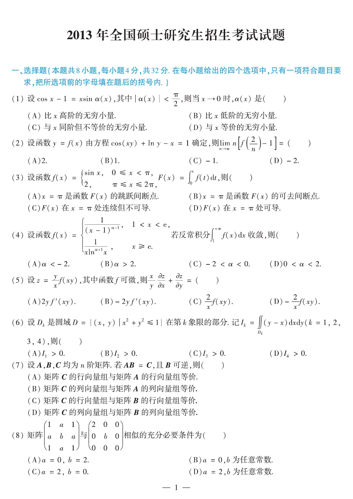

# 2013 数学二第 6 题

## 题目

设 $D_k$ 是圆域
$$
D=\{(x,y)\mid x^2+y^2\le 1\}
$$
在第 $k$ 象限的部分。记
$$
I_k=\iint_{D_k}(y-x)\,dxdy\quad (k=1,2,3,4),
$$
则（ ）

A. $I_1>0$  
B. $I_2>0$  
C. $I_3>0$  
D. $I_4>0$

## 标准答案

B

## 解析

在第二象限中有 $x<0,\ y>0$，故
$$
y-x>0,
$$
从而 $I_2>0$。其余三个象限中可由对称性或直接判断符号排除。

## 来源

- 题目来源：`math2_2013_questions.md`
- 答案来源：`math2_2013_answers.md`
