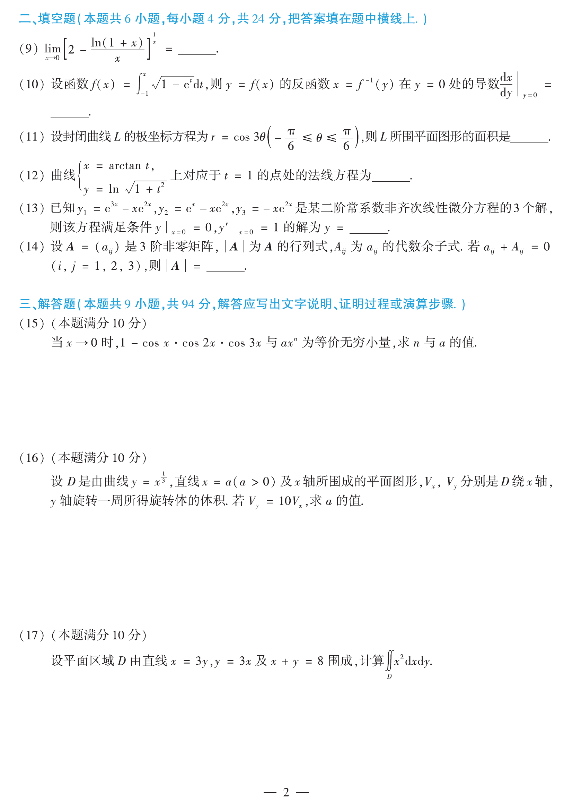

# 2013 数学二第 12 题

## 题目

曲线
$$
\begin{cases}
x=\arctan t,\\
y=\ln\sqrt{1+t^2}
\end{cases}
$$
上对应于 $t=1$ 的点处的法线方程为 $\underline{\qquad}$。

## 标准答案

$y+x-\dfrac{\pi}{4}-\dfrac12\ln 2=0$

## 解析

有
$$
\frac{dx}{dt}=\frac{1}{1+t^2},\qquad
\frac{dy}{dt}=\frac{t}{1+t^2},
$$
因而
$$
\frac{dy}{dx}=t.
$$
当 $t=1$ 时，切线斜率为 $1$，法线斜率为 $-1$。对应点为
$$
\left(\frac{\pi}{4},\ln\sqrt2\right)=\left(\frac{\pi}{4},\frac12\ln2\right).
$$
法线方程为
$$
y-\frac12\ln2=-\left(x-\frac{\pi}{4}\right),
$$
即
$$
y+x-\frac{\pi}{4}-\frac12\ln2=0.
$$

## 来源

- 题目来源：`math2_2013_questions.md`
- 答案来源：`math2_2013_answers.md`
