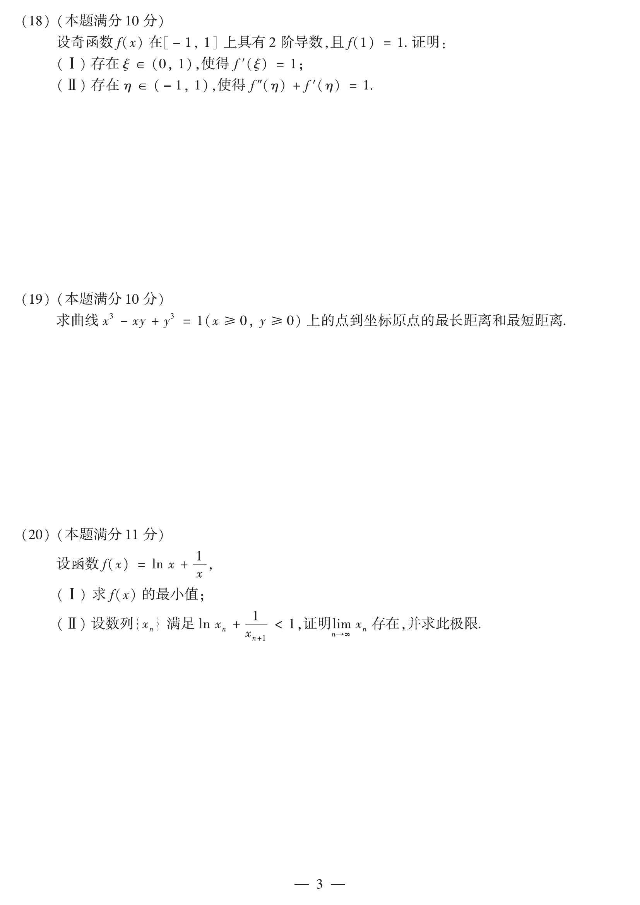

# 2013 数学二第 19 题

## 题目

求曲线
$$
x^3-xy+y^3=1\qquad (x\ge 0,\ y\ge 0)
$$
上的点到坐标原点的最长距离与最短距离。

## 标准答案

最长距离为 $\sqrt2$，最短距离为 $1$

## 解析

设
$$
F(x,y)=x^2+y^2,
$$
约束为
$$
g(x,y)=x^3-xy+y^3-1=0.
$$
用拉格朗日乘子法解
$$
\nabla F=\lambda \nabla g.
$$
联立后可得唯一的内部驻点是
$$
(x,y)=(1,1),
$$
此时
$$
F(1,1)=2.
$$
同时考察边界端点 $(1,0)$ 与 $(0,1)$，有
$$
F(1,0)=F(0,1)=1.
$$
故到原点的最长距离为 $\sqrt2$，最短距离为 $1$。

## 来源

- 题目来源：`math2_2013_questions.md`
- 答案来源：`math2_2013_answers.md`
