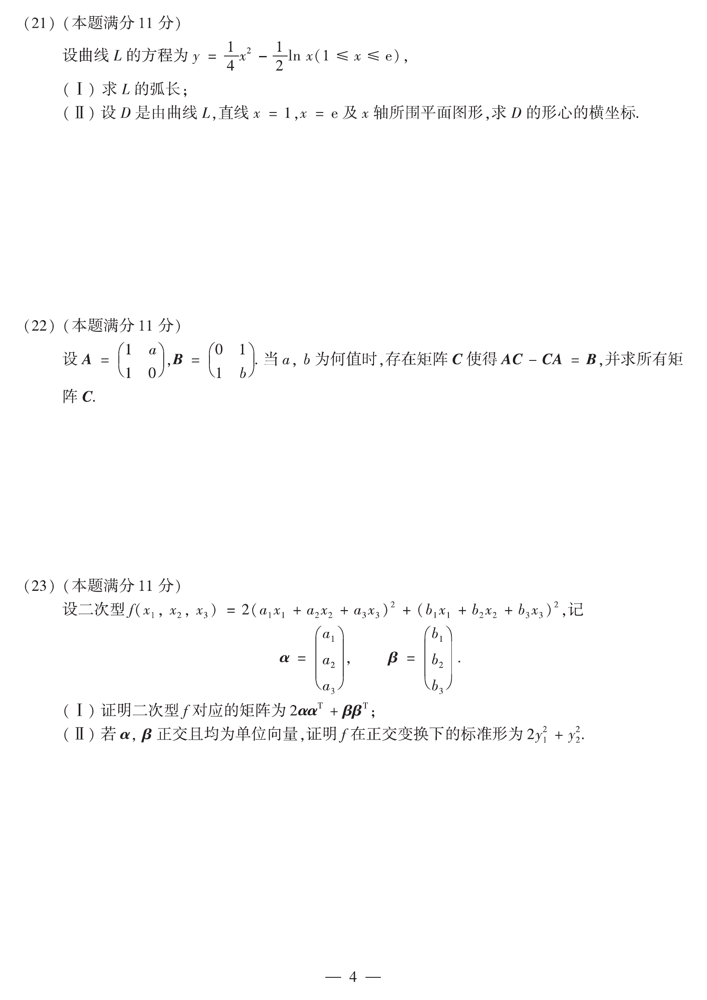

# 2013 数学二第 22 题

## 题目

设
$$
A=\begin{pmatrix}1&a\\1&0\end{pmatrix},\qquad
B=\begin{pmatrix}0&1\\1&b\end{pmatrix}.
$$
当 $a,b$ 为何值时，存在矩阵 $C$ 使得
$$
AC-CA=B,
$$
并求所有矩阵 $C$。

## 标准答案

$a=-1,\ b=0$；此时 $C=\begin{pmatrix}k_1+k_2&k_1+1\\k_2&k_1\end{pmatrix}$

## 解析

设
$$
C=\begin{pmatrix}x_1&x_2\\x_3&x_4\end{pmatrix}.
$$
把它代入方程 $AC-CA=B$，整理成关于 $x_1,x_2,x_3,x_4$ 的线性方程组。该方程组有解的充要条件是
$$
a=-1,\qquad b=0.
$$
在此条件下解得
$$
x_1=k_1+k_2,\qquad x_2=k_1+1,\qquad x_3=k_2,\qquad x_4=k_1,
$$
其中 $k_1,k_2$ 为任意常数。因此
$$
C=\begin{pmatrix}
k_1+k_2 & k_1+1\\
k_2 & k_1
\end{pmatrix}.
$$

## 来源

- 题目来源：`math2_2013_questions.md`
- 答案来源：`math2_2013_answers.md`
