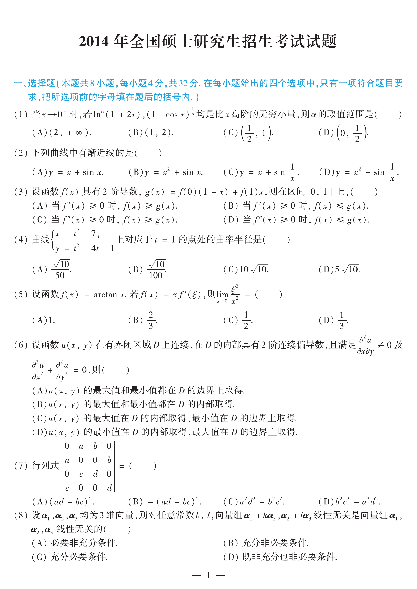

# 2014 数学二第 5 题

## 题目

设函数 $f(x)=\arctan x$。若 $f(x)=x f'(\xi)$，则 $\lim\limits_{x\to 0}\dfrac{\xi^2}{x^2}=$（ ）  
(A) $1$  
(B) $\dfrac23$  
(C) $\dfrac12$  
(D) $\dfrac13$

## 标准答案

D

## 解析

由题设
$$
\frac{f(x)}{x}=\frac{\arctan x}{x}=\frac{1}{1+\xi^2},
$$
整理得
$$
\xi^2=\frac{x-\arctan x}{\arctan x}.
$$
于是
$$
\frac{\xi^2}{x^2}=\frac{x-\arctan x}{x^2\arctan x}\sim \frac{x-\arctan x}{x^3}.
$$
再用洛必达法则或展开 $\arctan x=x-\dfrac{x^3}{3}+o(x^3)$，得极限为 $\dfrac13$。

## 来源

- 题目来源：`math2_2014_questions.md`
- 答案来源：`math2_2014_answers.md`
