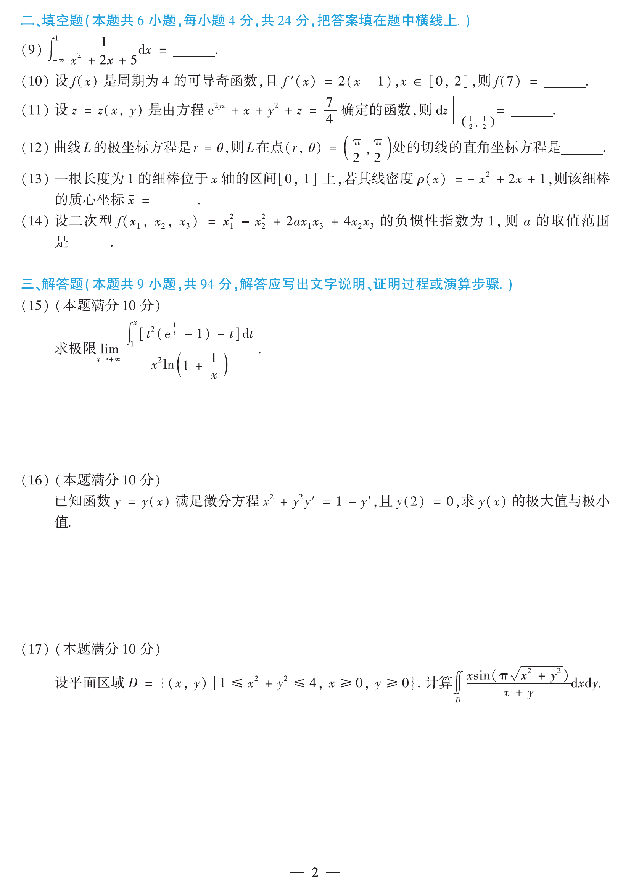

# 2014 数学二第 17 题

## 题目

设平面区域
$$
D=\{(x,y)\mid 1\le x^2+y^2\le 4,\ x\ge 0,\ y\ge 0\},
$$
计算
$$
\iint_D \frac{x\sin\!\bigl(\pi\sqrt{x^2+y^2}\bigr)}{x+y}\,dxdy.
$$

## 标准答案

$-\dfrac34$

## 解析

区域 $D$ 关于直线 $y=x$ 对称，因此
$$
\iint_D \frac{x\sin(\pi\sqrt{x^2+y^2})}{x+y}\,dxdy
=
\iint_D \frac{y\sin(\pi\sqrt{x^2+y^2})}{x+y}\,dxdy.
$$
两式相加后除以 2，得原积分
$$
I=\frac12\iint_D \sin(\pi\sqrt{x^2+y^2})\,dxdy.
$$
改用极坐标：
$$
I=\frac12\int_0^{\pi/2}\!\!d\theta\int_1^2 \sin(\pi r)\,r\,dr
=\frac{\pi}{4\pi}\int_1^2 r\sin(\pi r)\,dr.
$$
分部积分可得
$$
I=-\frac34.
$$

## 来源

- 题目来源：`math2_2014_questions.md`
- 答案来源：`math2_2014_answers.md`
