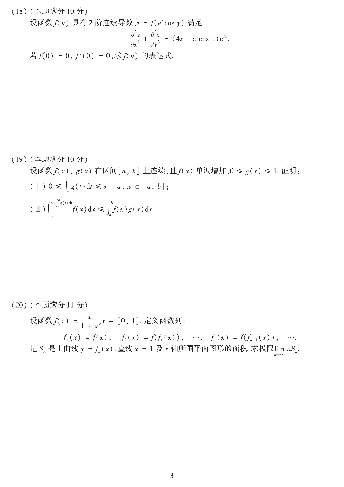

# 2014 数学二第 20 题

## 题目

设函数
$$
f(x)=\frac{x}{1+x},\qquad x\in[0,1].
$$
定义函数列
$$
f_1(x)=f(x),\quad f_2(x)=f(f_1(x)),\quad \cdots,\quad f_n(x)=f(f_{n-1}(x)),\quad \cdots
$$
记 $S_n$ 是由曲线 $y=f_n(x)$、直线 $x=1$ 及 $x$ 轴所围平面图形的面积。求极限 $\lim\limits_{n\to\infty} nS_n$。

## 标准答案

$1$

## 解析

先计算前几项：
$$
f_1(x)=\frac{x}{1+x},\qquad
f_2(x)=\frac{x}{1+2x},\qquad
f_3(x)=\frac{x}{1+3x}.
$$
由归纳法可得
$$
f_n(x)=\frac{x}{1+nx},\qquad x\in[0,1].
$$
因而
$$
S_n=\int_0^1 \frac{x}{1+nx}\,dx
=\frac1n\int_0^1\left(1-\frac{1}{1+nx}\right)dx
=\frac1n-\frac{1}{n^2}\ln(1+n).
$$
所以
$$
nS_n=1-\frac{\ln(1+n)}{n}\to 1.
$$

## 来源

- 题目来源：`math2_2014_questions.md`
- 答案来源：`math2_2014_answers.md`
